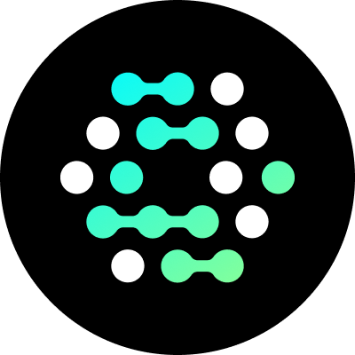

<div align="center">
  <p><a href="https://openfga.dev"></a></p>

  <h1>OpenFGA MCP Server</h1>

  <p>
    <a href="https://codecov.io/gh/evansims/openfga-mcp" target="_blank"></a>
    <a href="https://shepherd.dev/github/evansims/openfga-mcp" target="_blank"></a>
    <a href="https://www.bestpractices.dev/projects/10901"></a>
  </p>

  <p>Stop writing authorization logic. Start asking questions.</p>
</div>

<p><br /></p>

**Manage and query OpenFGA using AI agents.** Connect [OpenFGA](https://openfga.dev/) and [Auth0 FGA](https://auth0.com/fine-grained-authorization) to your AI workflows via the Model Context Protocol.

## Quick Start

### Offline Mode (Default)

Planning and code generation without a live server:

```json
{
  "mcpServers": {
    "OpenFGA": {
      "command": "docker",
      "args": ["run", "--rm", "-i", "--pull=always", "evansims/openfga-mcp:latest"]
    }
  }
}
```

### Online Mode

Connect to an OpenFGA instance for full functionality:

```json
{
  "mcpServers": {
    "OpenFGA": {
      "command": "docker",
      "args": [
        "run", "--rm", "-i", "--pull=always",
        "-e", "OPENFGA_MCP_API_URL=http://host.docker.internal:8080",  // Local
        "-e", "OPENFGA_MCP_API_WRITEABLE=true",                        // Optional: Enable writes
        "evansims/openfga-mcp:latest"
      ]
    }
  }
}
```

> **Safety:** Write operations are disabled by default. Set `OPENFGA_MCP_API_WRITEABLE=true` to enable.

> **Docker Networking:** Use `host.docker.internal` for local OpenFGA, container names for Docker networks, or full URLs for remote instances.

Works with [Claude Desktop](https://claude.ai/download), [Claude Code](https://www.anthropic.com/claude-code), [Zed](https://zed.dev), [Cursor](https://cursor.sh), and other MCP clients.

## Configuration

### Key Environment Variables

| Variable | Default | Description |
|----------|---------|-------------|
| `OPENFGA_MCP_API_URL` | _(not set)_ | OpenFGA server URL. Omit for offline mode |
| `OPENFGA_MCP_API_WRITEABLE` | `false` | Enable write operations |
| `OPENFGA_MCP_API_RESTRICT` | `false` | Restrict to configured store/model |
| `OPENFGA_MCP_API_STORE` | `null` | Default store ID |
| `OPENFGA_MCP_API_MODEL` | `null` | Default model ID |

### Authentication

**Token Authentication:**
- `OPENFGA_MCP_API_TOKEN` - API token

**Client Credentials:**
- `OPENFGA_MCP_API_CLIENT_ID` - Client ID
- `OPENFGA_MCP_API_CLIENT_SECRET` - Client secret
- `OPENFGA_MCP_API_ISSUER` - Token issuer
- `OPENFGA_MCP_API_AUDIENCE` - API audience

See [`docker-compose.example.yml`](docker-compose.example.yml) for complete examples.

## Features

### Tools

**Store Management**
- `create_store`, `list_stores`, `get_store`, `delete_store`

**Model Management**
- `create_model` - Create models using [DSL](https://openfga.dev/docs/configuration-language)
- `list_models`, `get_model`, `verify_model`, `get_model_dsl`

**Permissions**
- `check_permission` - Check user permissions
- `grant_permission`, `revoke_permission` - Manage access
- `list_users`, `list_objects` - Query relationships

### Resources & Templates

Access OpenFGA data via URIs:
- `openfga://stores` - List stores
- `openfga://store/{storeId}` - Store details
- `openfga://store/{storeId}/model/{modelId}` - Model details
- `openfga://store/{storeId}/check?user={user}&relation={relation}&object={object}` - Permission check

### AI Prompts

**Model Design**
- `design_model_for_domain` - Domain-specific models
- `convert_rbac_to_rebac` - Migration guidance
- `model_hierarchical_relationships` - Complex hierarchies
- `optimize_model_structure` - Performance optimization

**Authoring Guidance**
- `guide_model_authoring` - Comprehensive authoring help
- `create_model_step_by_step` - Step-by-step creation
- `design_relationship_patterns` - Pattern implementation
- `test_model_comprehensive` - Test generation

**Troubleshooting & Security**
- `debug_permission_denial` - Debug access issues
- `security_review_model` - Security audits
- `implement_least_privilege` - Security patterns

### Smart Completions

The server provides intelligent auto-completion for store IDs, model IDs, relations, users, and objects when connected to OpenFGA.

---

- [Contributing](./.github/CONTRIBUTING.md) | [Apache 2.0 License](./LICENSE)