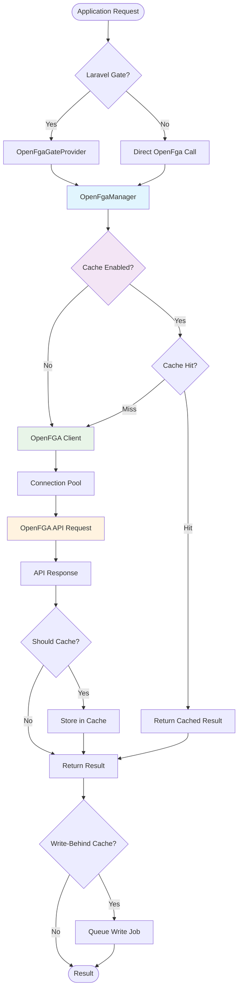

# LARAVEL_SDK Documentation

> Compiled from: https://github.com/evansims/openfga-laravel
> Generated: 2025-08-03 22:14:06 UTC

---


<!-- Source: evansims/openfga-laravel/README.md -->

<div align="center">
  <p><a href="https://openfga.dev"></a></p>

  <h1>OpenFGA Laravel SDK</h1>

  <p>Stop writing authorization logic. Start asking questions.</p>
</div>

<p><br /></p>

**Every app needs permissions.** Most developers end up with authorization logic scattered across controllers, middleware, and business logic. Changes break things. New features require touching dozens of files.

**[OpenFGA](https://openfga.dev/) solves this.** Define your authorization rules once, query them anywhere. This package provides complete integration of [OpenFGA](https://openfga.dev/) and [Auth0 FGA](https://auth0.com/fine-grained-authorization) for Laravel applications.

- **Eloquent Integration** - Authorization methods on your models
- **Middleware Protection** - Secure routes with permission checks
- **Blade Directives** - Show/hide UI based on permissions
- **Testing Utilities** - Fake permissions in your tests
- **Performance Optimized** - Built-in caching and batch operations
- **Queue Support** - Async permission operations
- **Multi-tenancy Ready** - Multiple stores and connections
- **Type Safe** - PHP 8.3+ with strict typing and comprehensive generics
- **Developer Friendly** - Enhanced IDE support with detailed PHPDoc annotations

<p><br /></p>

### Installation

```bash
composer require evansims/openfga-laravel
```

Publish the configuration:

```bash
php artisan vendor:publish --tag="openfga-config"
```

Set your environment variables:

```env
OPENFGA_URL=http://localhost:8080
OPENFGA_STORE_ID=your-store-id
```

<p><br /></p>

### Usage Patterns

```php
// Controllers - Type-safe permission checks
if (cannot('edit', $document)) {
    abort(403);
}

// Middleware - Strict parameter validation
Route::put('/documents/{document}', [DocumentController::class, 'update'])
    ->middleware('openfga:editor,document:{document}');

// Blade Views - Enhanced type safety
@can('edit', 'document:' . $document->id)
    <button>Edit</button>
@endcan

// Eloquent Models - Comprehensive type annotations
$document->grant($user, 'editor');  // Grant permission
$document->check($user, 'editor');  // Check permission
$document->revoke($user, 'editor'); // Revoke permission

// Query by permissions - Generic return types
$myDocuments = Document::whereUserCan($user, 'edit')->get();
```

<p><br /></p>

### Quickstart

Let's implement a simple document sharing system with enhanced type safety.

```php
<?php

declare(strict_types=1);

use App\Models\Document;

class DocumentController extends Controller
{
    /**
     * Share a document with another user.
     */
    public function share(Request $request, Document $document): RedirectResponse
    {
        // Ensure user can share (only owners can share)
        $this->authorize('owner', $document);

        // Grant permission to new user
        $document->grant($request->user_email, $request->permission);

        return back()->with('success', 'Document shared successfully!');
    }

    /**
     * List documents the user can view.
     */
    public function index(): View
    {
        $documents = Document::whereUserCan(auth()->user(), 'viewer')
            ->latest()
            ->paginate();

        return view('documents.index', compact('documents'));
    }
}
```

<p><br /></p>

### Documentation

- [Installation](https://github.com/evansims/openfga-laravel/blob/main/docs/installation.md)
- [Quickstart](https://github.com/evansims/openfga-laravel/blob/main/docs/quickstart.md)
- [Configuration](https://github.com/evansims/openfga-laravel/blob/main/docs/configuration.md)
- [Eloquent Integration](https://github.com/evansims/openfga-laravel/blob/main/docs/eloquent.md)
- [Middleware](https://github.com/evansims/openfga-laravel/blob/main/docs/middleware.md)
- [Performance & Optimization](https://github.com/evansims/openfga-laravel/blob/main/docs/performance.md)
- [Testing](https://github.com/evansims/openfga-laravel/blob/main/docs/testing.md)
- [API Reference](https://github.com/evansims/openfga-laravel/blob/main/docs/api-reference.md)
- **[Cookbook & Recipes](https://github.com/evansims/openfga-laravel/blob/main/docs/cookbook/README.md)** - Real-world implementation patterns

<p><br /></p>

### Related

- [OpenFGA PHP SDK](https://github.com/evansims/openfga-php)

<p><br /></p>

### Contributing

Contributions are welcome—have a look at our [contributing guidelines](https://github.com/evansims/openfga-laravel/blob/main/.github/CONTRIBUTING.md).


<!-- End of evansims/openfga-laravel/README.md -->


<!-- Source: evansims/openfga-laravel/docs/cache/read-through.md -->

### Read-Through Cache

The OpenFGA Laravel package includes a powerful read-through cache implementation that automatically fetches and caches permissions when they're not in cache, providing transparent caching behavior.

#### Overview

Read-through caching is a caching pattern where:

- Cache hits return data immediately from cache
- Cache misses automatically fetch from the source and populate the cache
- The application doesn't need to manage cache population explicitly

#### Features

- **Automatic cache population** - No manual cache warming needed
- **Negative result caching** - Cache "false" results with shorter TTL
- **Error caching** - Prevent hammering the API when errors occur
- **Contextual bypass** - Skip caching for requests with context
- **Cache metrics** - Track hit rates and performance
- **Tagged cache support** - Granular cache invalidation

#### Configuration

```php
// config/openfga.php
'cache' => [
    'enabled' => true,
    'store' => null, // Use default cache store
    'ttl' => 300, // 5 minutes
    'prefix' => 'openfga',

    // Read-through cache settings
    'read_through' => true,
    'negative_ttl' => 60, // Cache negative results for 1 minute
    'error_ttl' => 10, // Cache errors for 10 seconds
    'log_misses' => false, // Log cache misses for debugging

    // Cache metrics
    'metrics' => [
        'enabled' => true,
    ],
],
```

#### Usage

The read-through cache is automatically used by the OpenFgaManager when enabled:

```php
use OpenFGA\Laravel\OpenFgaManager;

$manager = app(OpenFgaManager::class);

// First call - cache miss, fetches from API
$allowed = $manager->check('user:123', 'viewer', 'document:456');

// Second call - cache hit, returns from cache
$allowed = $manager->check('user:123', 'viewer', 'document:456');
```

##### Direct Access

You can also access the read-through cache directly:

```php
$readThroughCache = $manager->getReadThroughCache();

// Check permission with caching
$allowed = $readThroughCache->check(
    'user:123',
    'viewer',
    'document:456'
);

// List objects with caching
$objects = $readThroughCache->listObjects(
    'user:123',
    'viewer',
    'document'
);
```

#### Cache Behavior

##### Positive Results

When a permission check returns `true`, it's cached for the configured TTL:

```php
// Cached for 5 minutes (default TTL)
$allowed = $manager->check('user:123', 'editor', 'document:456'); // true
```

##### Negative Results

When a permission check returns `false`, it's cached for a shorter duration:

```php
// Cached for 1 minute (negative_ttl)
$allowed = $manager->check('user:123', 'admin', 'document:456'); // false
```

##### Error Handling

Errors are cached briefly to prevent API hammering:

```php
try {
    // If API is down, error is cached for 10 seconds
    $allowed = $manager->check('user:123', 'viewer', 'document:456');
} catch (\Exception $e) {
    // Subsequent calls within 10 seconds won't hit the API
}
```

##### Contextual Requests

Requests with contextual tuples or context are never cached:

```php
// Not cached - has contextual tuples
$allowed = $manager->check(
    'user:123',
    'viewer',
    'document:456',
    $contextualTuples
);

// Not cached - has context
$allowed = $manager->check(
    'user:123',
    'viewer',
    'document:456',
    [],
    ['ip' => '192.168.1.1']
);
```

#### Cache Invalidation

The read-through cache integrates with the tagged cache for intelligent invalidation:

```php
$cache = $manager->getReadThroughCache();

// Invalidate all cache entries for a user
$cache->invalidate('user:123');

// Invalidate all cache entries for an object
$cache->invalidate(null, null, 'document:456');

// Invalidate all cache entries for a relation
$cache->invalidate(null, 'viewer');

// Invalidate a specific permission
$cache->invalidate('user:123', 'viewer', 'document:456');
```

#### Cache Metrics

Track cache performance with built-in metrics:

```php
$cache = $manager->getReadThroughCache();

// Get cache statistics
$stats = $cache->getStats();
// [
//     'hits' => 150,
//     'misses' => 50,
//     'hit_rate' => 75.0
// ]

// Reset statistics
$cache->resetStats();
```

##### Using the CLI

```bash
# View cache statistics
php artisan openfga:cache:stats

# Output as JSON
php artisan openfga:cache:stats --json

# Reset statistics
php artisan openfga:cache:stats --reset
```

#### Debugging

Enable cache miss logging for debugging:

```php
// .env
OPENFGA_CACHE_LOG_MISSES=true
```

This will log all cache misses:

```
[2024-01-15 10:30:45] local.DEBUG: OpenFGA cache miss {
    "user": "user:123",
    "relation": "viewer",
    "object": "document:456"
}
```

#### Performance Considerations

##### Cache Store Selection

Choose an appropriate cache store for your use case:

```php
// Redis - Recommended for production
OPENFGA_CACHE_STORE=redis

// Array - Good for testing
OPENFGA_CACHE_STORE=array

// File - Simple but slower
OPENFGA_CACHE_STORE=file
```

##### TTL Configuration

Balance between performance and data freshness:

```php
// Longer TTL for stable permissions
OPENFGA_CACHE_TTL=3600 // 1 hour

// Shorter TTL for frequently changing permissions
OPENFGA_CACHE_TTL=60 // 1 minute

// Different TTL for negative results
OPENFGA_CACHE_NEGATIVE_TTL=30 // 30 seconds
```

##### Memory Considerations

For high-traffic applications, monitor cache memory usage:

```php
// Limit cache entries with a shorter TTL
OPENFGA_CACHE_TTL=300

// Or use cache stores with eviction policies
OPENFGA_CACHE_STORE=redis
```

#### Advanced Usage

##### Custom Cache Configuration

```php
use OpenFGA\Laravel\Cache\ReadThroughCache;

$customCache = new ReadThroughCache($manager, [
    'enabled' => true,
    'ttl' => 600,
    'negative_ttl' => 120,
    'error_ttl' => 5,
    'prefix' => 'my-app',
    'metrics_enabled' => true,
]);

$allowed = $customCache->check('user:123', 'viewer', 'document:456');
```

##### Warming the Cache

Combine with cache warming for optimal performance:

```php
use OpenFGA\Laravel\Cache\CacheWarmer;

$warmer = app(CacheWarmer::class);

// Warm cache for specific permissions
$warmer->warmForUser(
    'user:123',
    ['viewer', 'editor'],
    ['document:456', 'document:789']
);

// Now these will be cache hits
$allowed = $manager->check('user:123', 'viewer', 'document:456');
```

##### Monitoring Cache Performance

```php
// In your monitoring system
$stats = $manager->getReadThroughCache()->getStats();

if ($stats['hit_rate'] < 50.0) {
    // Alert: Low cache hit rate
    Log::warning('OpenFGA cache hit rate below 50%', $stats);
}
```

#### Best Practices

1. **Enable metrics in production** to monitor cache effectiveness
2. **Use tagged cache stores** (Redis, DynamoDB) for better invalidation
3. **Set appropriate TTLs** based on your permission volatility
4. **Monitor cache size** to prevent memory issues
5. **Use cache warming** for predictable permission patterns
6. **Disable for tests** unless specifically testing cache behavior

#### Troubleshooting

##### Low Hit Rate

If your cache hit rate is low:

1. Check if permissions change frequently
2. Increase TTL if appropriate
3. Use cache warming for common permissions
4. Ensure cache store is properly configured

##### Cache Not Working

1. Verify cache is enabled: `OPENFGA_CACHE_ENABLED=true`
2. Check cache store supports your operations
3. Ensure proper permissions for file-based caches
4. Check Redis/Memcached connection if using

##### Stale Data

If you're seeing outdated permissions:

1. Reduce TTL for frequently changing permissions
2. Implement proper cache invalidation on updates
3. Use contextual tuples for dynamic permissions
4. Consider disabling cache for specific checks


<!-- End of evansims/openfga-laravel/docs/cache/read-through.md -->


<!-- Source: evansims/openfga-laravel/docs/cache/write-behind.md -->

### Write-Behind Cache

The write-behind cache pattern improves performance by buffering write operations and flushing them to OpenFGA asynchronously. This is ideal for scenarios where immediate consistency is not critical.

#### Overview

Write-behind caching:
- Buffers grant/revoke operations in memory
- Updates the read cache immediately for consistency
- Flushes operations to OpenFGA in batches
- Supports both synchronous and queue-based flushing

#### Configuration

##### Basic Configuration

```php
// config/openfga.php
'cache' => [
    'write_behind' => [
        'enabled' => env('OPENFGA_WRITE_BEHIND_ENABLED', false),
        'store' => env('OPENFGA_WRITE_BEHIND_STORE'), // null = default cache
        'batch_size' => env('OPENFGA_WRITE_BEHIND_BATCH_SIZE', 100),
        'flush_interval' => env('OPENFGA_WRITE_BEHIND_FLUSH_INTERVAL', 5), // seconds
        'ttl' => env('OPENFGA_WRITE_BEHIND_TTL', 300), // 5 minutes
        'periodic_flush' => env('OPENFGA_WRITE_BEHIND_PERIODIC_FLUSH', false),
        'flush_on_shutdown' => env('OPENFGA_WRITE_BEHIND_FLUSH_ON_SHUTDOWN', true),
    ],
],
```

##### Queue Integration

For improved reliability and scalability, enable queue-based flushing:

```php
// config/openfga.php
'queue' => [
    'enabled' => env('OPENFGA_QUEUE_ENABLED', false),
    'connection' => env('OPENFGA_QUEUE_CONNECTION'), // null = default
    'queue' => env('OPENFGA_QUEUE_NAME', 'openfga'),
],
```

#### Usage

##### Automatic Buffering

When write-behind is enabled, all write operations are automatically buffered:

```php
use OpenFGA\Laravel\Facades\OpenFga;

// These operations are buffered, not immediately sent to OpenFGA
OpenFga::grant('user:123', 'editor', 'document:456');
OpenFga::revoke('user:456', 'viewer', 'document:456');

// The read cache is updated immediately, so this returns the correct result
$canEdit = OpenFga::check('user:123', 'editor', 'document:456'); // true
```

##### Manual Control

You can manually control the write-behind cache:

```php
use OpenFGA\Laravel\Cache\WriteBehindCache;

$cache = app(WriteBehindCache::class);

// Check pending operations
$pending = $cache->getPendingCount();
// ['writes' => 5, 'deletes' => 2, 'total' => 7]

// Force immediate flush
$stats = $cache->flush();
// ['writes' => 5, 'deletes' => 2]

// Clear pending operations without flushing
$cache->clear();
```

#### Queue-Based Flushing

##### How It Works

With queue integration enabled:

1. Each operation is dispatched as a `WriteTupleToFgaJob`
2. Jobs are processed by queue workers
3. Failed jobs are automatically retried
4. Operations maintain connection context

##### Benefits

- **Reliability**: Failed operations are retried automatically
- **Performance**: Web requests remain fast
- **Scalability**: Distribute load across multiple workers
- **Fault Tolerance**: Survives OpenFGA downtime

##### Setup

1. Configure queue connection:
   ```env
   OPENFGA_QUEUE_ENABLED=true
   OPENFGA_QUEUE_CONNECTION=redis
   OPENFGA_QUEUE_NAME=openfga
   ```

2. Start queue workers:
   ```bash
   php artisan queue:work --queue=openfga
   ```

3. Monitor queue health:
   ```bash
   php artisan queue:monitor openfga --max=1000
   ```

##### Job Configuration

The queue jobs support:

- **Retries**: 3 attempts with exponential backoff (10s, 30s, 60s)
- **Timeout**: 30 seconds per job
- **Tags**: For monitoring in Horizon
- **Connection Context**: Maintains multi-tenant context

#### Flush Triggers

Operations are flushed when:

1. **Batch Size Reached**: Configurable via `batch_size`
2. **Time Interval**: After `flush_interval` seconds
3. **Manual Flush**: Via `$cache->flush()`
4. **Shutdown**: If `flush_on_shutdown` is enabled
5. **Periodic**: Via scheduler if `periodic_flush` is enabled

#### Monitoring

##### Artisan Commands

```bash
# View write-behind cache status
php artisan openfga:cache:status

# Manually flush write-behind cache
php artisan openfga:cache:flush

# Clear write-behind cache without flushing
php artisan openfga:cache:clear
```

##### Metrics

Track write-behind performance:

```php
use OpenFGA\Laravel\Cache\WriteBehindCache;

$cache = app(WriteBehindCache::class);
$operations = $cache->getPendingOperations();

// Log metrics
Log::info('Write-behind cache metrics', [
    'pending_writes' => count($operations['writes']),
    'pending_deletes' => count($operations['deletes']),
    'oldest_operation' => min(array_column($operations['writes'], 'timestamp')),
]);
```

##### Laravel Horizon

If using Horizon, monitor the `openfga` queue:

```php
// config/horizon.php
'environments' => [
    'production' => [
        'supervisor-1' => [
            'queue' => ['default', 'openfga'],
            'balance' => 'auto',
            'maxProcesses' => 10,
        ],
    ],
],
```

#### Best Practices

##### 1. Use for Non-Critical Updates

Write-behind is ideal for:
- Bulk permission imports
- Background synchronization
- Non-critical permission updates

Not recommended for:
- Security-critical operations
- Real-time permission changes
- Financial or compliance systems

##### 2. Configure Appropriate Batch Sizes

```php
// For high-throughput systems
'batch_size' => 500,
'flush_interval' => 2,

// For low-throughput systems
'batch_size' => 50,
'flush_interval' => 10,
```

##### 3. Monitor Queue Health

Set up alerts for:
- Queue size exceeding threshold
- Failed job rate
- Flush duration

##### 4. Handle Failures Gracefully

```php
// In your exception handler
public function report(Throwable $exception)
{
    if ($exception instanceof \OpenFGA\Laravel\Exceptions\OpenFgaException) {
        // Notify ops team
        // Consider fallback strategy
    }
    
    parent::report($exception);
}
```

##### 5. Test with Queue Workers

Always test with queue workers running:

```php
// In your tests
public function test_write_behind_with_queue()
{
    Queue::fake();
    
    config(['openfga.queue.enabled' => true]);
    
    OpenFga::grant('user:123', 'editor', 'document:456');
    
    Queue::assertPushed(WriteTupleToFgaJob::class, function ($job) {
        return $job->user === 'user:123'
            && $job->relation === 'editor'
            && $job->object === 'document:456';
    });
}
```

#### Troubleshooting

##### Operations Not Flushing

1. Check queue workers are running:
   ```bash
   php artisan queue:work --queue=openfga
   ```

2. Verify configuration:
   ```bash
   php artisan config:cache
   php artisan queue:restart
   ```

3. Check for failed jobs:
   ```bash
   php artisan queue:failed
   ```

##### Cache Inconsistencies

1. Clear both caches:
   ```bash
   php artisan cache:clear
   php artisan openfga:cache:clear
   ```

2. Verify write-behind is updating read cache:
   ```php
   Log::debug('Cache update', [
       'write_behind_enabled' => config('openfga.cache.write_behind.enabled'),
       'read_cache_enabled' => config('openfga.cache.enabled'),
   ]);
   ```

##### Performance Issues

1. Reduce batch size if flushes are slow
2. Increase flush interval for better batching
3. Add more queue workers for parallel processing
4. Consider using Redis for better queue performance

#### Migration from Synchronous Writes

To migrate from synchronous to write-behind:

1. **Enable in staging first**:
   ```env
   OPENFGA_WRITE_BEHIND_ENABLED=true
   OPENFGA_QUEUE_ENABLED=false
   ```

2. **Monitor for issues**:
   - Check logs for flush failures
   - Verify permission consistency
   - Monitor response times

3. **Enable queue integration**:
   ```env
   OPENFGA_QUEUE_ENABLED=true
   ```

4. **Gradually increase batch size**:
   - Start with small batches (50)
   - Increase based on performance
   - Monitor OpenFGA load

#### See Also

- [Performance Guide](https://github.com/evansims/openfga-laravel/blob/main/../performance.md)
- [Queue Configuration](https://github.com/evansims/openfga-laravel/blob/main/../configuration.md#queue-configuration)
- [Cache Configuration](https://github.com/evansims/openfga-laravel/blob/main/../configuration.md#cache-configuration)
- [Troubleshooting](https://github.com/evansims/openfga-laravel/blob/main/../troubleshooting.md)

<!-- End of evansims/openfga-laravel/docs/cache/write-behind.md -->


<!-- Source: evansims/openfga-laravel/docs/cookbook/README.md -->

## Cookbook & Recipes

Welcome to the OpenFGA Laravel Cookbook! This section provides practical recipes and real-world examples to help you implement common authorization patterns with OpenFGA Laravel.

### Available Recipes

#### 📋 [Implementing RBAC (Role-Based Access Control)](https://github.com/evansims/openfga-laravel/blob/main/implementing-rbac.md)

Learn how to implement traditional role-based access control where users are assigned roles and roles have permissions. This recipe covers:

- Setting up role hierarchies
- Managing user-role assignments
- Role-based route protection
- Conditional and temporary roles
- Testing RBAC implementations

**Use this when:** You need a traditional role-based system with clear role definitions and hierarchies.

#### 🏢 [Handling Organization/Team Permissions](https://github.com/evansims/openfga-laravel/blob/main/organization-team-permissions.md)

Implement complex organizational structures with teams, departments, and nested permissions. This recipe demonstrates:

- Multi-level organizational hierarchies
- Team membership with inheritance
- Cross-organization collaboration
- Department-based access control
- Contextual access controls

**Use this when:** You're building multi-tenant applications with complex organizational structures.

### Coming Soon

We're working on additional recipes to cover more authorization patterns:

- **Resource-Based Permissions**: Document ownership with sharing capabilities
- **Attribute-Based Access Control (ABAC)**: Context-aware permissions based on attributes
- **Time-Based Access Control**: Temporary permissions and scheduled access
- **Geographic Access Control**: Location-based permission restrictions
- **API Security Patterns**: Securing REST APIs and GraphQL endpoints
- **Multi-Application SSO**: Sharing permissions across multiple applications

### How to Use These Recipes

Each recipe follows this structure:

1. **Authorization Model**: The OpenFGA model definition
2. **Core Implementation**: PHP classes and services
3. **Eloquent Integration**: Laravel model integration
4. **API Endpoints**: REST API examples
5. **Testing**: Comprehensive test examples
6. **Best Practices**: Performance and security considerations

### Contributing Recipes

Have a common authorization pattern you'd like to share? We welcome contributions! Please:

1. Follow the existing recipe structure
2. Include complete, working examples
3. Add comprehensive tests
4. Document any trade-offs or limitations
5. Submit a pull request

### Getting Help

- Check the main [documentation](https://github.com/evansims/openfga-laravel/blob/main/../README.md) for basic concepts
- Review the [API Reference](https://github.com/evansims/openfga-laravel/blob/main/../api-reference.md) for detailed method documentation
- See the [Troubleshooting Guide](https://github.com/evansims/openfga-laravel/blob/main/../troubleshooting.md) for common issues
- Visit our [GitHub repository](https://github.com/evansims/openfga-laravel) for support

---

**Tip**: Start with the RBAC recipe if you're new to OpenFGA Laravel - it covers the fundamental concepts that apply to all other patterns.

<!-- End of evansims/openfga-laravel/docs/cookbook/README.md -->


<!-- Source: evansims/openfga-laravel/docs/cookbook/implementing-rbac.md -->

### Implementing RBAC (Role-Based Access Control)

This recipe shows you how to implement a traditional Role-Based Access Control system using OpenFGA Laravel. RBAC is one of the most common authorization patterns, where users are assigned roles, and roles have permissions.

#### Authorization Model

First, define your authorization model:

```dsl
model
  schema 1.1

type user

type role
  relations
    define assignee: [user]

type document
  relations
    define owner: [user]
    define admin: [user, role#assignee]
    define editor: [user, role#assignee] or admin
    define viewer: [user, role#assignee] or editor or owner
```

This model defines:
- **Users** can be directly assigned permissions on documents
- **Roles** can have users as assignees
- **Documents** can have permissions granted to users directly or through roles

#### Setting Up Roles

##### 1. Create Roles

```php
use OpenFGA\Laravel\Facades\OpenFga;

// Create organizational roles
OpenFga::writeBatch([
    // Marketing team roles
    ['role:marketing-manager', 'assignee', 'user:alice'],
    ['role:marketing-editor', 'assignee', 'user:bob'],
    ['role:marketing-viewer', 'assignee', 'user:charlie'],
    
    // Engineering team roles  
    ['role:engineering-lead', 'assignee', 'user:david'],
    ['role:senior-engineer', 'assignee', 'user:eve'],
    ['role:junior-engineer', 'assignee', 'user:frank'],
]);
```

##### 2. Grant Role-Based Permissions

```php
// Grant permissions to roles on different document types

// Marketing documents
OpenFga::writeBatch([
    ['role:marketing-manager', 'admin', 'document:campaign-brief'],
    ['role:marketing-editor', 'editor', 'document:campaign-brief'],
    ['role:marketing-viewer', 'viewer', 'document:campaign-brief'],
]);

// Technical documents
OpenFga::writeBatch([
    ['role:engineering-lead', 'admin', 'document:architecture-spec'],
    ['role:senior-engineer', 'editor', 'document:architecture-spec'],
    ['role:junior-engineer', 'viewer', 'document:architecture-spec'],
]);
```

#### User Management

##### 1. Assign Users to Roles

```php
class RoleManager
{
    public function assignUserToRole(string $userId, string $roleId): bool
    {
        return OpenFga::grant("user:{$userId}", 'assignee', "role:{$roleId}");
    }
    
    public function removeUserFromRole(string $userId, string $roleId): bool
    {
        return OpenFga::revoke("user:{$userId}", 'assignee', "role:{$roleId}");
    }
    
    public function getUserRoles(string $userId): array
    {
        return OpenFga::listObjects("user:{$userId}", 'assignee', 'role');
    }
    
    public function getRoleUsers(string $roleId): array
    {
        return OpenFga::listUsers("role:{$roleId}", 'assignee');
    }
}
```

##### 2. Check Role-Based Permissions

```php
class PermissionChecker
{
    public function canUserAccessDocument(string $userId, string $permission, string $documentId): bool
    {
        return OpenFga::check("user:{$userId}", $permission, "document:{$documentId}");
    }
    
    public function getUserDocuments(string $userId, string $permission): array
    {
        return OpenFga::listObjects("user:{$userId}", $permission, 'document');
    }
    
    public function hasRole(string $userId, string $roleId): bool
    {
        return OpenFga::check("user:{$userId}", 'assignee', "role:{$roleId}");
    }
}
```

#### Eloquent Integration

##### 1. User Model

```php
namespace App\Models;

use Illuminate\Foundation\Auth\User as Authenticatable;
use OpenFGA\Laravel\Facades\OpenFga;

class User extends Authenticatable
{
    public function assignRole(string $role): bool
    {
        return OpenFga::grant("user:{$this->id}", 'assignee', "role:{$role}");
    }
    
    public function removeRole(string $role): bool
    {
        return OpenFga::revoke("user:{$this->id}", 'assignee', "role:{$role}");
    }
    
    public function hasRole(string $role): bool
    {
        return OpenFga::check("user:{$this->id}", 'assignee', "role:{$role}");
    }
    
    public function getRoles(): array
    {
        return OpenFga::listObjects("user:{$this->id}", 'assignee', 'role');
    }
    
    public function canAccessDocument(string $documentId, string $permission = 'viewer'): bool
    {
        return OpenFga::check("user:{$this->id}", $permission, "document:{$documentId}");
    }
}
```

##### 2. Document Model

```php
namespace App\Models;

use Illuminate\Database\Eloquent\Model;
use OpenFGA\Laravel\Traits\HasAuthorization;

class Document extends Model
{
    use HasAuthorization;
    
    protected function authorizationType(): string
    {
        return 'document';
    }
    
    public function grantRolePermission(string $role, string $permission): bool
    {
        return $this->grant("role:{$role}", $permission);
    }
    
    public function revokeRolePermission(string $role, string $permission): bool
    {
        return $this->revoke("role:{$role}", $permission);
    }
    
    public function getUsersWithRole(string $role, string $permission): array
    {
        // First check if the role has the permission
        if (!$this->check("role:{$role}", $permission)) {
            return [];
        }
        
        // Get users assigned to this role
        return OpenFga::listUsers("role:{$role}", 'assignee');
    }
}
```

#### Middleware Integration

##### 1. Role-Based Route Protection

```php
// In routes/web.php

// Only marketing managers can access marketing admin routes
Route::middleware(['auth', 'role:marketing-manager'])
    ->prefix('marketing')
    ->group(function () {
        Route::get('/dashboard', [MarketingController::class, 'dashboard']);
        Route::post('/campaigns', [MarketingController::class, 'store']);
    });

// Engineering leads only
Route::middleware(['auth', 'role:engineering-lead'])
    ->prefix('engineering')
    ->group(function () {
        Route::get('/architecture', [EngineeringController::class, 'architecture']);
        Route::put('/deployment', [EngineeringController::class, 'deploy']);
    });
```

##### 2. Custom Role Middleware

```php
namespace App\Http\Middleware;

use Closure;
use Illuminate\Http\Request;
use OpenFGA\Laravel\Facades\OpenFga;

class CheckRole
{
    public function handle(Request $request, Closure $next, string $role): mixed
    {
        $user = $request->user();
        
        if (!$user || !OpenFga::check("user:{$user->id}", 'assignee', "role:{$role}")) {
            abort(403, "Access denied. Required role: {$role}");
        }
        
        return $next($request);
    }
}
```

Register the middleware:

```php
// In app/Http/Kernel.php or bootstrap/app.php (Laravel 11)
protected $middlewareAliases = [
    'role' => \App\Http\Middleware\CheckRole::class,
];
```

#### Advanced RBAC Patterns

##### 1. Hierarchical Roles

```dsl
type role
  relations
    define assignee: [user]
    define parent: [role]
    define inherited_assignee: assignee or parent->inherited_assignee
```

```php
// Create role hierarchy
OpenFga::writeBatch([
    ['role:admin', 'parent', 'role:manager'],
    ['role:manager', 'parent', 'role:editor'],
    ['role:editor', 'parent', 'role:viewer'],
]);

// Grant permissions at different levels
OpenFga::writeBatch([
    ['role:admin', 'admin', 'document:sensitive'],
    ['role:manager', 'editor', 'document:sensitive'],
    ['role:editor', 'editor', 'document:public'],
    ['role:viewer', 'viewer', 'document:public'],
]);
```

##### 2. Conditional Roles (Context-Based)

```php
class ConditionalRoleChecker
{
    public function checkWithContext(string $userId, string $permission, string $object, array $context = []): bool
    {
        // Basic role check
        $hasPermission = OpenFga::check("user:{$userId}", $permission, $object);
        
        if (!$hasPermission) {
            return false;
        }
        
        // Additional context checks
        if (isset($context['department'])) {
            $userDepartment = $this->getUserDepartment($userId);
            $objectDepartment = $this->getObjectDepartment($object);
            
            // Users can only access documents from their department
            if ($userDepartment !== $objectDepartment) {
                return false;
            }
        }
        
        if (isset($context['time_restriction'])) {
            // Check business hours
            $now = now();
            if ($now->hour < 9 || $now->hour > 17) {
                return false;
            }
        }
        
        return true;
    }
}
```

##### 3. Dynamic Role Assignment

```php
class DynamicRoleManager
{
    public function assignTemporaryRole(string $userId, string $role, int $durationMinutes): void
    {
        // Grant the role
        OpenFga::grant("user:{$userId}", 'assignee', "role:{$role}");
        
        // Schedule removal
        RevokeTemporaryRoleJob::dispatch($userId, $role)
            ->delay(now()->addMinutes($durationMinutes));
    }
    
    public function assignProjectRole(string $userId, string $projectId, string $role): bool
    {
        // Create project-specific role
        $projectRole = "role:{$role}-project-{$projectId}";
        
        return OpenFga::grant("user:{$userId}", 'assignee', $projectRole);
    }
}
```

#### Testing RBAC

```php
use OpenFGA\Laravel\Testing\FakesOpenFga;
use Tests\TestCase;

class RbacTest extends TestCase
{
    use FakesOpenFga;
    
    public function test_manager_can_edit_documents()
    {
        $this->fakeOpenFga();
        
        $user = User::factory()->create();
        $document = Document::factory()->create();
        
        // Assign role and permissions
        OpenFga::grant("user:{$user->id}", 'assignee', 'role:manager');
        OpenFga::grant('role:manager', 'editor', "document:{$document->id}");
        
        $response = $this->actingAs($user)
            ->put("/documents/{$document->id}", [
                'title' => 'Updated Title',
            ]);
            
        $response->assertOk();
        
        // Verify role-based permission was checked
        OpenFga::assertChecked("user:{$user->id}", 'editor', "document:{$document->id}");
    }
    
    public function test_role_hierarchy_works()
    {
        $this->fakeOpenFga();
        
        $admin = User::factory()->create();
        $manager = User::factory()->create();
        $viewer = User::factory()->create();
        
        // Set up hierarchy
        OpenFga::grant("user:{$admin->id}", 'assignee', 'role:admin');
        OpenFga::grant("user:{$manager->id}", 'assignee', 'role:manager');
        OpenFga::grant("user:{$viewer->id}", 'assignee', 'role:viewer');
        
        OpenFga::grant('role:admin', 'parent', 'role:manager');
        OpenFga::grant('role:manager', 'parent', 'role:viewer');
        
        // Admin should have all permissions
        $this->assertTrue($admin->hasRole('admin'));
        $this->assertTrue($admin->hasRole('manager')); // Through hierarchy
        $this->assertTrue($admin->hasRole('viewer'));  // Through hierarchy
        
        // Manager should have manager and viewer permissions
        $this->assertFalse($manager->hasRole('admin'));
        $this->assertTrue($manager->hasRole('manager'));
        $this->assertTrue($manager->hasRole('viewer')); // Through hierarchy
        
        // Viewer should only have viewer permissions
        $this->assertFalse($viewer->hasRole('admin'));
        $this->assertFalse($viewer->hasRole('manager'));
        $this->assertTrue($viewer->hasRole('viewer'));
    }
}
```

#### Best Practices

##### 1. Role Naming Conventions

- Use consistent prefixes: `role:department-level` (e.g., `role:marketing-manager`)
- Be descriptive: `role:content-editor` vs `role:editor`
- Consider scope: `role:project-lead-mobile-app`

##### 2. Permission Granularity

```php
// Too granular - hard to manage
'role:user-can-read-marketing-documents-on-weekdays'

// Good balance
'role:marketing-editor'

// Too broad - security risk
'role:admin-everything'
```

##### 3. Regular Cleanup

```php
class RoleCleanupCommand extends Command
{
    public function handle()
    {
        // Remove expired temporary roles
        $this->cleanupExpiredRoles();
        
        // Remove roles for inactive users
        $this->cleanupInactiveUserRoles();
        
        // Audit role assignments
        $this->auditRoleAssignments();
    }
}
```

This RBAC implementation provides a solid foundation that can be extended based on your specific requirements while maintaining security and performance.

<!-- End of evansims/openfga-laravel/docs/cookbook/implementing-rbac.md -->


<!-- Source: evansims/openfga-laravel/docs/cookbook/organization-team-permissions.md -->

### Handling Organization/Team Permissions

This recipe demonstrates how to implement complex organizational structures with teams, departments, and nested permissions. This pattern is common in enterprise applications where access control needs to reflect organizational hierarchies.

#### Authorization Model

```dsl
model
  schema 1.1

type user

type organization
  relations
    define admin: [user]
    define member: [user] or admin

type team
  relations
    define organization: [organization]
    define admin: [user]
    define member: [user] or admin
    define parent: [team]
    define member_including_parent: member or parent#member_including_parent

type document
  relations
    define organization: [organization]
    define team: [team]
    define owner: [user]
    define admin: [user] or owner or organization#admin or team#admin
    define editor: [user] or admin or team#member
    define viewer: [user] or editor or organization#member
```

This model supports:
- **Organizations** with admins and members
- **Teams** within organizations with hierarchical relationships
- **Documents** that can belong to organizations and teams
- **Inherited permissions** from organization/team membership

#### Organization Management

##### 1. Creating Organizations

```php
namespace App\Services;

use OpenFGA\Laravel\Facades\OpenFga;

class OrganizationService
{
    public function createOrganization(string $name, string $adminUserId): string
    {
        $organizationId = "organization:" . \Str::slug($name);

        // Make the creator an admin
        OpenFga::grant("user:{$adminUserId}", 'admin', $organizationId);

        return $organizationId;
    }

    public function addMember(string $organizationId, string $userId, string $role = 'member'): bool
    {
        return OpenFga::grant("user:{$userId}", $role, $organizationId);
    }

    public function removeMember(string $organizationId, string $userId, string $role = 'member'): bool
    {
        return OpenFga::revoke("user:{$userId}", $role, $organizationId);
    }

    public function getMembers(string $organizationId): array
    {
        return [
            'admins' => OpenFga::listUsers($organizationId, 'admin'),
            'members' => OpenFga::listUsers($organizationId, 'member'),
        ];
    }

    public function transferOwnership(string $organizationId, string $currentAdminId, string $newAdminId): bool
    {
        return OpenFga::writeBatch(
            writes: [
                ['user:' . $newAdminId, 'admin', $organizationId],
            ],
            deletes: [
                ['user:' . $currentAdminId, 'admin', $organizationId],
            ]
        );
    }
}
```

##### 2. Team Management

```php
class TeamService
{
    public function createTeam(string $name, string $organizationId, string $adminUserId, ?string $parentTeamId = null): string
    {
        $teamId = "team:" . \Str::slug($name);

        $writes = [
            // Set team admin
            ['user:' . $adminUserId, 'admin', $teamId],
            // Associate with organization
            [$organizationId, 'organization', $teamId],
        ];

        // Set parent team if provided
        if ($parentTeamId) {
            $writes[] = [$parentTeamId, 'parent', $teamId];
        }

        OpenFga::writeBatch($writes);

        return $teamId;
    }

    public function addTeamMember(string $teamId, string $userId, string $role = 'member'): bool
    {
        return OpenFga::grant("user:{$userId}", $role, $teamId);
    }

    public function createSubTeam(string $parentTeamId, string $name, string $adminUserId): string
    {
        $subTeamId = "team:" . \Str::slug($name);

        OpenFga::writeBatch([
            ['user:' . $adminUserId, 'admin', $subTeamId],
            [$parentTeamId, 'parent', $subTeamId],
        ]);

        return $subTeamId;
    }

    public function getTeamHierarchy(string $teamId): array
    {
        $children = OpenFga::listObjects($teamId, 'parent', 'team');
        $parent = OpenFga::listObjects($teamId, 'parent', 'team', inverse: true);

        return [
            'team_id' => $teamId,
            'parent' => $parent[0] ?? null,
            'children' => $children,
            'members' => $this->getTeamMembers($teamId),
        ];
    }

    public function getTeamMembers(string $teamId): array
    {
        return [
            'admins' => OpenFga::listUsers($teamId, 'admin'),
            'members' => OpenFga::listUsers($teamId, 'member'),
            'all_members' => OpenFga::listUsers($teamId, 'member_including_parent'),
        ];
    }
}
```

#### Document Management

##### 1. Document Service

```php
class DocumentService
{
    public function createDocument(array $data, string $ownerId, ?string $organizationId = null, ?string $teamId = null): Document
    {
        $document = Document::create($data);

        $writes = [
            ['user:' . $ownerId, 'owner', "document:{$document->id}"],
        ];

        if ($organizationId) {
            $writes[] = [$organizationId, 'organization', "document:{$document->id}"];
        }

        if ($teamId) {
            $writes[] = [$teamId, 'team', "document:{$document->id}"];
        }

        OpenFga::writeBatch($writes);

        return $document;
    }

    public function shareWithTeam(string $documentId, string $teamId, string $permission = 'viewer'): bool
    {
        return OpenFga::grant($teamId, $permission, "document:{$documentId}");
    }

    public function shareWithOrganization(string $documentId, string $organizationId, string $permission = 'viewer'): bool
    {
        return OpenFga::grant($organizationId, $permission, "document:{$documentId}");
    }

    public function getDocumentAccess(string $documentId): array
    {
        return [
            'owners' => OpenFga::listUsers("document:{$documentId}", 'owner'),
            'admins' => OpenFga::listUsers("document:{$documentId}", 'admin'),
            'editors' => OpenFga::listUsers("document:{$documentId}", 'editor'),
            'viewers' => OpenFga::listUsers("document:{$documentId}", 'viewer'),
            'teams' => OpenFga::listObjects("document:{$documentId}", 'team', 'team', inverse: true),
            'organizations' => OpenFga::listObjects("document:{$documentId}", 'organization', 'organization', inverse: true),
        ];
    }
}
```

##### 2. Permission Queries

```php
class PermissionQueryService
{
    public function getUserAccessibleDocuments(string $userId, string $permission = 'viewer'): array
    {
        return OpenFga::listObjects("user:{$userId}", $permission, 'document');
    }

    public function getTeamDocuments(string $teamId, string $permission = 'viewer'): array
    {
        return OpenFga::listObjects($teamId, $permission, 'document');
    }

    public function getOrganizationDocuments(string $organizationId, string $permission = 'viewer'): array
    {
        return OpenFga::listObjects($organizationId, $permission, 'document');
    }

    public function canUserAccessDocument(string $userId, string $documentId, string $permission = 'viewer'): bool
    {
        return OpenFga::check("user:{$userId}", $permission, "document:{$documentId}");
    }

    public function getUserPermissionsOnDocument(string $userId, string $documentId): array
    {
        $permissions = [];

        foreach (['owner', 'admin', 'editor', 'viewer'] as $permission) {
            if (OpenFga::check("user:{$userId}", $permission, "document:{$documentId}")) {
                $permissions[] = $permission;
            }
        }

        return $permissions;
    }
}
```

#### Eloquent Integration

##### 1. Organization Model

```php
namespace App\Models;

use Illuminate\Database\Eloquent\Model;
use Illuminate\Database\Eloquent\Relations\HasMany;
use OpenFGA\Laravel\Facades\OpenFga;

class Organization extends Model
{
    protected $fillable = ['name', 'slug', 'description'];

    public function teams(): HasMany
    {
        return $this->hasMany(Team::class);
    }

    public function documents(): HasMany
    {
        return $this->hasMany(Document::class);
    }

    public function addMember(User $user, string $role = 'member'): bool
    {
        return OpenFga::grant("user:{$user->id}", $role, "organization:{$this->id}");
    }

    public function removeMember(User $user, string $role = 'member'): bool
    {
        return OpenFga::revoke("user:{$user->id}", $role, "organization:{$this->id}");
    }

    public function isMember(User $user): bool
    {
        return OpenFga::check("user:{$user->id}", 'member', "organization:{$this->id}");
    }

    public function isAdmin(User $user): bool
    {
        return OpenFga::check("user:{$user->id}", 'admin', "organization:{$this->id}");
    }

    public function getMembers(): array
    {
        return [
            'admins' => OpenFga::listUsers("organization:{$this->id}", 'admin'),
            'members' => OpenFga::listUsers("organization:{$this->id}", 'member'),
        ];
    }
}
```

##### 2. Team Model

```php
namespace App\Models;

use Illuminate\Database\Eloquent\Model;
use Illuminate\Database\Eloquent\Relations\BelongsTo;
use Illuminate\Database\Eloquent\Relations\HasMany;
use OpenFGA\Laravel\Facades\OpenFga;

class Team extends Model
{
    protected $fillable = ['name', 'slug', 'description', 'organization_id', 'parent_id'];

    public function organization(): BelongsTo
    {
        return $this->belongsTo(Organization::class);
    }

    public function parent(): BelongsTo
    {
        return $this->belongsTo(Team::class, 'parent_id');
    }

    public function children(): HasMany
    {
        return $this->hasMany(Team::class, 'parent_id');
    }

    public function documents(): HasMany
    {
        return $this->hasMany(Document::class);
    }

    public function addMember(User $user, string $role = 'member'): bool
    {
        return OpenFga::grant("user:{$user->id}", $role, "team:{$this->id}");
    }

    public function removeMember(User $user, string $role = 'member'): bool
    {
        return OpenFga::revoke("user:{$user->id}", $role, "team:{$this->id}");
    }

    public function isMember(User $user, bool $includeParent = false): bool
    {
        $relation = $includeParent ? 'member_including_parent' : 'member';
        return OpenFga::check("user:{$user->id}", $relation, "team:{$this->id}");
    }

    public function isAdmin(User $user): bool
    {
        return OpenFga::check("user:{$user->id}", 'admin', "team:{$this->id}");
    }

    public function getMembers(bool $includeParent = false): array
    {
        $relation = $includeParent ? 'member_including_parent' : 'member';

        return [
            'admins' => OpenFga::listUsers("team:{$this->id}", 'admin'),
            'members' => OpenFga::listUsers("team:{$this->id}", $relation),
        ];
    }
}
```

##### 3. Enhanced Document Model

```php
namespace App\Models;

use Illuminate\Database\Eloquent\Model;
use Illuminate\Database\Eloquent\Relations\BelongsTo;
use OpenFGA\Laravel\Traits\HasAuthorization;

class Document extends Model
{
    use HasAuthorization;

    protected $fillable = ['title', 'content', 'organization_id', 'team_id', 'user_id'];

    public function organization(): BelongsTo
    {
        return $this->belongsTo(Organization::class);
    }

    public function team(): BelongsTo
    {
        return $this->belongsTo(Team::class);
    }

    public function owner(): BelongsTo
    {
        return $this->belongsTo(User::class, 'user_id');
    }

    protected function authorizationType(): string
    {
        return 'document';
    }

    public function shareWithTeam(Team $team, string $permission = 'viewer'): bool
    {
        return $this->grant("team:{$team->id}", $permission);
    }

    public function shareWithOrganization(Organization $organization, string $permission = 'viewer'): bool
    {
        return $this->grant("organization:{$organization->id}", $permission);
    }

    public function getTeamAccess(): array
    {
        return OpenFga::listObjects($this->authorizationObject(), 'team', 'team', inverse: true);
    }

    public function getOrganizationAccess(): array
    {
        return OpenFga::listObjects($this->authorizationObject(), 'organization', 'organization', inverse: true);
    }
}
```

#### Advanced Patterns

##### 1. Cross-Organization Collaboration

```php
class CollaborationService
{
    public function createCrossOrgProject(array $organizationIds, string $projectName, string $creatorId): string
    {
        $projectId = "project:" . \Str::slug($projectName);

        $writes = [
            ['user:' . $creatorId, 'admin', $projectId],
        ];

        // Add all organizations as members
        foreach ($organizationIds as $orgId) {
            $writes[] = [$orgId, 'member', $projectId];
        }

        OpenFga::writeBatch($writes);

        return $projectId;
    }

    public function inviteExternalUser(string $projectId, string $email, string $role = 'viewer'): bool
    {
        // Create temporary user for external invite
        $tempUserId = "temp-user:" . md5($email);

        return OpenFga::grant($tempUserId, $role, $projectId);
    }
}
```

##### 2. Department-Based Access Control

```php
class DepartmentService
{
    public function setupDepartmentStructure(string $organizationId): void
    {
        $departments = [
            'engineering' => ['backend-team', 'frontend-team', 'devops-team'],
            'marketing' => ['content-team', 'social-media-team', 'analytics-team'],
            'sales' => ['inside-sales-team', 'field-sales-team', 'sales-ops-team'],
        ];

        foreach ($departments as $deptName => $teams) {
            $deptId = "team:{$deptName}";

            // Create department
            OpenFga::grant($organizationId, 'organization', $deptId);

            // Create teams under department
            foreach ($teams as $teamName) {
                $teamId = "team:{$teamName}";
                OpenFga::writeBatch([
                    [$organizationId, 'organization', $teamId],
                    [$deptId, 'parent', $teamId],
                ]);
            }
        }
    }

    public function getDepartmentMembers(string $departmentId): array
    {
        return OpenFga::listUsers($departmentId, 'member_including_parent');
    }
}
```

##### 3. Conditional Access Based on Context

```php
class ContextualAccessService
{
    public function checkConditionalAccess(string $userId, string $documentId, array $context = []): bool
    {
        // Basic permission check
        if (!OpenFga::check("user:{$userId}", 'viewer', "document:{$documentId}")) {
            return false;
        }

        // Location-based access
        if (isset($context['location'])) {
            if (!$this->isLocationAllowed($userId, $context['location'])) {
                return false;
            }
        }

        // Time-based access
        if (isset($context['time_restriction'])) {
            if (!$this->isTimeAllowed($userId, $context['time_restriction'])) {
                return false;
            }
        }

        // Project-based access
        if (isset($context['project'])) {
            if (!$this->isProjectMember($userId, $context['project'])) {
                return false;
            }
        }

        return true;
    }

    private function isLocationAllowed(string $userId, string $location): bool
    {
        // Check if user is in allowed location
        $allowedLocations = OpenFga::listObjects("user:{$userId}", 'allowed_location', 'location');
        return in_array($location, $allowedLocations);
    }

    private function isTimeAllowed(string $userId, string $timeRestriction): bool
    {
        // Check business hours, etc.
        return match($timeRestriction) {
            'business_hours' => now()->between('09:00', '17:00'),
            'extended_hours' => now()->between('07:00', '22:00'),
            'always' => true,
            default => false,
        };
    }

    private function isProjectMember(string $userId, string $projectId): bool
    {
        return OpenFga::check("user:{$userId}", 'member', "project:{$projectId}");
    }
}
```

#### API Endpoints

##### 1. Organization Management API

```php
namespace App\Http\Controllers\Api;

use App\Http\Controllers\Controller;
use App\Models\Organization;
use App\Services\OrganizationService;
use Illuminate\Http\Request;

class OrganizationController extends Controller
{
    public function __construct(private OrganizationService $organizationService)
    {
    }

    public function store(Request $request)
    {
        $request->validate([
            'name' => 'required|string|max:255',
            'description' => 'nullable|string',
        ]);

        $organization = Organization::create($request->validated());

        // Set up OpenFGA permissions
        $this->organizationService->createOrganization(
            $organization->name,
            $request->user()->id
        );

        return response()->json($organization, 201);
    }

    public function addMember(Request $request, Organization $organization)
    {
        $this->authorize('admin', $organization);

        $request->validate([
            'user_id' => 'required|exists:users,id',
            'role' => 'required|in:admin,member',
        ]);

        $success = $this->organizationService->addMember(
            "organization:{$organization->id}",
            $request->user_id,
            $request->role
        );

        return response()->json(['success' => $success]);
    }

    public function members(Organization $organization)
    {
        $this->authorize('member', $organization);

        $members = $this->organizationService->getMembers("organization:{$organization->id}");

        return response()->json($members);
    }
}
```

##### 2. Team Management API

```php
namespace App\Http\Controllers\Api;

use App\Http\Controllers\Controller;
use App\Models\Team;
use App\Services\TeamService;
use Illuminate\Http\Request;

class TeamController extends Controller
{
    public function __construct(private TeamService $teamService)
    {
    }

    public function store(Request $request)
    {
        $request->validate([
            'name' => 'required|string|max:255',
            'organization_id' => 'required|exists:organizations,id',
            'parent_id' => 'nullable|exists:teams,id',
        ]);

        $this->authorize('admin', Organization::find($request->organization_id));

        $team = Team::create($request->validated());

        // Set up OpenFGA permissions
        $this->teamService->createTeam(
            $team->name,
            "organization:{$team->organization_id}",
            $request->user()->id,
            $request->parent_id ? "team:{$request->parent_id}" : null
        );

        return response()->json($team, 201);
    }

    public function hierarchy(Team $team)
    {
        $this->authorize('member', $team);

        $hierarchy = $this->teamService->getTeamHierarchy("team:{$team->id}");

        return response()->json($hierarchy);
    }
}
```

#### Testing

```php
use OpenFGA\Laravel\Testing\FakesOpenFga;
use Tests\TestCase;

class OrganizationTeamTest extends TestCase
{
    use FakesOpenFga;

    public function test_organization_member_can_access_team_documents()
    {
        $this->fakeOpenFga();

        $user = User::factory()->create();
        $organization = Organization::factory()->create();
        $team = Team::factory()->create(['organization_id' => $organization->id]);
        $document = Document::factory()->create(['team_id' => $team->id]);

        // Set up permissions
        OpenFga::grant("user:{$user->id}", 'member', "organization:{$organization->id}");
        OpenFga::grant("organization:{$organization->id}", 'organization', "team:{$team->id}");
        OpenFga::grant("team:{$team->id}", 'team', "document:{$document->id}");

        // Test access
        $this->assertTrue(
            OpenFga::check("user:{$user->id}", 'viewer', "document:{$document->id}")
        );

        OpenFga::assertChecked("user:{$user->id}", 'viewer', "document:{$document->id}");
    }

    public function test_team_hierarchy_permissions()
    {
        $this->fakeOpenFga();

        $user = User::factory()->create();
        $parentTeam = Team::factory()->create();
        $childTeam = Team::factory()->create();

        // Set up hierarchy
        OpenFga::grant("user:{$user->id}", 'member', "team:{$parentTeam->id}");
        OpenFga::grant("team:{$parentTeam->id}", 'parent', "team:{$childTeam->id}");

        // User should be member of child team through parent
        $this->assertTrue(
            OpenFga::check("user:{$user->id}", 'member_including_parent', "team:{$childTeam->id}")
        );
    }
}
```

This comprehensive approach to organization and team permissions provides a flexible foundation that can be adapted to various organizational structures while maintaining security and performance.


<!-- End of evansims/openfga-laravel/docs/cookbook/organization-team-permissions.md -->


<!-- Source: evansims/openfga-laravel/docs/api-reference.md -->

### API Reference

This document provides a complete reference for all public methods and classes in the OpenFGA Laravel package.

#### Table of Contents

- [OpenFgaManager](#openfgamanager)
- [Facades](#facades)
- [Traits](#traits)
- [Middleware](#middleware)
- [Commands](#commands)
- [Events](#events)
- [Exceptions](#exceptions)
- [Testing](#testing)

#### OpenFgaManager

The main service class for interacting with OpenFGA.

##### Methods

###### check()

Check if a user has a specific permission on an object.

```php
public function check(
    string $user,
    string $relation,
    string $object,
    ?array $contextualTuples = null,
    ?array $context = null,
    ?string $connection = null
): bool
```

**Parameters:**

- `$user` - User identifier (e.g., 'user:123' or '@me')
- `$relation` - The relation to check (e.g., 'viewer', 'editor')
- `$object` - Object identifier (e.g., 'document:456')
- `$contextualTuples` - Optional contextual tuples for the check
- `$context` - Optional context data
- `$connection` - Optional connection name

**Returns:** `bool` - Whether the user has the permission

**Example:**

```php
$allowed = OpenFga::check('user:123', 'editor', 'document:456');
```

###### grant()

Grant a permission to a user.

```php
public function grant(
    string $user,
    string $relation,
    string $object,
    ?string $connection = null
): void
```

**Parameters:**

- `$user` - User identifier
- `$relation` - The relation to grant
- `$object` - Object identifier
- `$connection` - Optional connection name

**Example:**

```php
OpenFga::grant('user:123', 'editor', 'document:456');
```

###### revoke()

Revoke a permission from a user.

```php
public function revoke(
    string $user,
    string $relation,
    string $object,
    ?string $connection = null
): void
```

**Parameters:**

- `$user` - User identifier
- `$relation` - The relation to revoke
- `$object` - Object identifier
- `$connection` - Optional connection name

**Example:**

```php
OpenFga::revoke('user:123', 'editor', 'document:456');
```

###### writeBatch()

Perform batch write operations.

```php
public function writeBatch(
    array $writes = [],
    array $deletes = [],
    ?string $connection = null
): void
```

**Parameters:**

- `$writes` - Array of tuples to write `[user, relation, object]`
- `$deletes` - Array of tuples to delete `[user, relation, object]`
- `$connection` - Optional connection name

**Example:**

```php
OpenFga::writeBatch(
    writes: [
        ['user:123', 'viewer', 'document:456'],
        ['user:123', 'editor', 'document:789'],
    ],
    deletes: [
        ['user:456', 'viewer', 'document:456'],
    ]
);
```

###### batchCheck()

Check multiple permissions in one request.

```php
public function batchCheck(
    array $checks,
    ?string $connection = null
): array
```

**Parameters:**

- `$checks` - Array of checks `[user, relation, object]`
- `$connection` - Optional connection name

**Returns:** `array` - Array of boolean results

**Example:**

```php
$results = OpenFga::batchCheck([
    ['user:123', 'viewer', 'document:456'],
    ['user:123', 'editor', 'document:456'],
]);
// Returns: [true, false]
```

###### expand()

Expand a relation to see all users who have access.

```php
public function expand(
    string $object,
    string $relation,
    ?string $connection = null
): array
```

**Parameters:**

- `$object` - Object identifier
- `$relation` - The relation to expand
- `$connection` - Optional connection name

**Returns:** `array` - Expansion result

**Example:**

```php
$result = OpenFga::expand('document:456', 'viewer');
```

###### listObjects()

List all objects a user has a specific permission for.

```php
public function listObjects(
    string $user,
    string $relation,
    string $type,
    ?array $contextualTuples = null,
    ?string $connection = null
): array
```

**Parameters:**

- `$user` - User identifier
- `$relation` - The relation to check
- `$type` - Object type to filter
- `$contextualTuples` - Optional contextual tuples
- `$connection` - Optional connection name

**Returns:** `array` - Array of object identifiers

**Example:**

```php
$documents = OpenFga::listObjects('user:123', 'viewer', 'document');
// Returns: ['document:456', 'document:789']
```

###### query()

Create a fluent query builder instance.

```php
public function query(?string $connection = null): AuthorizationQuery
```

**Parameters:**

- `$connection` - Optional connection name

**Returns:** `AuthorizationQuery` - Query builder instance

**Example:**

```php
$result = OpenFga::query()
    ->for('user:123')
    ->can('edit')
    ->on('document:456')
    ->check();
```

###### connection()

Switch to a different connection.

```php
public function connection(?string $name = null): self
```

**Parameters:**

- `$name` - Connection name (null for default)

**Returns:** `self` - Manager instance using specified connection

**Example:**

```php
OpenFga::connection('secondary')->check($user, $relation, $object);
```

#### Facades

##### OpenFga Facade

Provides static access to the OpenFgaManager.

```php
use OpenFGA\Laravel\Facades\OpenFga;

// All OpenFgaManager methods are available
OpenFga::check('@me', 'viewer', 'document:123');
OpenFga::grant('user:456', 'editor', 'document:123');
```

#### Traits

##### HasAuthorization

Add authorization capabilities to Eloquent models.

###### Methods

###### grant()

```php
public function grant(
    Model|string $user,
    string $relation
): void
```

**Example:**

```php
$document->grant($user, 'editor');
$document->grant('user:123', 'viewer');
```

###### check()

```php
public function check(
    Model|string $user,
    string $relation
): bool
```

**Example:**

```php
if ($document->check($user, 'editor')) {
    // User can edit
}
```

###### revoke()

```php
public function revoke(
    Model|string $user,
    string $relation
): void
```

**Example:**

```php
$document->revoke($user, 'editor');
```

###### revokeAll()

```php
public function revokeAll(Model|string $user): void
```

**Example:**

```php
$document->revokeAll($user);
```

###### revokeAllPermissions()

```php
public function revokeAllPermissions(): void
```

**Example:**

```php
$document->revokeAllPermissions();
```

###### getUsersWithPermission()

```php
public function getUsersWithPermission(string $relation): array
```

**Example:**

```php
$editors = $document->getUsersWithPermission('editor');
```

###### authorizationObject()

```php
public function authorizationObject(): string
```

**Example:**

```php
$objectId = $document->authorizationObject();
// Returns: "document:123"
```

###### authorizationType()

```php
protected function authorizationType(): string
```

Override to customize the object type.

**Example:**

```php
protected function authorizationType(): string
{
    return 'doc'; // Results in "doc:123"
}
```

###### Scopes

###### whereUserCan()

```php
public function scopeWhereUserCan(
    Builder $query,
    Model|string $user,
    string $relation
): Builder
```

**Example:**

```php
$documents = Document::whereUserCan($user, 'viewer')->get();
```

###### whereUserCanAny()

```php
public function scopeWhereUserCanAny(
    Builder $query,
    Model|string $user,
    array $relations
): Builder
```

**Example:**

```php
$documents = Document::whereUserCanAny($user, ['viewer', 'editor'])->get();
```

###### whereUserCanAll()

```php
public function scopeWhereUserCanAll(
    Builder $query,
    Model|string $user,
    array $relations
): Builder
```

**Example:**

```php
$documents = Document::whereUserCanAll($user, ['viewer', 'commenter'])->get();
```

##### AuthorizesWithOpenFga

Add OpenFGA authorization to Form Requests.

###### Methods

###### checkPermission()

```php
protected function checkPermission(
    string $relation,
    Model|string $object
): bool
```

**Example:**

```php
public function authorize(): bool
{
    return $this->checkPermission('editor', $this->route('document'));
}
```

###### checkAnyPermission()

```php
protected function checkAnyPermission(
    array $relations,
    Model|string $object
): bool
```

**Example:**

```php
public function authorize(): bool
{
    return $this->checkAnyPermission(['editor', 'owner'], $this->route('document'));
}
```

###### checkAllPermissions()

```php
protected function checkAllPermissions(
    array $relations,
    Model|string $object
): bool
```

**Example:**

```php
public function authorize(): bool
{
    return $this->checkAllPermissions(['member', 'active'], $this->route('team'));
}
```

##### FakesOpenFga

Testing trait for faking OpenFGA operations.

###### Methods

###### fakeOpenFga()

```php
protected function fakeOpenFga(): void
```

**Example:**

```php
protected function setUp(): void
{
    parent::setUp();
    $this->fakeOpenFga();
}
```

#### Middleware

##### OpenFgaMiddleware

Base middleware for route protection.

```php
Route::middleware(['openfga:editor,document:{document}'])
    ->get('/documents/{document}/edit', [DocumentController::class, 'edit']);
```

**Format:** `openfga:relation,object[,connection]`

##### RequiresAnyPermission

Check if user has any of the specified permissions.

```php
Route::middleware(['can.any:viewer,editor,owner,document:{document}'])
    ->get('/documents/{document}', [DocumentController::class, 'show']);
```

**Format:** `can.any:relation1,relation2,...,object[,connection]`

##### RequiresAllPermissions

Check if user has all specified permissions.

```php
Route::middleware(['can.all:member,billing,team:{team}'])
    ->get('/teams/{team}/billing', [BillingController::class, 'index']);
```

**Format:** `can.all:relation1,relation2,...,object[,connection]`

#### Commands

##### openfga:check

Check if a user has permission.

```bash
php artisan openfga:check {user} {relation} {object} [options]
```

**Options:**

- `--connection[=CONNECTION]` - The connection to use
- `--json` - Output as JSON
- `--contextual-tuple[=CONTEXTUAL-TUPLE]` - Contextual tuples (multiple allowed)
- `--context[=CONTEXT]` - Context values as key=value (multiple allowed)

**Example:**

```bash
php artisan openfga:check user:123 editor document:456
php artisan openfga:check user:123 viewer document:456 --json
```

##### openfga:grant

Grant permission to a user.

```bash
php artisan openfga:grant {user} {relation} {object} [options]
```

**Options:**

- `--connection[=CONNECTION]` - The connection to use
- `--batch` - Enable batch mode for multiple users

**Example:**

```bash
php artisan openfga:grant user:123 editor document:456
php artisan openfga:grant user:123,user:456,user:789 viewer document:456 --batch
```

##### openfga:revoke

Revoke permission from a user.

```bash
php artisan openfga:revoke {user} {relation} {object} [options]
```

**Options:**

- `--connection[=CONNECTION]` - The connection to use
- `--all` - Revoke all permissions for the user on this object

**Example:**

```bash
php artisan openfga:revoke user:123 editor document:456
php artisan openfga:revoke user:123 all document:456 --all
```

##### openfga:expand

Expand a relation to see all users.

```bash
php artisan openfga:expand {object} {relation} [options]
```

**Options:**

- `--connection[=CONNECTION]` - The connection to use
- `--json` - Output as JSON

**Example:**

```bash
php artisan openfga:expand document:456 viewer
php artisan openfga:expand document:456 editor --json
```

##### openfga:list-objects

List objects a user has permission for.

```bash
php artisan openfga:list-objects {user} {relation} {type} [options]
```

**Options:**

- `--connection[=CONNECTION]` - The connection to use
- `--json` - Output as JSON

**Example:**

```bash
php artisan openfga:list-objects user:123 viewer document
php artisan openfga:list-objects user:123 editor folder --json
```

##### openfga:debug

Debug OpenFGA configuration and connection.

```bash
php artisan openfga:debug [options]
```

**Options:**

- `--connection[=CONNECTION]` - Test specific connection

**Example:**

```bash
php artisan openfga:debug
php artisan openfga:debug --connection=secondary
```

##### openfga:stats

Display permission statistics.

```bash
php artisan openfga:stats [options]
```

**Options:**

- `--days[=DAYS]` - Number of days to show (default: 7)
- `--json` - Output as JSON

**Example:**

```bash
php artisan openfga:stats
php artisan openfga:stats --days=30
```

#### Events

##### PermissionChecked

Fired when a permission is checked.

```php
namespace OpenFGA\Laravel\Events;

class PermissionChecked
{
    public string $user;
    public string $relation;
    public string $object;
    public bool $allowed;
    public ?string $connection;
    public float $duration;
    public bool $cached;
    public array $context;
}
```

##### PermissionGranted

Fired when a permission is granted.

```php
namespace OpenFGA\Laravel\Events;

class PermissionGranted
{
    public string $user;
    public string $relation;
    public string $object;
    public ?string $connection;
    public float $duration;
}
```

##### PermissionRevoked

Fired when a permission is revoked.

```php
namespace OpenFGA\Laravel\Events;

class PermissionRevoked
{
    public string $user;
    public string $relation;
    public string $object;
    public ?string $connection;
    public float $duration;
}
```

##### BatchWriteCompleted

Fired when a batch write completes.

```php
namespace OpenFGA\Laravel\Events;

class BatchWriteCompleted
{
    public array $writes;
    public array $deletes;
    public ?string $connection;
    public float $duration;
    public array $options;
}
```

##### BatchWriteFailed

Fired when a batch write fails.

```php
namespace OpenFGA\Laravel\Events;

class BatchWriteFailed
{
    public array $writes;
    public array $deletes;
    public ?string $connection;
    public Throwable $exception;
    public array $options;
}
```

#### Exceptions

##### AuthorizationException

Thrown when authorization operations fail.

```php
namespace OpenFGA\Laravel\Exceptions;

class AuthorizationException extends Exception
{
    public function getUser(): ?string;
    public function getRelation(): ?string;
    public function getObject(): ?string;
}
```

##### ConfigurationException

Thrown when configuration is invalid.

```php
namespace OpenFGA\Laravel\Exceptions;

class ConfigurationException extends Exception
{
    public function getConnection(): ?string;
    public function getConfigKey(): ?string;
}
```

#### Testing

##### FakeOpenFga

Fake implementation for testing.

###### Assertion Methods

###### assertGranted()

```php
OpenFga::assertGranted(string $user, string $relation, string $object): void
```

**Example:**

```php
OpenFga::assertGranted('user:123', 'editor', 'document:456');
```

###### assertRevoked()

```php
OpenFga::assertRevoked(string $user, string $relation, string $object): void
```

**Example:**

```php
OpenFga::assertRevoked('user:123', 'editor', 'document:456');
```

###### assertChecked()

```php
OpenFga::assertChecked(string $user, string $relation, string $object): void
```

**Example:**

```php
OpenFga::assertChecked('user:123', 'viewer', 'document:456');
```

###### assertNotChecked()

```php
OpenFga::assertNotChecked(string $user, string $relation, string $object): void
```

**Example:**

```php
OpenFga::assertNotChecked('user:123', 'admin', 'system:core');
```

###### assertNothingGranted()

```php
OpenFga::assertNothingGranted(): void
```

**Example:**

```php
OpenFga::assertNothingGranted();
```

###### assertBatchWritten()

```php
OpenFga::assertBatchWritten(array $expectedWrites, array $expectedDeletes = []): void
```

**Example:**

```php
OpenFga::assertBatchWritten([
    ['user:123', 'viewer', 'document:456'],
    ['user:456', 'editor', 'document:456'],
]);
```

###### Mocking Methods

###### shouldCheck()

```php
OpenFga::shouldCheck(
    string $user,
    string $relation,
    string $object,
    bool $result
): void
```

**Example:**

```php
OpenFga::shouldCheck('user:123', 'editor', 'document:456', true);
```

###### shouldListObjects()

```php
OpenFga::shouldListObjects(
    string $user,
    string $relation,
    string $type,
    array $objects
): void
```

**Example:**

```php
OpenFga::shouldListObjects(
    'user:123',
    'viewer',
    'document',
    ['document:456', 'document:789']
);
```

###### shouldFail()

```php
OpenFga::shouldFail(string $message = 'Operation failed'): void
```

**Example:**

```php
OpenFga::shouldFail('Connection timeout');
```

###### shouldFailTimes()

```php
OpenFga::shouldFailTimes(int $times, string $message = 'Operation failed'): void
```

**Example:**

```php
OpenFga::shouldFailTimes(2, 'Service unavailable');
```

#### Configuration

##### Connection Configuration

```php
'connections' => [
    'main' => [
        'url' => string,              // OpenFGA server URL
        'store_id' => string,         // Store identifier
        'model_id' => ?string,        // Model ID (null for latest)
        'credentials' => [
            'method' => string,       // 'none', 'api_token', 'client_credentials'
            'token' => ?string,       // API token
            'client_id' => ?string,   // OAuth client ID
            'client_secret' => ?string, // OAuth client secret
            'api_token_issuer' => ?string,
            'api_audience' => ?string,
            'scopes' => array,        // OAuth scopes
        ],
        'retries' => [
            'max_retries' => int,     // Max retry attempts
            'min_wait_ms' => int,     // Min wait between retries
        ],
        'http_options' => [
            'timeout' => int,         // Request timeout
            'connect_timeout' => int, // Connection timeout
        ],
    ],
],
```

##### Cache Configuration

```php
'cache' => [
    'enabled' => bool,          // Enable caching
    'store' => string,          // Cache store to use
    'ttl' => int,              // TTL in seconds
    'prefix' => string,        // Cache key prefix
],
```

##### Queue Configuration

```php
'queue' => [
    'enabled' => bool,          // Enable queue support
    'connection' => string,     // Queue connection
    'queue' => string,         // Queue name
],
```

#### Blade Directives

##### @can

```blade
@can('editor', 'document:' . $document->id)
    <button>Edit Document</button>
@endcan
```

##### @cannot

```blade
@cannot('owner', 'document:' . $document->id)
    <p>You don't own this document</p>
@endcannot
```

##### @canany

```blade
@canany(['editor', 'owner'], 'document:' . $document->id)
    <button>Manage Document</button>
@endcanany
```

##### @canall

```blade
@canall(['member', 'verified'], 'team:' . $team->id)
    <div>Premium Team Features</div>
@endcanall
```

#### Helper Functions

##### can()

```php
function can(string $relation, string $object): bool
```

**Example:**

```php
if (can('editor', 'document:123')) {
    // Current user can edit
}
```

##### cannot()

```php
function cannot(string $relation, string $object): bool
```

**Example:**

```php
if (cannot('owner', 'document:123')) {
    // Current user is not owner
}
```

##### canAny()

```php
function canAny(array $relations, string $object): bool
```

**Example:**

```php
if (canAny(['viewer', 'editor'], 'document:123')) {
    // User has at least one permission
}
```

##### canAll()

```php
function canAll(array $relations, string $object): bool
```

**Example:**

```php
if (canAll(['member', 'active'], 'team:123')) {
    // User has all permissions
}
```


<!-- End of evansims/openfga-laravel/docs/api-reference.md -->


<!-- Source: evansims/openfga-laravel/docs/configuration.md -->

### Configuration Guide

This guide covers all configuration options available in the OpenFGA Laravel package. The configuration file is located at `config/openfga.php` after publishing.

#### Configuration File Structure

```php
<?php

return [
    'default' => env('OPENFGA_CONNECTION', 'main'),

    'connections' => [
        // Connection configurations
    ],

    'cache' => [
        // Cache settings
    ],

    'queue' => [
        // Queue settings
    ],

    'logging' => [
        // Logging settings
    ],

    'options' => [
        // Global options
    ],
];
```

#### Connection Configuration

##### Single Connection

For most applications, a single connection is sufficient:

```php
'connections' => [
    'main' => [
        'url' => env('OPENFGA_URL', 'http://localhost:8080'),
        'store_id' => env('OPENFGA_STORE_ID'),
        'model_id' => env('OPENFGA_MODEL_ID'),

        'credentials' => [
            'method' => env('OPENFGA_AUTH_METHOD', 'none'),
            'token' => env('OPENFGA_API_TOKEN'),
            'client_id' => env('OPENFGA_CLIENT_ID'),
            'client_secret' => env('OPENFGA_CLIENT_SECRET'),
            'api_token_issuer' => env('OPENFGA_TOKEN_ISSUER'),
            'api_audience' => env('OPENFGA_API_AUDIENCE'),
            'scopes' => explode(',', env('OPENFGA_SCOPES', '')),
        ],

        'retries' => [
            'max_retries' => 3,
            'min_wait_ms' => 100,
        ],

        'http_options' => [
            'timeout' => 30,
            'connect_timeout' => 10,
        ],
    ],
],
```

##### Multiple Connections

Configure multiple connections for different environments or stores:

```php
'connections' => [
    'production' => [
        'url' => env('OPENFGA_PROD_URL'),
        'store_id' => env('OPENFGA_PROD_STORE_ID'),
        'model_id' => env('OPENFGA_PROD_MODEL_ID'),
        // ... other settings
    ],

    'staging' => [
        'url' => env('OPENFGA_STAGING_URL'),
        'store_id' => env('OPENFGA_STAGING_STORE_ID'),
        'model_id' => env('OPENFGA_STAGING_MODEL_ID'),
        // ... other settings
    ],

    'development' => [
        'url' => 'http://localhost:8080',
        'store_id' => 'dev-store',
        'model_id' => null, // Uses latest model
        // ... other settings
    ],
],
```

Using different connections:

```php
use OpenFGA\Laravel\Facades\OpenFga;

// Use default connection
OpenFga::check('user:123', 'reader', 'document:456');

// Use specific connection
OpenFga::connection('staging')->check('user:123', 'reader', 'document:456');

// Switch default connection
OpenFga::setDefaultConnection('production');
```

#### Authentication Methods

##### No Authentication

For local development or unsecured environments:

```php
'credentials' => [
    'method' => 'none',
],
```

##### API Token

For token-based authentication:

```php
'credentials' => [
    'method' => 'api_token',
    'token' => env('OPENFGA_API_TOKEN'),
],
```

##### OAuth2 Client Credentials

For OAuth2 authentication:

```php
'credentials' => [
    'method' => 'client_credentials',
    'client_id' => env('OPENFGA_CLIENT_ID'),
    'client_secret' => env('OPENFGA_CLIENT_SECRET'),
    'api_token_issuer' => env('OPENFGA_TOKEN_ISSUER'),
    'api_audience' => env('OPENFGA_API_AUDIENCE'),
    'scopes' => ['read', 'write', 'admin'],
],
```

#### Retry Configuration

Configure retry behavior for failed requests:

```php
'retries' => [
    'max_retries' => 3,        // Maximum number of retry attempts
    'min_wait_ms' => 100,      // Minimum wait time between retries
    'max_wait_ms' => 5000,     // Maximum wait time between retries
    'retry_on' => [            // HTTP status codes to retry on
        429, // Too Many Requests
        500, // Internal Server Error
        502, // Bad Gateway
        503, // Service Unavailable
        504, // Gateway Timeout
    ],
],
```

#### HTTP Options

Configure HTTP client options:

```php
'http_options' => [
    'timeout' => 30,           // Request timeout in seconds
    'connect_timeout' => 10,   // Connection timeout in seconds
    'proxy' => env('HTTP_PROXY'),
    'verify' => true,          // Verify SSL certificates
    'headers' => [
        'User-Agent' => 'OpenFGA-Laravel/1.0',
        'X-Custom-Header' => 'value',
    ],
],
```

#### Cache Configuration

##### Basic Cache Settings

```php
'cache' => [
    'enabled' => env('OPENFGA_CACHE_ENABLED', true),
    'store' => env('OPENFGA_CACHE_STORE', 'default'),
    'ttl' => env('OPENFGA_CACHE_TTL', 300), // 5 minutes
    'prefix' => 'openfga',
],
```

##### Advanced Cache Configuration

```php
'cache' => [
    'enabled' => true,
    'store' => 'redis',
    'ttl' => 300,
    'prefix' => 'openfga',

    // Cache specific operations
    'operations' => [
        'check' => true,        // Cache permission checks
        'list_objects' => true, // Cache object listings
        'expand' => false,      // Don't cache expansions
    ],

    // Cache tags for invalidation
    'tags' => [
        'enabled' => true,
        'prefix' => 'openfga-tags',
    ],

    // Warm cache on specific events
    'warming' => [
        'enabled' => true,
        'on_grant' => true,     // Warm cache when granting permissions
        'on_revoke' => false,   // Don't warm cache on revoke
    ],
],
```

#### Queue Configuration

##### Basic Queue Settings

```php
'queue' => [
    'enabled' => env('OPENFGA_QUEUE_ENABLED', false),
    'connection' => env('OPENFGA_QUEUE_CONNECTION', 'default'),
    'queue' => env('OPENFGA_QUEUE_NAME', 'openfga'),
],
```

##### Advanced Queue Configuration

```php
'queue' => [
    'enabled' => true,
    'connection' => 'redis',
    'queue' => 'openfga',

    // Batch settings
    'batch' => [
        'size' => 100,          // Max operations per batch
        'delay' => 0,           // Delay in seconds
        'tries' => 3,           // Retry attempts
        'timeout' => 120,       // Job timeout
    ],

    // Auto-queue large operations
    'auto_queue' => [
        'enabled' => true,
        'threshold' => 50,      // Queue if more than 50 operations
    ],
],
```

#### Logging Configuration

##### Basic Logging

```php
'logging' => [
    'enabled' => env('OPENFGA_LOGGING_ENABLED', true),
    'channel' => env('OPENFGA_LOG_CHANNEL', 'default'),
],
```

##### Advanced Logging

```php
'logging' => [
    'enabled' => true,
    'channel' => 'openfga',

    // Log levels for different operations
    'levels' => [
        'check' => 'debug',
        'write' => 'info',
        'error' => 'error',
        'performance' => 'info',
    ],

    // Performance logging
    'performance' => [
        'enabled' => true,
        'threshold' => 100,     // Log requests taking > 100ms
    ],

    // Sensitive data handling
    'redact' => [
        'user_ids' => false,    // Don't redact user IDs
        'object_ids' => false,  // Don't redact object IDs
        'context' => true,      // Redact context data
    ],
],
```

#### Global Options

##### Exception Handling

```php
'options' => [
    'throw_on_error' => env('OPENFGA_THROW_ON_ERROR', true),
    'exception_class' => \OpenFGA\Laravel\Exceptions\AuthorizationException::class,
],
```

##### Model Cleanup

```php
'options' => [
    'cleanup_on_delete' => true,  // Auto-revoke permissions when models are deleted
    'cleanup_queue' => true,      // Use queue for cleanup operations
],
```

##### Performance Options

```php
'options' => [
    'batch_size' => 100,          // Default batch size for operations
    'connection_pooling' => true, // Enable connection pooling
    'persistent_connections' => false,
],
```

#### Environment-Specific Configuration

##### Using Environment Files

```env
# Production
OPENFGA_URL=https://api.openfga.example.com
OPENFGA_STORE_ID=prod-store-id
OPENFGA_MODEL_ID=prod-model-id
OPENFGA_CACHE_ENABLED=true
OPENFGA_QUEUE_ENABLED=true
OPENFGA_LOGGING_ENABLED=false

# Development
OPENFGA_URL=http://localhost:8080
OPENFGA_STORE_ID=dev-store-id
OPENFGA_MODEL_ID=
OPENFGA_CACHE_ENABLED=false
OPENFGA_QUEUE_ENABLED=false
OPENFGA_LOGGING_ENABLED=true
```

##### Dynamic Configuration

```php
// In AppServiceProvider
use OpenFGA\Laravel\Facades\OpenFga;

public function boot()
{
    if ($this->app->environment('production')) {
        config(['openfga.cache.ttl' => 600]); // 10 minutes in production
        config(['openfga.queue.enabled' => true]);
    }

    if ($this->app->environment('local')) {
        config(['openfga.logging.levels.check' => 'debug']);
    }
}
```

#### Configuration Validation

The package validates configuration on boot. Common validation errors:

##### Invalid Store ID

```
OpenFGA Configuration Error: Store ID is required for connection 'main'
```

**Solution**: Set `OPENFGA_STORE_ID` in your `.env` file

##### Invalid Authentication

```
OpenFGA Configuration Error: Invalid authentication method 'invalid'
```

**Solution**: Use one of: `none`, `api_token`, `client_credentials`

##### Missing Credentials

```
OpenFGA Configuration Error: API token required for 'api_token' authentication
```

**Solution**: Set `OPENFGA_API_TOKEN` in your `.env` file

#### Configuration Caching

For production, cache your configuration:

```bash
php artisan config:cache
```

Clear cached configuration:

```bash
php artisan config:clear
```

#### Debugging Configuration

Use the debug command to inspect current configuration:

```bash
php artisan openfga:debug
```

Output:

```
OpenFGA Configuration Debug
===========================

Default Connection: main

Connections:
  [main]
    URL: http://localhost:8080
    Store ID: 01J5KGFHSDHGJSD123
    Model ID: 01J5KGH7SDFGHJKL456
    Auth Method: api_token
    Cache: enabled (300s TTL)
    Queue: disabled

  [production]
    URL: https://api.openfga.example.com
    Store ID: prod-store-123
    Model ID: prod-model-456
    Auth Method: client_credentials
    Cache: enabled (600s TTL)
    Queue: enabled

Cache Status: ✓ Enabled (redis driver)
Queue Status: ✗ Disabled
Logging Status: ✓ Enabled (openfga channel)
```

#### Next Steps

- Learn about [Eloquent Integration](https://github.com/evansims/openfga-laravel/blob/main/eloquent.md)
- Configure [Middleware & Authorization](https://github.com/evansims/openfga-laravel/blob/main/middleware.md)
- Set up [Testing](https://github.com/evansims/openfga-laravel/blob/main/testing.md)
- Optimize with [Performance Guide](https://github.com/evansims/openfga-laravel/blob/main/performance.md)


<!-- End of evansims/openfga-laravel/docs/configuration.md -->


<!-- Source: evansims/openfga-laravel/docs/eloquent.md -->

### Eloquent Integration Guide

This guide covers how to integrate OpenFGA authorization with your Eloquent models, providing a seamless authorization layer for your Laravel applications.

#### Getting Started

##### Adding the Trait

Add the `HasAuthorization` trait to any model that needs authorization:

```php
<?php

namespace App\Models;

use Illuminate\Database\Eloquent\Model;
use OpenFGA\Laravel\Traits\HasAuthorization;

class Document extends Model
{
    use HasAuthorization;
}
```

#### Basic Authorization Operations

##### Granting Permissions

```php
$document = Document::find(1);
$user = User::find(1);

// Grant using model instance
$document->grant($user, 'editor');

// Grant using user ID string
$document->grant('user:123', 'viewer');

// Grant multiple permissions at once
$document->grantMany([
    ['user:alice', 'viewer'],
    ['user:bob', 'editor'],
    ['user:charlie', 'owner'],
]);
```

##### Checking Permissions

```php
// Check permission for a user model
if ($document->check($user, 'editor')) {
    // User can edit the document
}

// Check permission for current authenticated user
if ($document->check('@me', 'viewer')) {
    // Current user can view the document
}

// Check permission with user ID string
if ($document->check('user:123', 'owner')) {
    // User 123 is the owner
}
```

##### Revoking Permissions

```php
// Revoke single permission
$document->revoke($user, 'editor');

// Revoke multiple permissions
$document->revokeMany([
    ['user:alice', 'viewer'],
    ['user:bob', 'editor'],
]);

// Revoke all permissions for a user
$document->revokeAll($user);

// Revoke all permissions for everyone
$document->revokeAllPermissions();
```

#### Authorization Object Customization

##### Default Behavior

By default, the authorization object is generated as `{model_type}:{id}`:

```php
$document = Document::find(123);
echo $document->authorizationObject(); // "document:123"
```

##### Customizing the Type

Override the `authorizationType()` method:

```php
class Document extends Model
{
    use HasAuthorization;

    protected function authorizationType(): string
    {
        return 'doc'; // Results in "doc:123"
    }
}
```

##### Customizing the Object Format

Override the `authorizationObject()` method for complete control:

```php
class Document extends Model
{
    use HasAuthorization;

    public function authorizationObject(): string
    {
        return "document:{$this->team_id}:{$this->id}";
        // Results in "document:team-5:123"
    }
}
```

##### Using UUIDs or Slugs

```php
class Document extends Model
{
    use HasAuthorization;

    public function authorizationObject(): string
    {
        // Use UUID if available
        if ($this->uuid) {
            return "document:{$this->uuid}";
        }

        // Fall back to ID
        return "document:{$this->id}";
    }
}
```

#### Query Scopes

##### whereUserCan Scope

Find all models that a user has specific permissions for:

```php
// Get all documents the current user can view
$viewableDocuments = Document::whereUserCan('@me', 'viewer')->get();

// Get all documents a specific user can edit
$editableDocuments = Document::whereUserCan($user, 'editor')->get();

// Combine with other query constraints
$recentEditableDocuments = Document::whereUserCan($user, 'editor')
    ->where('created_at', '>', now()->subDays(7))
    ->orderBy('updated_at', 'desc')
    ->get();
```

##### whereUserCanAny Scope

Find models where user has any of the specified permissions:

```php
// Get documents where user can edit OR own
$documents = Document::whereUserCanAny($user, ['editor', 'owner'])->get();
```

##### whereUserCanAll Scope

Find models where user has all specified permissions:

```php
// Get documents where user is both viewer AND editor
$documents = Document::whereUserCanAll($user, ['viewer', 'editor'])->get();
```

#### Model Events

##### Automatic Permission Cleanup

The trait automatically cleans up permissions when a model is deleted:

```php
$document->delete(); // All permissions for this document are automatically revoked
```

To disable automatic cleanup:

```php
class Document extends Model
{
    use HasAuthorization;

    protected $cleanupPermissionsOnDelete = false;
}
```

Or globally in config:

```php
// config/openfga.php
'options' => [
    'cleanup_on_delete' => false,
],
```

##### Permission Events

Listen for permission changes:

```php
use OpenFGA\Laravel\Events\PermissionGranted;
use OpenFGA\Laravel\Events\PermissionRevoked;

// In EventServiceProvider
protected $listen = [
    PermissionGranted::class => [
        SendPermissionNotification::class,
        UpdateAuditLog::class,
    ],
    PermissionRevoked::class => [
        NotifyPermissionRevoked::class,
        CleanupRelatedData::class,
    ],
];
```

#### Advanced Usage

##### Contextual Permissions

Check permissions with contextual tuples:

```php
$document->checkWithContext(
    $user,
    'viewer',
    [
        ['user:' . $user->id, 'member', 'team:engineering'],
    ]
);
```

##### Batch Operations

Perform multiple authorization operations efficiently:

```php
// Queue batch operations
$document->queueBatchWrite(
    writes: [
        ['user:alice', 'viewer'],
        ['user:bob', 'editor'],
        ['user:charlie', 'owner'],
    ],
    deletes: [
        ['user:david', 'viewer'],
    ]
);

// Execute immediately
$document->executeBatchWrite(
    writes: [
        ['user:alice', 'viewer'],
        ['user:bob', 'editor'],
    ]
);
```

##### Getting Users with Permissions

```php
// Get all users who have a specific permission
$editors = $document->getUsersWithPermission('editor');

// Get users with any of the specified permissions
$users = $document->getUsersWithAnyPermission(['viewer', 'editor']);

// Get permissions for a specific user
$permissions = $document->getUserPermissions($user);
// Returns: ['viewer', 'editor']
```

##### Permission Expansion

Expand permissions to see the full authorization tree:

```php
$expansion = $document->expandPermission('viewer');

// Get all users from expansion
$users = $expansion->getUsers();
```

#### Relationships and Permissions

##### Parent-Child Relationships

```php
class Folder extends Model
{
    use HasAuthorization;

    public function documents()
    {
        return $this->hasMany(Document::class);
    }

    // Grant permission to all documents when granting to folder
    public function grantWithChildren($user, $relation)
    {
        // Grant to folder
        $this->grant($user, $relation);

        // Grant to all documents
        $this->documents->each->grant($user, $relation);
    }
}
```

##### Many-to-Many Relationships

```php
class Team extends Model
{
    use HasAuthorization;

    public function users()
    {
        return $this->belongsToMany(User::class);
    }

    // Grant team permissions to all members
    public function grantToAllMembers($relation, $object)
    {
        $writes = $this->users->map(function ($user) use ($relation, $object) {
            return ["user:{$user->id}", $relation, $object];
        })->toArray();

        OpenFga::writeBatch(writes: $writes);
    }
}
```

#### Performance Optimization

##### Eager Loading Permissions

Create a custom attribute to cache permission checks:

```php
class Document extends Model
{
    use HasAuthorization;

    protected $appends = ['can_edit', 'can_view'];

    public function getCanEditAttribute()
    {
        return once(fn() => $this->check('@me', 'editor'));
    }

    public function getCanViewAttribute()
    {
        return once(fn() => $this->check('@me', 'viewer'));
    }
}
```

##### Batch Loading Permissions

Load permissions for multiple models at once:

```php
$documents = Document::limit(10)->get();

// Pre-load permissions
$permissions = OpenFga::batchCheck(
    $documents->map(fn($doc) => [
        'user' => 'user:' . auth()->id(),
        'relation' => 'viewer',
        'object' => $doc->authorizationObject(),
    ])->toArray()
);

// Use cached results
foreach ($documents as $index => $document) {
    $canView = $permissions[$index];
}
```

##### Using with Resources

Integrate with API Resources:

```php
class DocumentResource extends JsonResource
{
    public function toArray($request)
    {
        return [
            'id' => $this->id,
            'title' => $this->title,
            'content' => $this->when(
                $this->check('@me', 'viewer'),
                $this->content
            ),
            'permissions' => [
                'can_view' => $this->check('@me', 'viewer'),
                'can_edit' => $this->check('@me', 'editor'),
                'can_delete' => $this->check('@me', 'owner'),
            ],
        ];
    }
}
```

#### Testing with Models

##### Using Factories

```php
use OpenFGA\Laravel\Testing\FakesOpenFga;

class DocumentTest extends TestCase
{
    use FakesOpenFga;

    public function test_user_can_edit_document()
    {
        $this->fakeOpenFga();

        $user = User::factory()->create();
        $document = Document::factory()->create();

        // Grant permission
        $document->grant($user, 'editor');

        // Assert permission exists
        $this->assertTrue($document->check($user, 'editor'));

        // Assert OpenFGA was called
        OpenFga::assertGranted(
            "user:{$user->id}",
            'editor',
            "document:{$document->id}"
        );
    }
}
```

##### Testing Scopes

```php
public function test_where_user_can_scope()
{
    $this->fakeOpenFga();

    $user = User::factory()->create();
    $documents = Document::factory()->count(5)->create();

    // Grant permissions to some documents
    $documents[0]->grant($user, 'viewer');
    $documents[2]->grant($user, 'viewer');
    $documents[4]->grant($user, 'viewer');

    // Mock listObjects response
    OpenFga::shouldListObjects(
        "user:{$user->id}",
        'viewer',
        'document',
        ["document:{$documents[0]->id}", "document:{$documents[2]->id}", "document:{$documents[4]->id}"]
    );

    // Test scope
    $viewableDocuments = Document::whereUserCan($user, 'viewer')->get();

    $this->assertCount(3, $viewableDocuments);
}
```

#### Common Patterns

##### Resource Ownership

```php
class Document extends Model
{
    use HasAuthorization;

    protected static function booted()
    {
        // Automatically grant owner permission to creator
        static::created(function (Document $document) {
            if (auth()->check()) {
                $document->grant('@me', 'owner');
            }
        });
    }

    public function isOwnedBy($user): bool
    {
        return $this->check($user, 'owner');
    }
}
```

##### Hierarchical Permissions

```php
class Document extends Model
{
    use HasAuthorization;

    public function grantWithHierarchy($user, $relation)
    {
        $relations = ['viewer', 'editor', 'owner'];
        $index = array_search($relation, $relations);

        if ($index === false) {
            throw new InvalidArgumentException("Invalid relation: {$relation}");
        }

        // Grant requested permission and all lower permissions
        for ($i = 0; $i <= $index; $i++) {
            $this->grant($user, $relations[$i]);
        }
    }
}
```

##### Temporary Permissions

```php
class Document extends Model
{
    use HasAuthorization;

    public function grantTemporary($user, $relation, $expiresAt)
    {
        $this->grant($user, $relation);

        // Schedule revocation
        dispatch(new RevokePermissionJob($this, $user, $relation))
            ->delay($expiresAt);
    }
}
```

#### Next Steps

- Set up [Middleware & Authorization](https://github.com/evansims/openfga-laravel/blob/main/middleware.md)
- Learn about [Testing](https://github.com/evansims/openfga-laravel/blob/main/testing.md) your models
- Optimize with [Performance Guide](https://github.com/evansims/openfga-laravel/blob/main/performance.md)
- Check the [API Reference](https://github.com/evansims/openfga-laravel/blob/main/api-reference.md)


<!-- End of evansims/openfga-laravel/docs/eloquent.md -->


<!-- Source: evansims/openfga-laravel/docs/installation.md -->

### Installation Guide

This guide will walk you through installing and configuring the OpenFGA Laravel package in your Laravel application.

#### Requirements

- PHP 8.3 or higher
- Laravel 12.0 or higher
- OpenFGA server (self-hosted or cloud)
- Composer

#### Installation

##### Step 1: Install via Composer

Install the package using Composer:

```bash
composer require evansimsopenfga-laravel
```

##### Step 2: Publish Configuration

Publish the configuration file to customize your setup:

```bash
php artisan vendor:publish --tag="openfga-config"
```

This will create a `config/openfga.php` file in your application.

##### Step 3: Configure Environment Variables

Add the following environment variables to your `.env` file:

```env
# Basic OpenFGA Configuration
OPENFGA_URL=http://localhost:8080
OPENFGA_STORE_ID=your-store-id
OPENFGA_MODEL_ID=your-model-id

# Authentication (choose one method)
OPENFGA_AUTH_METHOD=none  # Options: none, api_token, client_credentials

# For API Token authentication
OPENFGA_API_TOKEN=your-api-token

# For OAuth2 Client Credentials
OPENFGA_CLIENT_ID=your-client-id
OPENFGA_CLIENT_SECRET=your-client-secret
OPENFGA_TOKEN_ISSUER=your-token-issuer
OPENFGA_API_AUDIENCE=your-api-audience

# Optional: Performance & Features
OPENFGA_CACHE_ENABLED=true
OPENFGA_CACHE_TTL=300
OPENFGA_QUEUE_ENABLED=false
OPENFGA_LOGGING_ENABLED=true
```

##### Step 4: Register Service Providers (Optional)

The package's service providers are automatically discovered by Laravel. However, if you've disabled package discovery, add these to your `config/app.php`:

```php
'providers' => [
    // ...
    OpenFGA\Laravel\OpenFgaServiceProvider::class,
    OpenFGA\Laravel\Providers\AuthorizationServiceProvider::class,
    OpenFGA\Laravel\Providers\BladeServiceProvider::class,
    OpenFGA\Laravel\Providers\EventServiceProvider::class,
],
```

##### Step 5: Add Middleware (Optional)

To use the authorization middleware, add it to your `app/Http/Kernel.php`:

```php
protected $middlewareAliases = [
    // ...
    'openfga' => \OpenFGA\Laravel\Http\Middleware\OpenFgaMiddleware::class,
    'can.any' => \OpenFGA\Laravel\Http\Middleware\RequiresAnyPermission::class,
    'can.all' => \OpenFGA\Laravel\Http\Middleware\RequiresAllPermissions::class,
];
```

##### Step 6: Generate IDE Helper Files (Optional)

For better IDE autocompletion and static analysis, generate the IDE helper files:

```bash
# Generate IDE helper files
php artisan ide-helper:generate
php artisan ide-helper:models
php artisan ide-helper:meta
```

The package automatically integrates with barryvdh/laravel-ide-helper when running in local environment, providing full autocompletion support for the OpenFGA facade and all its methods.

#### Configuration Options

##### Multiple Connections

You can configure multiple OpenFGA connections for different stores or environments:

```php
// config/openfga.php
return [
    'default' => env('OPENFGA_CONNECTION', 'main'),

    'connections' => [
        'main' => [
            'url' => env('OPENFGA_URL'),
            'store_id' => env('OPENFGA_STORE_ID'),
            'model_id' => env('OPENFGA_MODEL_ID'),
            // ...
        ],

        'secondary' => [
            'url' => env('OPENFGA_SECONDARY_URL'),
            'store_id' => env('OPENFGA_SECONDARY_STORE_ID'),
            'model_id' => env('OPENFGA_SECONDARY_MODEL_ID'),
            // ...
        ],
    ],
];
```

##### Caching

Configure caching to improve performance:

```php
'cache' => [
    'enabled' => true,
    'store' => 'redis',  // Use your preferred cache store
    'ttl' => 300,        // Cache TTL in seconds
    'prefix' => 'openfga',
],
```

##### Queue Support

Enable queue support for batch operations:

```php
'queue' => [
    'enabled' => true,
    'connection' => 'redis',
    'queue' => 'openfga',
],
```

#### Verifying Installation

##### Step 1: Check Configuration

Run the debug command to verify your configuration:

```bash
php artisan openfga:debug
```

##### Step 2: Test Connection

Test the connection to your OpenFGA server:

```bash
php artisan openfga:check user:test reader document:test
```

##### Step 3: Create Test Permission

Grant a test permission to verify write operations:

```bash
php artisan openfga:grant user:test writer document:test
```

#### Common Issues

##### Connection Refused

If you're getting connection errors:

1. Verify your OpenFGA server is running
2. Check the `OPENFGA_URL` is correct
3. Ensure no firewall is blocking the connection

##### Invalid Store ID

If you're getting store-related errors:

1. Verify the `OPENFGA_STORE_ID` exists
2. Check you have proper permissions for the store
3. Try creating a new store if needed

##### Authentication Errors

For authentication issues:

1. Verify your credentials are correct
2. Check the authentication method matches your server configuration
3. Ensure tokens/credentials haven't expired

#### Next Steps

- Read the [Quick Start Tutorial](https://github.com/evansims/openfga-laravel/blob/main/quickstart.md) to learn basic usage
- Explore [Configuration Options](https://github.com/evansims/openfga-laravel/blob/main/configuration.md) for advanced settings
- Check out [Eloquent Integration](https://github.com/evansims/openfga-laravel/blob/main/eloquent.md) for model authorization
- Learn about [Testing](https://github.com/evansims/openfga-laravel/blob/main/testing.md) with the package

#### Support

If you encounter any issues:

1. Check the [Troubleshooting Guide](https://github.com/evansims/openfga-laravel/blob/main/troubleshooting.md)
2. Search existing [GitHub Issues](https://github.com/evansims/openfga-laravel/issues)
3. Create a new issue with detailed information about your problem

#### Version Compatibility

| Laravel Version | Package Version | PHP Version |
| --------------- | --------------- | ----------- |
| 10.x            | 1.x             | 8.1+        |
| 11.x            | 1.x             | 8.2+        |


<!-- End of evansims/openfga-laravel/docs/installation.md -->


<!-- Source: evansims/openfga-laravel/docs/middleware.md -->

### Middleware & Authorization Guide

This guide covers how to protect your routes and integrate OpenFGA with Laravel's authorization system using middleware, gates, and policies.

#### Middleware Setup

##### Registering Middleware

Register the middleware in your `app/Http/Kernel.php`:

```php
protected $middlewareAliases = [
    // ... other middleware
    'openfga' => \OpenFGA\Laravel\Http\Middleware\OpenFgaMiddleware::class,
    'can.any' => \OpenFGA\Laravel\Http\Middleware\RequiresAnyPermission::class,
    'can.all' => \OpenFGA\Laravel\Http\Middleware\RequiresAllPermissions::class,
];
```

#### Basic Route Protection

##### Single Permission Check

Protect routes requiring a specific permission:

```php
// User must have 'editor' permission on document
Route::middleware(['auth', 'openfga:editor,document:{document}'])
    ->get('/documents/{document}/edit', [DocumentController::class, 'edit']);

// User must be owner of the team
Route::middleware(['auth', 'openfga:owner,team:{team}'])
    ->get('/teams/{team}/settings', [TeamController::class, 'settings']);
```

##### Dynamic Object Resolution

The middleware automatically resolves route parameters:

```php
// Middleware will check: user:123#viewer@document:456
Route::middleware(['auth', 'openfga:viewer,document:{document}'])
    ->get('/documents/{document}', [DocumentController::class, 'show']);

// For nested resources
Route::middleware(['auth', 'openfga:member,team:{team}'])
    ->get('/teams/{team}/documents/{document}', function (Team $team, Document $document) {
        // Both $team and $document are available
    });
```

#### Multiple Permission Checks

##### Any Permission (OR Logic)

User needs at least one of the specified permissions:

```php
// User can view OR edit OR own the document
Route::middleware(['auth', 'can.any:viewer,editor,owner,document:{document}'])
    ->get('/documents/{document}', [DocumentController::class, 'show']);

// More complex example
Route::middleware([
    'auth',
    'can.any:admin,moderator,owner,forum:{forum}'
])->group(function () {
    Route::get('/forums/{forum}/manage', [ForumController::class, 'manage']);
    Route::post('/forums/{forum}/settings', [ForumController::class, 'updateSettings']);
});
```

##### All Permissions (AND Logic)

User needs all specified permissions:

```php
// User must be both a member AND have billing permission
Route::middleware(['auth', 'can.all:member,billing_manager,team:{team}'])
    ->get('/teams/{team}/billing', [BillingController::class, 'index']);

// Multiple requirements
Route::middleware([
    'auth',
    'can.all:verified_user,premium_member,active,user:{user}'
])->get('/premium-content', [PremiumController::class, 'index']);
```

#### Advanced Middleware Usage

##### Custom Object Resolution

Create custom middleware for complex object resolution:

```php
namespace App\Http\Middleware;

use OpenFGA\Laravel\Http\Middleware\OpenFgaMiddleware;

class ProjectPermission extends OpenFgaMiddleware
{
    protected function resolveObject($request): string
    {
        $project = $request->route('project');
        $team = $project->team;

        // Check permission on team instead of project
        return "team:{$team->id}";
    }
}
```

##### Contextual Permissions

Add contextual tuples in middleware:

```php
namespace App\Http\Middleware;

use OpenFGA\Laravel\Http\Middleware\OpenFgaMiddleware;

class ContextualPermission extends OpenFgaMiddleware
{
    protected function getContextualTuples($request): array
    {
        $user = $request->user();
        $organization = $user->organization;

        return [
            ["user:{$user->id}", 'member', "organization:{$organization->id}"],
            ["user:{$user->id}", 'employee', "company:{$organization->company_id}"],
        ];
    }
}
```

##### Connection-Specific Checks

Use different OpenFGA connections:

```php
Route::middleware(['auth', 'openfga:admin,system:core,connection:admin'])
    ->get('/admin', [AdminController::class, 'dashboard']);
```

#### Gate Integration

##### Registering Gates

The package automatically registers gates based on your permissions:

```php
// In AuthServiceProvider or OpenFgaServiceProvider
use Illuminate\Support\Facades\Gate;
use OpenFGA\Laravel\Facades\OpenFga;

public function boot()
{
    // Define a gate using OpenFGA
    Gate::define('edit-document', function ($user, $document) {
        return OpenFga::check(
            "user:{$user->id}",
            'editor',
            "document:{$document->id}"
        );
    });

    // Dynamic gate registration
    $relations = ['viewer', 'editor', 'owner'];
    foreach ($relations as $relation) {
        Gate::define("{$relation}-document", function ($user, $document) use ($relation) {
            return OpenFga::check(
                "user:{$user->id}",
                $relation,
                "document:{$document->id}"
            );
        });
    }
}
```

##### Using Gates in Controllers

```php
class DocumentController extends Controller
{
    public function edit(Document $document)
    {
        // Using Gate facade
        if (Gate::denies('edit-document', $document)) {
            abort(403);
        }

        // Using authorize helper
        $this->authorize('editor-document', $document);

        // Using can method
        if (!auth()->user()->can('edit-document', $document)) {
            abort(403);
        }

        return view('documents.edit', compact('document'));
    }
}
```

##### Gate Responses

Return detailed responses from gates:

```php
Gate::define('manage-team', function ($user, $team) {
    if (!OpenFga::check("user:{$user->id}", 'admin', "team:{$team->id}")) {
        return Response::deny('You must be a team admin to manage settings.');
    }

    if (!$team->is_active) {
        return Response::deny('This team is inactive.');
    }

    return Response::allow();
});
```

#### Policy Classes

##### Creating an OpenFGA Policy

```php
namespace App\Policies;

use App\Models\User;
use App\Models\Document;
use OpenFGA\Laravel\Policies\OpenFgaPolicy;

class DocumentPolicy extends OpenFgaPolicy
{
    public function view(User $user, Document $document): bool
    {
        return $this->check($user, 'viewer', $document);
    }

    public function update(User $user, Document $document): bool
    {
        return $this->check($user, 'editor', $document);
    }

    public function delete(User $user, Document $document): bool
    {
        return $this->check($user, 'owner', $document);
    }

    public function restore(User $user, Document $document): bool
    {
        return $this->check($user, 'owner', $document);
    }

    public function forceDelete(User $user, Document $document): bool
    {
        return $this->check($user, 'owner', $document)
            && $this->check($user, 'admin', 'system:documents');
    }
}
```

##### Advanced Policy Methods

```php
class DocumentPolicy extends OpenFgaPolicy
{
    public function viewAny(User $user): bool
    {
        // Check if user can view any documents
        return $this->check($user, 'member', 'system:documents');
    }

    public function create(User $user): bool
    {
        // Check if user can create documents
        return $this->check($user, 'creator', 'system:documents')
            && $user->hasActiveSubscription();
    }

    public function share(User $user, Document $document): bool
    {
        // Custom method for sharing
        return $this->check($user, 'owner', $document)
            || $this->check($user, 'editor', $document);
    }

    public function publish(User $user, Document $document): bool
    {
        // Multiple checks with context
        return $this->checkWithContext(
            $user,
            'publisher',
            $document,
            [
                ["user:{$user->id}", 'verified', 'system:users'],
            ]
        );
    }
}
```

##### Registering Policies

Register your policies in `AuthServiceProvider`:

```php
protected $policies = [
    Document::class => DocumentPolicy::class,
    Team::class => TeamPolicy::class,
    Project::class => ProjectPolicy::class,
];
```

#### Form Request Authorization

##### Basic Form Request

```php
namespace App\Http\Requests;

use Illuminate\Foundation\Http\FormRequest;
use OpenFGA\Laravel\Traits\AuthorizesWithOpenFga;

class UpdateDocumentRequest extends FormRequest
{
    use AuthorizesWithOpenFga;

    public function authorize(): bool
    {
        $document = $this->route('document');

        return $this->checkPermission('editor', $document);
    }

    public function rules(): array
    {
        return [
            'title' => 'required|string|max:255',
            'content' => 'required|string',
            'tags' => 'array',
            'tags.*' => 'string|max:50',
        ];
    }
}
```

##### Complex Authorization Logic

```php
class PublishDocumentRequest extends FormRequest
{
    use AuthorizesWithOpenFga;

    public function authorize(): bool
    {
        $document = $this->route('document');
        $user = $this->user();

        // Must be editor or owner
        if (!$this->checkAnyPermission(['editor', 'owner'], $document)) {
            return false;
        }

        // Must have publishing rights
        if (!$this->checkPermission('publisher', 'system:documents')) {
            return false;
        }

        // Document must be in draft state
        return $document->status === 'draft';
    }

    protected function failedAuthorization()
    {
        throw new AuthorizationException('You are not authorized to publish this document.');
    }
}
```

##### Contextual Form Requests

```php
class TransferOwnershipRequest extends FormRequest
{
    use AuthorizesWithOpenFga;

    public function authorize(): bool
    {
        $document = $this->route('document');
        $team = $document->team;

        // Check with contextual tuples
        return $this->checkPermissionWithContext(
            'owner',
            $document,
            [
                ["user:{$this->user()->id}", 'admin', "team:{$team->id}"],
            ]
        );
    }
}
```

#### Middleware Groups

##### Creating Permission-Based Route Groups

```php
// routes/web.php
Route::middleware(['auth'])->group(function () {
    // Public routes - only need authentication
    Route::get('/dashboard', [DashboardController::class, 'index']);

    // Editor routes
    Route::middleware(['can.any:editor,admin,document:{document}'])->group(function () {
        Route::get('/documents/{document}/edit', [DocumentController::class, 'edit']);
        Route::put('/documents/{document}', [DocumentController::class, 'update']);
    });

    // Admin routes
    Route::middleware(['openfga:admin,system:core'])->prefix('admin')->group(function () {
        Route::get('/', [AdminController::class, 'index']);
        Route::get('/users', [AdminController::class, 'users']);
        Route::get('/settings', [AdminController::class, 'settings']);
    });
});
```

##### Resource Controllers with Middleware

```php
Route::resource('documents', DocumentController::class)
    ->middleware([
        'index' => 'openfga:viewer,system:documents',
        'create' => 'openfga:creator,system:documents',
        'store' => 'openfga:creator,system:documents',
        'show' => 'openfga:viewer,document:{document}',
        'edit' => 'openfga:editor,document:{document}',
        'update' => 'openfga:editor,document:{document}',
        'destroy' => 'openfga:owner,document:{document}',
    ]);
```

#### API Authentication

##### Protecting API Routes

```php
// routes/api.php
Route::middleware(['auth:sanctum'])->group(function () {
    Route::middleware(['openfga:api_user,system:api'])->group(function () {
        Route::apiResource('documents', Api\DocumentController::class);
    });

    Route::middleware(['openfga:api_admin,system:api'])->prefix('admin')->group(function () {
        Route::get('/stats', [Api\AdminController::class, 'stats']);
        Route::get('/audit', [Api\AdminController::class, 'audit']);
    });
});
```

##### Token-Based Permissions

```php
namespace App\Http\Middleware;

use OpenFGA\Laravel\Http\Middleware\OpenFgaMiddleware;

class ApiPermission extends OpenFgaMiddleware
{
    protected function resolveUser($request): string
    {
        $token = $request->user()->currentAccessToken();

        // Use token ID for API permissions
        return "token:{$token->id}";
    }
}
```

#### Error Handling

##### Custom Error Responses

```php
namespace App\Http\Middleware;

use OpenFGA\Laravel\Http\Middleware\OpenFgaMiddleware;

class CustomPermissionMiddleware extends OpenFgaMiddleware
{
    protected function handleUnauthorized($request, $relation, $object)
    {
        if ($request->expectsJson()) {
            return response()->json([
                'error' => 'Insufficient permissions',
                'required' => $relation,
                'object' => $object,
            ], 403);
        }

        return redirect()
            ->route('access-denied')
            ->with('error', "You need {$relation} permission to access this resource.");
    }
}
```

##### Logging Failed Attempts

```php
class AuditedPermissionMiddleware extends OpenFgaMiddleware
{
    protected function handleUnauthorized($request, $relation, $object)
    {
        Log::warning('Unauthorized access attempt', [
            'user' => $request->user()->id,
            'relation' => $relation,
            'object' => $object,
            'ip' => $request->ip(),
            'url' => $request->fullUrl(),
        ]);

        return parent::handleUnauthorized($request, $relation, $object);
    }
}
```

#### Testing Middleware

##### Testing Route Protection

```php
use OpenFGA\Laravel\Testing\FakesOpenFga;

class DocumentMiddlewareTest extends TestCase
{
    use FakesOpenFga;

    public function test_editor_can_access_edit_page()
    {
        $this->fakeOpenFga();

        $user = User::factory()->create();
        $document = Document::factory()->create();

        OpenFga::grant("user:{$user->id}", 'editor', "document:{$document->id}");

        $response = $this->actingAs($user)
            ->get("/documents/{$document->id}/edit");

        $response->assertOk();
    }

    public function test_viewer_cannot_access_edit_page()
    {
        $this->fakeOpenFga();

        $user = User::factory()->create();
        $document = Document::factory()->create();

        OpenFga::grant("user:{$user->id}", 'viewer', "document:{$document->id}");

        $response = $this->actingAs($user)
            ->get("/documents/{$document->id}/edit");

        $response->assertForbidden();
    }
}
```

##### Testing Multiple Permissions

```php
public function test_any_permission_middleware()
{
    $this->fakeOpenFga();

    $user = User::factory()->create();
    $document = Document::factory()->create();

    // User only has viewer permission
    OpenFga::grant("user:{$user->id}", 'viewer', "document:{$document->id}");

    // Route requires viewer OR editor OR owner
    $response = $this->actingAs($user)
        ->get("/documents/{$document->id}/details");

    $response->assertOk();

    // Verify the correct permission was checked
    OpenFga::assertChecked("user:{$user->id}", 'viewer', "document:{$document->id}");
}
```

#### Performance Tips

##### Preload Permissions

```php
namespace App\Http\Middleware;

class PreloadPermissions
{
    public function handle($request, Closure $next)
    {
        if ($user = $request->user()) {
            // Preload common permissions
            $permissions = OpenFga::batchCheck([
                ["user:{$user->id}", 'member', 'system:app'],
                ["user:{$user->id}", 'premium', 'system:features'],
                ["user:{$user->id}", 'admin', 'system:core'],
            ]);

            // Store in request for later use
            $request->attributes->set('user_permissions', $permissions);
        }

        return $next($request);
    }
}
```

##### Cache Middleware Results

```php
class CachedPermissionMiddleware extends OpenFgaMiddleware
{
    protected function checkPermission($user, $relation, $object): bool
    {
        $cacheKey = "permission:{$user}:{$relation}:{$object}";

        return Cache::remember($cacheKey, 300, function () use ($user, $relation, $object) {
            return parent::checkPermission($user, $relation, $object);
        });
    }
}
```

#### Next Steps

- Learn about [Testing](https://github.com/evansims/openfga-laravel/blob/main/testing.md) authorization
- Optimize with [Performance Guide](https://github.com/evansims/openfga-laravel/blob/main/performance.md)
- See [Troubleshooting Guide](https://github.com/evansims/openfga-laravel/blob/main/troubleshooting.md) for common issues
- Check the [API Reference](https://github.com/evansims/openfga-laravel/blob/main/api-reference.md)


<!-- End of evansims/openfga-laravel/docs/middleware.md -->


<!-- Source: evansims/openfga-laravel/docs/migration-guide.md -->

### Migration Guide: From Traditional Authorization to OpenFGA Laravel

This guide helps you migrate from existing Laravel authorization systems to OpenFGA Laravel, providing step-by-step instructions, code examples, and best practices.

#### Table of Contents

- [Overview](#overview)
- [From Laravel's Built-in Authorization](#from-laravels-built-in-authorization)
- [From Spatie Laravel Permission](#from-spatie-laravel-permission)
- [From Laravel Sanctum/Passport with Roles](#from-laravel-sanctumpassport-with-roles)
- [From Custom Authorization Systems](#from-custom-authorization-systems)
- [Migration Strategies](#migration-strategies)
- [Common Challenges and Solutions](#common-challenges-and-solutions)
- [Testing Your Migration](#testing-your-migration)

#### Overview

OpenFGA provides fine-grained, relationship-based authorization that scales better than traditional role-based systems. This guide covers migrating from various Laravel authorization patterns.

##### Why Migrate to OpenFGA?

- **Fine-grained permissions**: Move beyond simple roles to relationship-based authorization
- **Scalability**: Handle complex permission hierarchies without performance degradation
- **Flexibility**: Model real-world authorization scenarios accurately
- **Auditability**: Track permission changes with detailed logging
- **Performance**: Efficient permission checking with built-in caching

#### From Laravel's Built-in Authorization

Laravel's built-in authorization using Gates and Policies can be enhanced with OpenFGA's relationship-based model.

##### Before: Laravel Gates

```php
// app/Providers/AuthServiceProvider.php
Gate::define('edit-post', function (User $user, Post $post) {
    return $user->id === $post->user_id || $user->isAdmin();
});

Gate::define('view-admin-panel', function (User $user) {
    return $user->role === 'admin';
});
```

##### After: OpenFGA Laravel

```php
// 1. Define your authorization model
// openfga/model.fga
model
  schema 1.1

type user

type organization
  relations
    define admin: [user]
    define member: [user] or admin

type post
  relations
    define owner: [user]
    define editor: [user] or owner
    define viewer: [user] or editor or member from organization

// 2. Use in your application
class PostController extends Controller
{
    public function edit(Post $post)
    {
        $this->authorize('edit', $post); // Uses OpenFGA policy
        return view('posts.edit', compact('post'));
    }
}

// 3. Create OpenFGA Policy
class PostPolicy
{
    use \OpenFGA\Laravel\Traits\AuthorizesWithOpenFga;

    public function edit(User $user, Post $post): bool
    {
        return $this->check($user->authorizationUser(), 'editor', $post->authorizationObject());
    }
}
```

##### Migration Steps

1. **Install OpenFGA Laravel**:
```bash
composer require evansims/openfga-laravel
php artisan vendor:publish --provider="OpenFGA\Laravel\OpenFgaServiceProvider"
```

2. **Define your authorization model** based on existing Gates:
```bash
php artisan openfga:model:create
```

3. **Replace Gate definitions** with OpenFGA policies:
```php
// Instead of Gate::define(), create Policy classes
php artisan make:policy PostPolicy --model=Post
```

4. **Migrate existing permissions**:
```php
// Create a migration command
php artisan make:command MigrateToOpenFga

class MigrateToOpenFga extends Command
{
    public function handle()
    {
        User::chunk(100, function ($users) {
            foreach ($users as $user) {
                if ($user->role === 'admin') {
                    // Grant admin access to organization
                    OpenFga::grant($user->authorizationUser(), 'admin', 'organization:main');
                }

                // Migrate post ownership
                foreach ($user->posts as $post) {
                    OpenFga::grant($user->authorizationUser(), 'owner', $post->authorizationObject());
                }
            }
        });
    }
}
```

#### From Spatie Laravel Permission

Spatie's Laravel Permission package uses roles and permissions. OpenFGA provides more flexibility with relationships.

##### Before: Spatie Laravel Permission

```php
// Roles and permissions
$user->assignRole('editor');
$user->givePermissionTo('edit articles');

// Checking permissions
if ($user->can('edit articles')) {
    // Allow editing
}

// Role-based checks
if ($user->hasRole('admin')) {
    // Admin actions
}
```

##### After: OpenFGA Laravel

```php
// Define relationships in authorization model
type user

type role
  relations
    define assignee: [user]

type organization
  relations
    define admin: [user]
    define editor: [user] or admin
    define member: [user] or editor

type article
  relations
    define owner: [user]
    define editor: [user] or owner or editor from organization
    define viewer: [user] or editor

// Grant relationships
OpenFga::grant('user:123', 'editor', 'organization:acme');
OpenFga::grant('user:123', 'owner', 'article:456');

// Check permissions
if (OpenFga::check('user:123', 'editor', 'article:456')) {
    // Allow editing
}
```

##### Compatibility Layer

Create a compatibility layer to ease migration:

```php
// app/Services/SpatieMigrationService.php
class SpatieMigrationService
{
    public function migrateUser(User $user): void
    {
        // Migrate roles
        foreach ($user->roles as $role) {
            $this->migrateRole($user, $role);
        }

        // Migrate direct permissions
        foreach ($user->permissions as $permission) {
            $this->migratePermission($user, $permission);
        }
    }

    private function migrateRole(User $user, Role $role): void
    {
        match ($role->name) {
            'admin' => OpenFga::grant($user->authorizationUser(), 'admin', 'organization:main'),
            'editor' => OpenFga::grant($user->authorizationUser(), 'editor', 'organization:main'),
            'member' => OpenFga::grant($user->authorizationUser(), 'member', 'organization:main'),
            default => $this->handleCustomRole($user, $role),
        };
    }

    private function migratePermission(User $user, Permission $permission): void
    {
        // Map Spatie permissions to OpenFGA relationships
        $mapping = [
            'edit articles' => ['editor', 'article:*'],
            'view admin panel' => ['admin', 'organization:main'],
            'manage users' => ['admin', 'organization:main'],
        ];

        if (isset($mapping[$permission->name])) {
            [$relation, $object] = $mapping[$permission->name];
            OpenFga::grant($user->authorizationUser(), $relation, $object);
        }
    }
}
```

##### Migration Command

```php
class MigrateFromSpatie extends Command
{
    protected $signature = 'openfga:migrate:spatie';
    protected $description = 'Migrate from Spatie Laravel Permission to OpenFGA';

    public function handle(SpatieMigrationService $migrationService)
    {
        $this->info('Starting migration from Spatie Laravel Permission...');

        $userCount = User::count();
        $bar = $this->output->createProgressBar($userCount);

        User::with(['roles', 'permissions'])->chunk(100, function ($users) use ($migrationService, $bar) {
            foreach ($users as $user) {
                $migrationService->migrateUser($user);
                $bar->advance();
            }
        });

        $bar->finish();
        $this->newLine();
        $this->info('Migration completed successfully!');
    }
}
```

#### From Laravel Sanctum/Passport with Roles

API authentication with roles can be enhanced with OpenFGA's fine-grained permissions.

##### Before: Sanctum with Abilities

```php
// Create token with abilities
$token = $user->createToken('API Token', ['read-posts', 'write-posts']);

// Check abilities in middleware
Route::middleware(['auth:sanctum', 'abilities:write-posts'])->post('/posts', [PostController::class, 'store']);

// In controller
if ($request->user()->tokenCan('write-posts')) {
    // Allow action
}
```

##### After: OpenFGA Laravel with API

```php
// API middleware using OpenFGA
class OpenFgaApiMiddleware
{
    public function handle($request, Closure $next, $relation, $objectType = null)
    {
        $user = $request->user();
        $object = $objectType ?? $this->resolveObjectFromRoute($request);

        if (!OpenFga::check($user->authorizationUser(), $relation, $object)) {
            return response()->json(['error' => 'Insufficient permissions'], 403);
        }

        return $next($request);
    }
}

// Routes with OpenFGA protection
Route::middleware(['auth:sanctum', 'openfga:editor,post'])->post('/posts', [PostController::class, 'store']);
Route::middleware(['auth:sanctum', 'openfga:viewer,post'])->get('/posts/{post}', [PostController::class, 'show']);
```

##### API Permission Checking Endpoint

```php
// routes/api.php
Route::middleware('auth:sanctum')->post('/permissions/check', [PermissionController::class, 'check']);

// app/Http/Controllers/Api/PermissionController.php
class PermissionController extends Controller
{
    public function check(Request $request)
    {
        $request->validate([
            'checks' => 'required|array',
            'checks.*.relation' => 'required|string',
            'checks.*.object' => 'required|string',
        ]);

        $user = $request->user();
        $results = [];

        foreach ($request->checks as $check) {
            $results[] = OpenFga::check(
                $user->authorizationUser(),
                $check['relation'],
                $check['object']
            );
        }

        return response()->json(['results' => $results]);
    }
}
```

#### From Custom Authorization Systems

If you have a custom authorization system, migration requires mapping your existing logic to OpenFGA relationships.

##### Analysis Phase

1. **Audit existing permissions**:
```php
php artisan make:command AnalyzePermissions

class AnalyzePermissions extends Command
{
    public function handle()
    {
        // Analyze existing permission patterns
        $this->analyzeUserRoles();
        $this->analyzeResourcePermissions();
        $this->analyzePermissionInheritance();
    }

    private function analyzeUserRoles()
    {
        $roles = DB::table('user_roles')->distinct()->pluck('role');
        $this->table(['Existing Roles'], $roles->map(fn($role) => [$role]));
    }

    private function analyzeResourcePermissions()
    {
        // Analyze how permissions are currently structured
        $permissions = DB::table('permissions')
            ->select('resource_type', 'action', DB::raw('count(*) as count'))
            ->groupBy('resource_type', 'action')
            ->get();

        $this->table(['Resource Type', 'Action', 'Count'], $permissions->toArray());
    }
}
```

2. **Map to OpenFGA model**:
```fga
model
  schema 1.1

type user

type department
  relations
    define manager: [user]
    define member: [user] or manager

type project
  relations
    define owner: [user]
    define collaborator: [user] or member from department
    define viewer: [user] or collaborator

type document
  relations
    define author: [user]
    define editor: [user] or author or collaborator from project
    define viewer: [user] or editor
```

##### Migration Strategy

```php
class CustomSystemMigration
{
    public function migrate()
    {
        $this->migrateDepartments();
        $this->migrateProjects();
        $this->migrateDocuments();
        $this->migrateUserRelationships();
    }

    private function migrateDepartments()
    {
        Department::chunk(50, function ($departments) {
            foreach ($departments as $dept) {
                // Grant manager access
                if ($dept->manager) {
                    OpenFga::grant(
                        $dept->manager->authorizationUser(),
                        'manager',
                        $dept->authorizationObject()
                    );
                }

                // Grant member access
                foreach ($dept->members as $member) {
                    OpenFga::grant(
                        $member->authorizationUser(),
                        'member',
                        $dept->authorizationObject()
                    );
                }
            }
        });
    }
}
```

#### Migration Strategies

##### 1. Gradual Migration (Recommended)

Migrate functionality piece by piece while maintaining existing system:

```php
// Feature flag approach
class AuthorizationService
{
    public function check(User $user, string $permission, $resource = null): bool
    {
        if (config('features.openfga_authorization')) {
            return $this->checkWithOpenFga($user, $permission, $resource);
        }

        return $this->checkWithLegacySystem($user, $permission, $resource);
    }

    private function checkWithOpenFga(User $user, string $permission, $resource): bool
    {
        $relation = $this->mapPermissionToRelation($permission);
        $object = $resource ? $resource->authorizationObject() : 'organization:main';

        return OpenFga::check($user->authorizationUser(), $relation, $object);
    }
}
```

##### 2. Shadow Mode

Run both systems in parallel for comparison:

```php
class ShadowModeAuthorization
{
    public function check(User $user, string $permission, $resource = null): bool
    {
        $legacyResult = $this->legacyCheck($user, $permission, $resource);

        if (config('features.openfga_shadow_mode')) {
            $openFgaResult = $this->openFgaCheck($user, $permission, $resource);

            // Log discrepancies for analysis
            if ($legacyResult !== $openFgaResult) {
                Log::warning('Authorization mismatch', [
                    'user_id' => $user->id,
                    'permission' => $permission,
                    'resource' => $resource?->getKey(),
                    'legacy_result' => $legacyResult,
                    'openfga_result' => $openFgaResult,
                ]);
            }
        }

        return $legacyResult;
    }
}
```

##### 3. Big Bang Migration

Complete migration all at once (for smaller applications):

```php
class BigBangMigration extends Command
{
    public function handle()
    {
        DB::transaction(function () {
            $this->info('Starting complete migration...');

            // Disable legacy authorization
            config(['features.legacy_auth' => false]);

            // Migrate all data
            $this->migrateAllUsers();
            $this->migrateAllResources();
            $this->migrateAllPermissions();

            // Enable OpenFGA
            config(['features.openfga_auth' => true]);

            $this->info('Migration completed!');
        });
    }
}
```

#### Common Challenges and Solutions

##### 1. Complex Permission Hierarchies

**Challenge**: Existing complex role hierarchies don't map directly to OpenFGA relationships.

**Solution**: Use OpenFGA's relationship inheritance:

```fga
type organization
  relations
    define owner: [user]
    define admin: [user] or owner
    define manager: [user] or admin
    define member: [user] or manager
```

##### 2. Dynamic Permissions

**Challenge**: Permissions that change based on context or time.

**Solution**: Use contextual tuples and condition evaluation:

```php
// Grant temporary access
OpenFga::grant('user:123', 'editor', 'document:456', [
    'expires_at' => now()->addDays(7)->toISOString()
]);

// Check with context
$allowed = OpenFga::check('user:123', 'editor', 'document:456', [
    'current_time' => now()->toISOString()
]);
```

##### 3. Performance During Migration

**Challenge**: Migration queries can be slow for large datasets.

**Solution**: Use batching and caching:

```php
class PerformantMigration
{
    public function migrateInBatches()
    {
        $batchSize = 1000;
        $offset = 0;

        do {
            $tuples = $this->prepareTuples($offset, $batchSize);

            if (!empty($tuples)) {
                OpenFga::writeBatch($tuples);
                $this->info("Migrated batch starting at offset {$offset}");
            }

            $offset += $batchSize;
        } while (count($tuples) === $batchSize);
    }

    private function prepareTuples(int $offset, int $limit): array
    {
        return User::offset($offset)
            ->limit($limit)
            ->with(['roles', 'permissions'])
            ->get()
            ->flatMap(fn($user) => $this->userToTuples($user))
            ->toArray();
    }
}
```

##### 4. Data Consistency

**Challenge**: Ensuring data remains consistent during migration.

**Solution**: Use database transactions and verification:

```php
class ConsistentMigration
{
    public function migrate()
    {
        DB::transaction(function () {
            $this->performMigration();
            $this->verifyMigration();
        });
    }

    private function verifyMigration()
    {
        $sampleUsers = User::inRandomOrder()->limit(100)->get();

        foreach ($sampleUsers as $user) {
            $legacyPermissions = $this->getLegacyPermissions($user);
            $openFgaPermissions = $this->getOpenFgaPermissions($user);

            if (!$this->permissionsMatch($legacyPermissions, $openFgaPermissions)) {
                throw new Exception("Migration verification failed for user {$user->id}");
            }
        }
    }
}
```

#### Testing Your Migration

##### 1. Unit Tests

```php
class MigrationTest extends TestCase
{
    use RefreshDatabase, FakesOpenFga;

    public function test_admin_permissions_migrated_correctly()
    {
        $admin = User::factory()->create();
        $admin->assignRole('admin'); // Legacy system

        $migration = new SpatieMigrationService();
        $migration->migrateUser($admin);

        $this->assertPermissionGranted(
            $admin->authorizationUser(),
            'admin',
            'organization:main'
        );
    }

    public function test_resource_ownership_migrated()
    {
        $user = User::factory()->create();
        $post = Post::factory()->create(['user_id' => $user->id]);

        $migration = new LegacyMigrationService();
        $migration->migratePost($post);

        $this->assertPermissionGranted(
            $user->authorizationUser(),
            'owner',
            $post->authorizationObject()
        );
    }
}
```

##### 2. Integration Tests

```php
class AuthorizationIntegrationTest extends TestCase
{
    public function test_migrated_permissions_work_in_controllers()
    {
        $editor = User::factory()->create();
        OpenFga::grant($editor->authorizationUser(), 'editor', 'organization:main');

        $response = $this->actingAs($editor)
            ->post('/posts', ['title' => 'Test Post']);

        $response->assertSuccessful();
    }
}
```

##### 3. Performance Tests

```php
class MigrationPerformanceTest extends TestCase
{
    public function test_migration_completes_within_time_limit()
    {
        $startTime = microtime(true);

        $migration = new FullMigration();
        $migration->migrate();

        $duration = microtime(true) - $startTime;

        $this->assertLessThan(300, $duration, 'Migration should complete within 5 minutes');
    }
}
```

#### Post-Migration Checklist

- [ ] All user permissions migrated correctly
- [ ] All resource relationships established
- [ ] Legacy authorization system disabled
- [ ] Performance benchmarks met
- [ ] All tests passing
- [ ] Documentation updated
- [ ] Team trained on new system
- [ ] Monitoring and alerts configured
- [ ] Rollback plan tested
- [ ] Security audit completed

#### Rollback Strategy

Always have a rollback plan:

```php
class RollbackMigration extends Command
{
    public function handle()
    {
        if (!$this->confirm('Are you sure you want to rollback to the legacy system?')) {
            return;
        }

        // Re-enable legacy system
        config(['features.legacy_auth' => true]);
        config(['features.openfga_auth' => false]);

        // Clear OpenFGA data if needed
        if ($this->confirm('Clear OpenFGA authorization data?')) {
            $this->clearOpenFgaData();
        }

        $this->info('Rollback completed successfully');
    }
}
```

#### Support and Resources

- **Documentation**: Refer to the [OpenFGA Laravel documentation](https://github.com/evansims/openfga-laravel/blob/main/docs/README.md)
- **Community**: Join discussions in GitHub issues
- **Examples**: Check the [example application](https://github.com/evansims/openfga-laravel/blob/main/example/README.md)
- **Support**: For migration assistance, create a GitHub issue with the `migration` label

#### Next Steps

After completing your migration:

1. **Optimize Performance**: Implement caching strategies for your use case
2. **Enhance Security**: Set up proper audit logging and monitoring
3. **Expand Usage**: Explore advanced OpenFGA features like conditions and contextual tuples
4. **Team Training**: Ensure your team understands the new authorization model

This migration guide provides a comprehensive approach to moving from traditional Laravel authorization to OpenFGA. Take time to plan your migration strategy and test thoroughly in a staging environment before deploying to production.


<!-- End of evansims/openfga-laravel/docs/migration-guide.md -->


<!-- Source: evansims/openfga-laravel/docs/multi-tenancy.md -->

### Multi-Tenancy Support

OpenFGA Laravel provides first-class support for multi-tenancy, allowing you to manage authorization for multiple tenants using different stores, models, or even different OpenFGA servers.

#### Configuration

Define multiple connections in your `config/openfga.php`:

```php
return [
    'default' => env('OPENFGA_CONNECTION', 'main'),
    
    'connections' => [
        'main' => [
            'url' => env('OPENFGA_URL', 'http://localhost:8080'),
            'store_id' => env('OPENFGA_STORE_ID'),
            'model_id' => env('OPENFGA_MODEL_ID'),
            'credentials' => [
                'method' => env('OPENFGA_AUTH_METHOD', 'none'),
            ],
        ],
        
        'tenant_a' => [
            'url' => env('TENANT_A_OPENFGA_URL'),
            'store_id' => env('TENANT_A_STORE_ID'),
            'model_id' => env('TENANT_A_MODEL_ID'),
            'credentials' => [
                'method' => 'api_token',
                'token' => env('TENANT_A_API_TOKEN'),
            ],
        ],
        
        'tenant_b' => [
            'url' => env('TENANT_B_OPENFGA_URL'),
            'store_id' => env('TENANT_B_STORE_ID'),
            'model_id' => env('TENANT_B_MODEL_ID'),
            'credentials' => [
                'method' => 'client_credentials',
                'client_id' => env('TENANT_B_CLIENT_ID'),
                'client_secret' => env('TENANT_B_CLIENT_SECRET'),
                'api_token_issuer' => env('TENANT_B_TOKEN_ISSUER'),
                'api_audience' => env('TENANT_B_API_AUDIENCE'),
            ],
        ],
    ],
];
```

#### Usage Patterns

##### Per-Request Connection Selection

Use a specific connection for individual operations:

```php
use OpenFGA\Laravel\Facades\OpenFga;

// Check permission for tenant A
$allowed = OpenFga::connection('tenant_a')->check(
    user: 'user:123',
    relation: 'viewer',
    object: 'document:456'
);

// List objects for tenant B
$documents = OpenFga::connection('tenant_b')->listObjects(
    user: 'user:123',
    relation: 'viewer',
    type: 'document'
);
```

##### Switching Default Connection

Change the default connection for all subsequent operations:

```php
// Set default connection for current request
OpenFga::setConnection('tenant_a');

// All subsequent operations use tenant_a connection
OpenFga::check('user:123', 'viewer', 'document:456');
OpenFga::grant('user:123', 'editor', 'document:789');

// Switch to another tenant
OpenFga::setConnection('tenant_b');
```

##### Middleware-Based Tenant Resolution

Automatically set the connection based on the current tenant:

```php
namespace App\Http\Middleware;

use Closure;
use Illuminate\Http\Request;
use OpenFGA\Laravel\Facades\OpenFga;

class SetOpenFgaTenant
{
    public function handle(Request $request, Closure $next)
    {
        // Resolve tenant from request (e.g., subdomain, header, session)
        $tenant = $request->route('tenant') 
            ?? $request->header('X-Tenant-ID')
            ?? session('tenant_id');
        
        if ($tenant) {
            // Map tenant to connection name
            $connection = $this->mapTenantToConnection($tenant);
            OpenFga::setConnection($connection);
        }
        
        return $next($request);
    }
    
    private function mapTenantToConnection(string $tenant): string
    {
        return match ($tenant) {
            'acme' => 'tenant_a',
            'globex' => 'tenant_b',
            default => 'main',
        };
    }
}
```

Register the middleware:

```php
// In app/Http/Kernel.php
protected $middlewareGroups = [
    'api' => [
        // ... other middleware
        \App\Http\Middleware\SetOpenFgaTenant::class,
    ],
];
```

##### Model-Level Tenant Isolation

Use the `HasAuthorization` trait with tenant-specific connections:

```php
namespace App\Models;

use Illuminate\Database\Eloquent\Model;
use OpenFGA\Laravel\Traits\HasAuthorization;

class Document extends Model
{
    use HasAuthorization;
    
    /**
     * Get the OpenFGA connection for this model.
     */
    protected function authorizationConnection(): ?string
    {
        // Return connection based on model's tenant
        return $this->tenant?->openfga_connection ?? 'main';
    }
}

// Usage
$document = Document::find(1);
$document->grant($user, 'viewer'); // Uses tenant-specific connection
```

##### Query Builder with Tenant Context

```php
use OpenFGA\Laravel\Facades\OpenFga;

// Create tenant-specific query builders
$tenantAQuery = OpenFga::query('tenant_a');
$tenantBQuery = OpenFga::query('tenant_b');

// Perform operations on specific tenants
$allowedInA = $tenantAQuery
    ->for('user:123')
    ->can('view')
    ->on('document:456')
    ->check();

$documentsInB = $tenantBQuery
    ->for('user:123')
    ->can('edit')
    ->type('document')
    ->listObjects();
```

#### Cache Isolation

Each connection maintains its own cache namespace:

```php
// Cache keys are automatically namespaced by store ID
'cache' => [
    'enabled' => true,
    'prefix' => 'openfga', // Base prefix
    // Actual cache key: openfga:{store_id}:check:user:123:viewer:document:456
],
```

#### Best Practices

##### 1. Connection Naming

Use descriptive connection names that reflect their purpose:

```php
'connections' => [
    'production_us_east' => [...],
    'production_eu_west' => [...],
    'staging' => [...],
    'customer_acme' => [...],
    'customer_globex' => [...],
],
```

##### 2. Environment Configuration

Use environment-specific configuration files:

```bash
# .env.production
OPENFGA_CONNECTION=production_main
PRODUCTION_MAIN_URL=https://api.openfga.prod.example.com
PRODUCTION_MAIN_STORE_ID=01HQMVAH3R8XPROD123456

# .env.staging
OPENFGA_CONNECTION=staging
STAGING_URL=https://api.openfga.staging.example.com
STAGING_STORE_ID=01HQMVAH3R8XSTAGE123456
```

##### 3. Connection Pooling

Enable connection pooling for better performance:

```php
'connections' => [
    'high_traffic_tenant' => [
        // ... other config
        'pool' => [
            'enabled' => true,
            'max_connections' => 20,
            'min_connections' => 5,
        ],
    ],
],
```

##### 4. Health Monitoring

Monitor all tenant connections:

```php
use OpenFGA\Laravel\Facades\OpenFga;

// Check health of all connections
$health = OpenFga::healthCheckAll();

foreach ($health as $connection => $status) {
    if (!$status['healthy']) {
        Log::error("OpenFGA connection {$connection} is unhealthy", $status);
    }
}
```

##### 5. Testing with Multiple Connections

```php
use OpenFGA\Laravel\Testing\OpenFgaTestCase;

class MultiTenantTest extends OpenFgaTestCase
{
    public function test_tenant_isolation(): void
    {
        // Mock different responses for different connections
        $this->mockOpenFga('tenant_a')
            ->shouldCheckPermission(
                user: 'user:123',
                relation: 'viewer',
                object: 'document:456'
            )
            ->andReturn(true);
            
        $this->mockOpenFga('tenant_b')
            ->shouldCheckPermission(
                user: 'user:123',
                relation: 'viewer',
                object: 'document:456'
            )
            ->andReturn(false);
        
        // Test isolation
        $this->assertTrue(
            OpenFga::connection('tenant_a')->check('user:123', 'viewer', 'document:456')
        );
        
        $this->assertFalse(
            OpenFga::connection('tenant_b')->check('user:123', 'viewer', 'document:456')
        );
    }
}
```

#### Migration Between Tenants

Transfer permissions between tenants:

```php
use OpenFGA\Laravel\Facades\OpenFga;

class TenantMigration
{
    public function migrateTenant(string $from, string $to, string $userId): void
    {
        // Export permissions from source tenant
        $permissions = OpenFga::connection($from)
            ->export()
            ->forUser($userId)
            ->get();
        
        // Import to target tenant
        OpenFga::connection($to)
            ->import($permissions)
            ->execute();
    }
}
```

#### Troubleshooting

##### Connection Not Found

```php
// This will throw an exception
OpenFga::connection('nonexistent')->check(...);

// Safe connection checking
if (config("openfga.connections.{$tenant}")) {
    $result = OpenFga::connection($tenant)->check(...);
} else {
    // Handle missing connection
    Log::warning("Unknown tenant connection: {$tenant}");
}
```

##### Performance Considerations

1. **Connection Overhead**: Each connection maintains its own HTTP client. Reuse connections when possible.

2. **Cache Warming**: Pre-warm caches for frequently accessed tenants:
   ```php
   Artisan::call('openfga:cache:warm', ['--connection' => 'tenant_a']);
   ```

3. **Batch Operations**: Group operations by tenant to minimize connection switching:
   ```php
   // Inefficient
   foreach ($items as $item) {
       OpenFga::connection($item->tenant)->check(...);
   }
   
   // Efficient
   $itemsByTenant = $items->groupBy('tenant');
   foreach ($itemsByTenant as $tenant => $tenantItems) {
       OpenFga::setConnection($tenant);
       OpenFga::batchCheck($tenantItems->map(...));
   }
   ```

#### See Also

- [Configuration](https://github.com/evansims/openfga-laravel/blob/main/configuration.md) - Detailed configuration options
- [Performance](https://github.com/evansims/openfga-laravel/blob/main/performance.md) - Performance optimization strategies
- [Testing](https://github.com/evansims/openfga-laravel/blob/main/testing.md) - Testing multi-tenant applications

<!-- End of evansims/openfga-laravel/docs/multi-tenancy.md -->


<!-- Source: evansims/openfga-laravel/docs/performance.md -->

### OpenFGA Laravel - Performance Best Practices

This guide covers performance optimization strategies for OpenFGA Laravel to ensure your authorization system scales efficiently.

#### Table of Contents

- [Caching Strategies](#caching-strategies)
- [Batch Operations](#batch-operations)
- [Connection Pooling](#connection-pooling)
- [Queue Integration](#queue-integration)
- [Database Optimization](#database-optimization)
- [Monitoring & Profiling](#monitoring--profiling)
- [Common Pitfalls](#common-pitfalls)

#### Caching Strategies

##### Enable Caching

The most significant performance improvement comes from enabling caching:

```env
OPENFGA_CACHE_ENABLED=true
OPENFGA_CACHE_TTL=300  # 5 minutes
```

##### Use Tagged Caching

For granular cache invalidation, use a cache store that supports tagging (Redis, Memcached):

```env
OPENFGA_CACHE_STORE=redis
OPENFGA_CACHE_TAGS_ENABLED=true
```

##### Cache Warming

Pre-load frequently checked permissions:

```php
use OpenFGA\Laravel\Facades\OpenFga;

// Warm cache for common permissions
$commonChecks = [
    ['user:123', 'read', 'document:456'],
    ['user:123', 'write', 'document:456'],
    // ...
];

OpenFga::batchCheck($commonChecks);
```

Use the artisan command for bulk warming:

```bash
php artisan openfga:warm-cache --user=123 --relations=read,write --type=document
```

##### Write-Behind Cache

For non-critical permission updates, enable write-behind caching:

```env
OPENFGA_WRITE_BEHIND_ENABLED=true
OPENFGA_WRITE_BEHIND_BATCH_SIZE=100
OPENFGA_WRITE_BEHIND_FLUSH_INTERVAL=5
```

#### Batch Operations

##### Batch Checks

Always use batch checks when checking multiple permissions:

```php
// ❌ Inefficient - Multiple API calls
$canRead = OpenFga::check('user:123', 'read', 'document:1');
$canWrite = OpenFga::check('user:123', 'write', 'document:1');
$canDelete = OpenFga::check('user:123', 'delete', 'document:1');

// ✅ Efficient - Single API call
$results = OpenFga::batchCheck([
    ['user:123', 'read', 'document:1'],
    ['user:123', 'write', 'document:1'],
    ['user:123', 'delete', 'document:1'],
]);
```

##### Batch Writes

Group permission changes together:

```php
// ❌ Inefficient - Multiple API calls
OpenFga::grant('user:123', 'read', 'document:1');
OpenFga::grant('user:123', 'write', 'document:1');
OpenFga::grant('user:456', 'read', 'document:1');

// ✅ Efficient - Single API call
OpenFga::writeBatch([
    ['user:123', 'read', 'document:1'],
    ['user:123', 'write', 'document:1'],
    ['user:456', 'read', 'document:1'],
]);
```

##### Eloquent Batch Operations

Use collection methods for bulk model operations:

```php
// Grant permissions to multiple users efficiently
$document->grantBulk($users, 'read');

// Check permissions for multiple models
$readableDocuments = Document::whereUserCan($user, 'read')
    ->chunk(1000, function ($documents) {
        // Process documents in chunks
    });
```

#### Connection Pooling

Enable connection pooling for high-traffic applications:

```env
OPENFGA_POOL_ENABLED=true
OPENFGA_POOL_MAX_CONNECTIONS=10
OPENFGA_POOL_MIN_CONNECTIONS=2
```

Configure pool settings based on your load:

```php
// config/openfga.php
'pool' => [
    'enabled' => true,
    'max_connections' => env('OPENFGA_POOL_MAX_CONNECTIONS', 10),
    'min_connections' => env('OPENFGA_POOL_MIN_CONNECTIONS', 2),
    'max_idle_time' => env('OPENFGA_POOL_MAX_IDLE_TIME', 300),
    'connection_timeout' => env('OPENFGA_POOL_CONNECTION_TIMEOUT', 5),
],
```

#### Queue Integration

##### Async Permission Updates

Use queues for non-critical permission updates:

```env
OPENFGA_QUEUE_ENABLED=true
OPENFGA_QUEUE_CONNECTION=redis
OPENFGA_QUEUE_NAME=openfga-high
```

Example usage:

```php
use OpenFGA\Laravel\Jobs\BatchWriteJob;

// Queue permission updates
BatchWriteJob::dispatch($writes, $deletes)
    ->onQueue('openfga-low'); // Use different queue priorities
```

##### Queue Worker Configuration

Optimize queue workers for OpenFGA jobs:

```bash
# High priority queue for critical updates
php artisan queue:work redis --queue=openfga-high --tries=3 --timeout=30

# Low priority queue for bulk operations
php artisan queue:work redis --queue=openfga-low --tries=5 --timeout=120
```

#### Database Optimization

##### Deduplication

Enable request deduplication to prevent duplicate API calls:

```php
use OpenFGA\Laravel\Deduplication\RequestDeduplicator;

// Deduplication is automatic for identical concurrent requests
$results = OpenFga::withDeduplication()->batchCheck($checks);
```

##### Optimize Contextual Tuples

When using contextual tuples, batch them efficiently:

```php
// Include all necessary context in a single check
$allowed = OpenFga::check('user:123', 'view', 'document:456', [
    'contextual_tuples' => [
        ['user:123', 'member', 'team:789'],
        ['team:789', 'has_access', 'folder:abc'],
    ],
]);
```

#### Monitoring & Profiling

##### Enable Profiling

Enable profiling to identify bottlenecks:

```env
OPENFGA_PROFILING_ENABLED=true
OPENFGA_SLOW_QUERY_THRESHOLD=100
```

##### View Profiling Data

```bash
# View current profile
php artisan openfga:profile

# Show only slow queries
php artisan openfga:profile --slow

# Export as JSON for analysis
php artisan openfga:profile --json > profile.json
```

##### Laravel Debugbar Integration

The package automatically integrates with Laravel Debugbar when available:

```env
OPENFGA_DEBUGBAR_ENABLED=true
```

##### Custom Metrics

Track custom metrics in your application:

```php
use OpenFGA\Laravel\Profiling\OpenFgaProfiler;

$profiler = app(OpenFgaProfiler::class);
$profile = $profiler->startProfile('custom_operation', ['key' => 'value']);

// Your operation here

$profile->end(true);
$profile->addMetadata('result_count', 42);
```

#### Common Pitfalls

##### 1. N+1 Query Problem

Avoid checking permissions in loops:

```php
// ❌ Bad - N+1 queries
foreach ($documents as $document) {
    if (OpenFga::check($user, 'read', $document->authorizationObject())) {
        // Process document
    }
}

// ✅ Good - Batch check
$checks = $documents->map(fn($doc) => [
    $user, 'read', $doc->authorizationObject()
])->toArray();

$results = OpenFga::batchCheck($checks);
```

##### 2. Unnecessary Cache Invalidation

Be strategic about cache invalidation:

```php
// ❌ Bad - Invalidates entire cache
Cache::tags(['openfga'])->flush();

// ✅ Good - Invalidate specific entries
OpenFga::forgetCached('user:123', 'read', 'document:456');
```

##### 3. Over-Fetching Relations

Use `listObjects` efficiently:

```php
// ❌ Bad - Fetches all objects then filters
$allDocuments = OpenFga::listObjects('user:123', 'read', 'document');
$recentDocuments = collect($allDocuments)->filter(...);

// ✅ Good - Filter at database level
$documentIds = OpenFga::listObjects('user:123', 'read', 'document');
$recentDocuments = Document::whereIn('id', $documentIds)
    ->where('created_at', '>', now()->subDays(7))
    ->get();
```

##### 4. Synchronous Write-Behind Flushes

Avoid synchronous flushes in request cycle:

```php
// ❌ Bad - Blocks request
app(WriteBehindCache::class)->flush();

// ✅ Good - Use scheduled job
// In app/Console/Kernel.php
$schedule->command('openfga:flush-write-behind')->everyMinute();
```

#### Performance Benchmarks

Run benchmarks to measure your setup:

```bash
# Basic benchmark
php artisan openfga:benchmark

# Detailed benchmark with custom parameters
php artisan openfga:benchmark --operations=10000 --concurrent=100 --duration=60
```

Expected performance targets:

- **Cached checks**: < 1ms
- **Single API check**: < 50ms
- **Batch check (100 items)**: < 200ms
- **Write operations**: < 100ms
- **List operations**: < 200ms

#### Optimization Checklist

- [ ] Enable caching with appropriate TTL
- [ ] Use tagged caching if available
- [ ] Implement cache warming for hot paths
- [ ] Use batch operations wherever possible
- [ ] Enable connection pooling for high traffic
- [ ] Configure queue workers for async operations
- [ ] Enable request deduplication
- [ ] Set up monitoring and profiling
- [ ] Regular benchmark testing
- [ ] Review slow query logs weekly

#### Advanced Optimizations

##### Custom Cache Keys

Implement custom cache key strategies:

```php
use OpenFGA\Laravel\Cache\CacheKeyGenerator;

class CustomCacheKeyGenerator extends CacheKeyGenerator
{
    public function generate(string $user, string $relation, string $object): string
    {
        // Include tenant context in cache key
        $tenant = tenant()->id;
        return "openfga:{$tenant}:{$user}:{$relation}:{$object}";
    }
}
```

##### Precomputed Permissions

For extremely high-performance requirements, consider precomputing permissions:

```php
// Scheduled job to precompute common permissions
class PrecomputePermissions extends Command
{
    public function handle()
    {
        $users = User::active()->get();
        $documents = Document::recent()->get();

        $checks = [];
        foreach ($users as $user) {
            foreach ($documents as $document) {
                foreach (['read', 'write'] as $relation) {
                    $checks[] = [
                        "user:{$user->id}",
                        $relation,
                        $document->authorizationObject(),
                    ];
                }
            }
        }

        // Warm cache with batch check
        OpenFga::batchCheck($checks);
    }
}
```

#### Conclusion

Following these best practices will ensure your OpenFGA Laravel implementation scales efficiently. Remember to:

1. **Measure first** - Use profiling to identify actual bottlenecks
2. **Cache aggressively** - Most permission checks are read-heavy
3. **Batch operations** - Reduce API calls through batching
4. **Monitor continuously** - Set up alerts for slow queries
5. **Optimize iteratively** - Start with quick wins, then tackle complex optimizations

For more help, see our [Troubleshooting Guide](https://github.com/evansims/openfga-laravel/blob/main/TROUBLESHOOTING.md) or visit the [OpenFGA documentation](https://openfga.dev/docs).


<!-- End of evansims/openfga-laravel/docs/performance.md -->


<!-- Source: evansims/openfga-laravel/docs/quickstart.md -->

### Quickstart Tutorial

This tutorial will get you up and running with OpenFGA Laravel in just a few minutes. We'll build a simple document management system where users can have different permissions on documents.

#### Prerequisites

Make sure you've completed the [installation guide](https://github.com/evansims/openfga-laravel/blob/main/installation.md) and have:

- OpenFGA Laravel package installed
- OpenFGA server running
- Basic configuration in place

#### Setting Up Your Authorization Model

First, let's define a simple authorization model. Create a file called `document-model.openfga`:

```dsl
model
  schema 1.1

type user

type document
  relations
    define owner: [user]
    define editor: [user] or owner
    define viewer: [user] or editor
```

Load this model into your OpenFGA store using the OpenFGA CLI or API.

#### How It Works

Understanding how OpenFGA Laravel processes authorization requests helps you build more efficient applications. Here's the complete request lifecycle:



**Key Components:**

1. **Laravel Gate Integration**: Seamlessly integrates with Laravel's authorization system
2. **OpenFgaManager**: Central coordination point with connection pooling and multi-tenancy
3. **Caching Layer**: Optional Redis/database caching for improved performance
4. **Connection Pool**: Manages multiple OpenFGA connections for different tenants
5. **Write-Behind Cache**: Queued write operations for better response times
6. **OpenFGA API**: The actual authorization service

#### Basic Usage

##### 1. Granting Permissions

Let's grant a user permission to view a document:

```php
use OpenFGA\Laravel\Facades\OpenFga;

// Grant viewer permission
OpenFga::grant('user:alice', 'viewer', 'document:budget-2024');

// Grant editor permission
OpenFga::grant('user:bob', 'editor', 'document:budget-2024');

// Grant owner permission
OpenFga::grant('user:charlie', 'owner', 'document:budget-2024');
```

##### 2. Checking Permissions

Check if a user has permission:

```php
// Check single permission
if (OpenFga::check('user:alice', 'viewer', 'document:budget-2024')) {
    echo "Alice can view the document";
}

// Check using the current authenticated user
if (OpenFga::check('@me', 'editor', 'document:budget-2024')) {
    echo "Current user can edit the document";
}
```

##### 3. Using the Query Builder

For more complex operations, use the query builder:

```php
// Check with contextual tuples
$canEdit = OpenFga::query()
    ->for('user:alice')
    ->can('editor')
    ->on('document:budget-2024')
    ->with(['user:alice', 'member', 'team:finance'])
    ->check();

// Batch operations
OpenFga::query()
    ->grant([
        ['user:alice', 'viewer', 'document:report-1'],
        ['user:alice', 'viewer', 'document:report-2'],
        ['user:alice', 'viewer', 'document:report-3'],
    ])
    ->execute();
```

#### Eloquent Integration

##### 1. Add the Trait to Your Model

```php
namespace App\Models;

use Illuminate\Database\Eloquent\Model;
use OpenFGA\Laravel\Traits\HasAuthorization;

class Document extends Model
{
    use HasAuthorization;

    // Optional: customize the authorization type
    protected function authorizationType(): string
    {
        return 'document';
    }
}
```

##### 2. Working with Model Permissions

```php
$document = Document::find(1);

// Grant permission
$document->grant($user, 'editor');
$document->grant('user:alice', 'viewer');

// Check permission
if ($document->check($user, 'editor')) {
    // User can edit
}

// Revoke permission
$document->revoke($user, 'editor');

// Get all users with a specific permission
$editors = $document->getUsersWithPermission('editor');
```

##### 3. Query by Permissions

```php
// Get all documents the user can view
$documents = Document::whereUserCan($user, 'viewer')->get();

// Get documents where current user is owner
$myDocuments = Document::whereUserCan('@me', 'owner')->get();
```

#### Route Protection

##### 1. Using Middleware

```php
// In routes/web.php
Route::middleware(['auth', 'openfga:editor,document:{document}'])
    ->get('/documents/{document}/edit', [DocumentController::class, 'edit']);

// Multiple permissions (any)
Route::middleware(['auth', 'can.any:viewer,editor,document:{document}'])
    ->get('/documents/{document}', [DocumentController::class, 'show']);

// Multiple permissions (all required)
Route::middleware(['auth', 'can.all:viewer,member,document:{document}'])
    ->get('/documents/{document}/share', [DocumentController::class, 'share']);
```

##### 2. Controller Authorization

```php
namespace App\Http\Controllers;

use App\Models\Document;
use OpenFGA\Laravel\Facades\OpenFga;

class DocumentController extends Controller
{
    public function show(Document $document)
    {
        // Manual check
        if (!OpenFga::check('@me', 'viewer', $document->authorizationObject())) {
            abort(403);
        }

        return view('documents.show', compact('document'));
    }

    public function update(Request $request, Document $document)
    {
        // Using Laravel's authorize method
        $this->authorize('editor', $document);

        $document->update($request->validated());

        return redirect()->route('documents.show', $document);
    }
}
```

#### Blade Templates

##### 1. Conditional Rendering

```blade
@can('editor', 'document:' . $document->id)
    <a href="{{ route('documents.edit', $document) }}">Edit Document</a>
@endcan

@cannot('owner', 'document:' . $document->id)
    <p>You don't own this document</p>
@endcannot

@canany(['editor', 'owner'], 'document:' . $document->id)
    <button>Delete Document</button>
@endcanany
```

##### 2. Using Components

```blade
<x-openfga-can relation="viewer" :object="$document->authorizationObject()">
    <div class="document-content">
        {{ $document->content }}
    </div>
</x-openfga-can>

<x-openfga-can-any :relations="['editor', 'owner']" :object="$document->authorizationObject()">
    <div class="document-actions">
        <button>Edit</button>
        <button>Share</button>
    </div>
</x-openfga-can-any>
```

#### Form Requests

Create authorized form requests:

```php
namespace App\Http\Requests;

use Illuminate\Foundation\Http\FormRequest;
use OpenFGA\Laravel\Traits\AuthorizesWithOpenFga;

class UpdateDocumentRequest extends FormRequest
{
    use AuthorizesWithOpenFga;

    public function authorize(): bool
    {
        return $this->checkPermission('editor', $this->route('document'));
    }

    public function rules(): array
    {
        return [
            'title' => 'required|string|max:255',
            'content' => 'required|string',
        ];
    }
}
```

#### Testing

##### 1. Using Fake Implementation

```php
use OpenFGA\Laravel\Testing\FakesOpenFga;
use Tests\TestCase;

class DocumentTest extends TestCase
{
    use FakesOpenFga;

    public function test_user_can_view_document()
    {
        $this->fakeOpenFga();

        $user = User::factory()->create();
        $document = Document::factory()->create();

        // Grant permission in fake
        OpenFga::grant("user:{$user->id}", 'viewer', "document:{$document->id}");

        // Test the permission
        $response = $this->actingAs($user)
            ->get("/documents/{$document->id}");

        $response->assertOk();

        // Assert permission was checked
        OpenFga::assertChecked("user:{$user->id}", 'viewer', "document:{$document->id}");
    }
}
```

##### 2. Testing Specific Scenarios

```php
public function test_editor_can_update_document()
{
    $this->fakeOpenFga();

    $user = User::factory()->create();
    $document = Document::factory()->create();

    // Setup permissions
    OpenFga::grant("user:{$user->id}", 'editor', "document:{$document->id}");

    $response = $this->actingAs($user)
        ->put("/documents/{$document->id}", [
            'title' => 'Updated Title',
            'content' => 'Updated content',
        ]);

    $response->assertRedirect();
    $this->assertDatabaseHas('documents', [
        'id' => $document->id,
        'title' => 'Updated Title',
    ]);
}
```

#### Best Practices

##### 1. Use Type Prefixes

Always prefix your identifiers:

- ✅ `user:123`
- ✅ `document:abc-123`
- ❌ `123`
- ❌ `abc-123`

##### 2. Cache Permissions

Enable caching for better performance:

```php
// config/openfga.php
'cache' => [
    'enabled' => true,
    'ttl' => 300, // 5 minutes
],
```

##### 3. Use Batch Operations

When granting/revoking multiple permissions:

```php
// Good - Single batch operation
OpenFga::writeBatch(
    writes: [
        ['user:alice', 'viewer', 'document:1'],
        ['user:alice', 'viewer', 'document:2'],
        ['user:alice', 'viewer', 'document:3'],
    ]
);

// Avoid - Multiple individual calls
OpenFga::grant('user:alice', 'viewer', 'document:1');
OpenFga::grant('user:alice', 'viewer', 'document:2');
OpenFga::grant('user:alice', 'viewer', 'document:3');
```

##### 4. Clean Up Permissions

When deleting models, clean up their permissions:

```php
class Document extends Model
{
    use HasAuthorization;

    protected static function booted()
    {
        static::deleting(function (Document $document) {
            $document->revokeAllPermissions();
        });
    }
}
```

#### Next Steps

- Learn about [Configuration Options](https://github.com/evansims/openfga-laravel/blob/main/configuration.md)
- Explore [Eloquent Integration](https://github.com/evansims/openfga-laravel/blob/main/eloquent.md) in depth
- Understand [Middleware & Authorization](https://github.com/evansims/openfga-laravel/blob/main/middleware.md)
- Set up [Testing](https://github.com/evansims/openfga-laravel/blob/main/testing.md) for your application
- Optimize with our [Performance Guide](https://github.com/evansims/openfga-laravel/blob/main/performance.md)

#### Getting Help

- Check the [API Reference](https://github.com/evansims/openfga-laravel/blob/main/api-reference.md)
- See the [Troubleshooting Guide](https://github.com/evansims/openfga-laravel/blob/main/troubleshooting.md)
- Visit our [GitHub repository](https://github.com/evansims/openfga-laravel)


<!-- End of evansims/openfga-laravel/docs/quickstart.md -->


<!-- Source: evansims/openfga-laravel/docs/spatie-compatibility.md -->

### Spatie Laravel Permission Compatibility

OpenFGA Laravel provides a comprehensive compatibility layer for [Spatie Laravel Permission](https://spatie.be/docs/laravel-permission), allowing you to migrate from role-based permissions to relationship-based authorization with minimal code changes.

#### Table of Contents

- [Overview](#overview)
- [Installation](#installation)
- [Configuration](#configuration)
- [User Model Integration](#user-model-integration)
- [Blade Directives](#blade-directives)
- [Middleware](#middleware)
- [Migration from Spatie](#migration-from-spatie)
- [API Reference](#api-reference)
- [Limitations](#limitations)

#### Overview

The Spatie compatibility layer provides:

- **Familiar API**: Use the same method names as Spatie Laravel Permission
- **Automatic Mapping**: Roles and permissions are automatically mapped to OpenFGA relations
- **Blade Directives**: All Spatie Blade directives work with OpenFGA
- **Middleware**: Drop-in replacement for Spatie middleware
- **Migration Tools**: Commands to migrate existing Spatie data to OpenFGA

#### Installation

##### 1. Enable Compatibility

Add to your `.env` file:

```env
OPENFGA_SPATIE_COMPATIBILITY=true
```

##### 2. Publish Configuration

```bash
php artisan vendor:publish --tag=openfga-spatie-config
```

##### 3. Register Service Provider (Optional)

If not using Laravel's auto-discovery, add to `config/app.php`:

```php
'providers' => [
    // ...
    OpenFGA\Laravel\Providers\SpatieCompatibilityServiceProvider::class,
],
```

#### Configuration

The compatibility layer is configured in `config/spatie-compatibility.php`:

```php
return [
    // Enable compatibility features
    'enabled' => env('OPENFGA_SPATIE_COMPATIBILITY', false),

    // Map Spatie permissions to OpenFGA relations
    'permission_mappings' => [
        'edit posts' => 'editor',
        'view posts' => 'viewer',
        'delete posts' => 'owner',
        'manage users' => 'admin',
        // ... more mappings
    ],

    // Map Spatie roles to OpenFGA relations
    'role_mappings' => [
        'admin' => 'admin',
        'editor' => 'editor',
        'moderator' => 'moderator',
        'user' => 'member',
        // ... more mappings
    ],

    // Default context for role/permission checks
    'default_context' => 'organization:main',

    // Enable/disable specific Blade directives
    'blade_directives' => [
        'hasrole' => true,
        'haspermission' => true,
        // ... more directives
    ],
];
```

##### Custom Mappings

You can add custom mappings programmatically:

```php
use OpenFGA\Laravel\Compatibility\SpatieCompatibility;

$compatibility = app(SpatieCompatibility::class);

// Add permission mapping
$compatibility->addPermissionMapping('custom permission', 'custom_relation');

// Add role mapping
$compatibility->addRoleMapping('custom role', 'custom_relation');
```

#### User Model Integration

##### Add the Compatibility Trait

```php
<?php

namespace App\Models;

use Illuminate\Foundation\Auth\User as Authenticatable;
use OpenFGA\Laravel\Traits\{HasAuthorization, SpatieCompatible};

class User extends Authenticatable
{
    use HasAuthorization, SpatieCompatible;

    // ... rest of your model
}
```

##### Using Spatie Methods

Once the trait is added, you can use all familiar Spatie methods:

```php
$user = User::find(1);

// Role methods
$user->assignRole('admin');
$user->removeRole('editor');
$user->hasRole('admin'); // true
$user->hasAnyRole(['admin', 'editor']); // true
$user->hasAllRoles(['admin', 'editor']); // false if user only has admin

// Permission methods
$user->givePermissionTo('edit posts');
$user->revokePermissionTo('delete posts');
$user->hasPermissionTo('edit posts'); // true
$user->hasAnyPermission(['edit posts', 'view posts']); // true

// Get collections
$user->getRoleNames(); // Collection of role names
$user->getAllPermissions(); // Collection of permissions

// Sync methods
$user->syncRoles(['admin', 'editor']);
$user->syncPermissions(['edit posts', 'view posts']);
```

##### Contextual Permissions

OpenFGA supports contextual permissions, which you can use with the compatibility layer:

```php
// Check role in specific organization
$user->hasRole('admin', 'organization:acme');

// Assign role in specific context
$user->assignRole('manager', 'department:engineering');

// Check permission on specific model
$post = Post::find(1);
$user->hasPermissionTo('edit posts', $post);
```

#### Blade Directives

All Spatie Blade directives are supported:

##### Role Directives

```blade
@hasrole('admin')
    <p>You are an admin!</p>
@endhasrole

@hasanyrole('admin|editor')
    <p>You are an admin or editor!</p>
@endhasanyrole

@hasallroles('admin|editor')
    <p>You are both admin and editor!</p>
@endhasallroles

@unlessrole('admin')
    <p>You are not an admin.</p>
@endunlessrole
```

##### Permission Directives

```blade
@haspermission('edit posts')
    <a href="/posts/create">Create Post</a>
@endhaspermission

@hasanypermission('edit posts|view posts')
    <p>You can work with posts!</p>
@endhasanypermission

@hasallpermissions('edit posts|delete posts')
    <p>You have full post control!</p>
@endhasallpermissions

@unlesspermission('edit posts')
    <p>You cannot edit posts.</p>
@endunlesspermission
```

##### With Guard Support

```blade
@role('admin', 'api')
    <p>Admin via API guard</p>
@endrole

@permission('edit posts', 'web')
    <p>Can edit posts via web guard</p>
@endpermission
```

#### Middleware

The compatibility layer provides drop-in replacements for Spatie middleware:

##### Register Middleware

The middleware is automatically registered when compatibility is enabled. You can use them in routes:

```php
// Role middleware
Route::middleware(['auth', 'role:admin'])->group(function () {
    Route::get('/admin', [AdminController::class, 'index']);
});

// Permission middleware
Route::middleware(['auth', 'permission:edit posts'])->group(function () {
    Route::resource('posts', PostController::class);
});

// Multiple roles (OR logic)
Route::middleware(['auth', 'role:admin|editor'])->group(function () {
    Route::get('/content', [ContentController::class, 'index']);
});

// Multiple permissions (OR logic)
Route::middleware(['auth', 'permission:edit posts|edit articles'])->group(function () {
    Route::get('/content/edit', [ContentController::class, 'edit']);
});
```

##### Controller Usage

```php
<?php

namespace App\Http\Controllers;

use Illuminate\Http\Request;

class PostController extends Controller
{
    public function __construct()
    {
        $this->middleware('permission:view posts')->only(['index', 'show']);
        $this->middleware('permission:edit posts')->only(['create', 'store', 'edit', 'update']);
        $this->middleware('permission:delete posts')->only(['destroy']);
    }

    // ... controller methods
}
```

#### Migration from Spatie

##### Automatic Migration

Use the migration command to automatically transfer your Spatie data to OpenFGA:

```bash
# Dry run to see what would be migrated
php artisan openfga:migrate:spatie --dry-run

# Perform the actual migration
php artisan openfga:migrate:spatie

# Migrate with verification
php artisan openfga:migrate:spatie --verify

# Migrate in smaller batches
php artisan openfga:migrate:spatie --batch-size=50
```

##### Continuous Synchronization

For applications that need to keep Spatie permissions synchronized with OpenFGA, use the sync command:

```bash
# Sync permissions from Spatie to OpenFGA
php artisan openfga:sync-spatie-permissions

# Dry run to see what would be synced
php artisan openfga:sync-spatie-permissions --dry-run

# Full sync (removes OpenFGA permissions not in Spatie)
php artisan openfga:sync-spatie-permissions --full

# Sync with custom batch size
php artisan openfga:sync-spatie-permissions --batch-size=200

# Quiet mode (less output)
php artisan openfga:sync-spatie-permissions --quiet-mode
```

This command is useful when:
- You're gradually migrating from Spatie to OpenFGA
- You need to maintain both systems temporarily
- You want to schedule periodic syncs (e.g., via cron)
- You're testing the migration in a staging environment

Example cron job for periodic sync:
```cron
# Sync permissions every hour
0 * * * * cd /path/to/your/app && php artisan openfga:sync-spatie-permissions --quiet-mode >> /dev/null 2>&1
```

##### Manual Migration

If you prefer manual control, you can migrate specific parts:

```php
use OpenFGA\Laravel\Compatibility\SpatieCompatibility;

$compatibility = app(SpatieCompatibility::class);

// Migrate a user's roles
$user = User::find(1);
foreach ($user->roles as $role) {
    $compatibility->assignRole($user, $role->name);
}

// Migrate a user's direct permissions
foreach ($user->permissions as $permission) {
    $compatibility->givePermissionTo($user, $permission->name);
}
```

##### Post-Migration Steps

1. **Test thoroughly**: Verify all permissions work as expected
2. **Update authorization model**: Consider optimizing your OpenFGA model
3. **Remove Spatie**: Once confident, remove the Spatie package
4. **Clean up**: Remove old Spatie tables if desired

```bash
# Remove Spatie package (when ready)
composer remove spatie/laravel-permission

# Drop Spatie tables (optional, after backup)
php artisan migrate:rollback --path=vendor/spatie/laravel-permission/database/migrations
```

#### API Reference

##### SpatieCompatibility Class

```php
use OpenFGA\Laravel\Compatibility\SpatieCompatibility;

$compatibility = app(SpatieCompatibility::class);

// Permission methods
$compatibility->hasPermissionTo($user, 'edit posts', $model);
$compatibility->hasAnyPermission($user, ['edit posts', 'view posts'], $model);
$compatibility->hasAllPermissions($user, ['edit posts', 'delete posts'], $model);
$compatibility->givePermissionTo($user, 'edit posts', $model);
$compatibility->revokePermissionTo($user, 'edit posts', $model);

// Role methods
$compatibility->hasRole($user, 'admin', $context);
$compatibility->hasAnyRole($user, ['admin', 'editor'], $context);
$compatibility->hasAllRoles($user, ['admin', 'editor'], $context);
$compatibility->assignRole($user, 'admin', $context);
$compatibility->removeRole($user, 'admin', $context);

// Collection methods
$compatibility->getAllPermissions($user, $context);
$compatibility->getRoleNames($user, $context);

// Sync methods
$compatibility->syncRoles($user, ['admin', 'editor'], $context);
$compatibility->syncPermissions($user, ['edit posts', 'view posts'], $model);

// Mapping methods
$compatibility->addPermissionMapping($permission, $relation);
$compatibility->addRoleMapping($role, $relation);
$compatibility->getPermissionMappings();
$compatibility->getRoleMappings();
```

##### SpatieCompatible Trait Methods

All methods from the `SpatieCompatibility` class are available on models using the trait:

```php
$user = User::find(1);

// Permission methods
$user->hasPermissionTo('edit posts');
$user->hasAnyPermission(['edit posts', 'view posts']);
$user->hasAllPermissions(['edit posts', 'delete posts']);
$user->givePermissionTo('edit posts');
$user->revokePermissionTo('edit posts');
$user->can('edit posts'); // Alias for hasPermissionTo
$user->cannot('edit posts'); // Opposite of hasPermissionTo

// Role methods
$user->hasRole('admin');
$user->hasAnyRole(['admin', 'editor']);
$user->hasAllRoles(['admin', 'editor']);
$user->assignRole('admin');
$user->removeRole('admin');

// Collection methods
$user->getAllPermissions();
$user->getRoleNames();
$user->roles(); // Returns object collection for compatibility
$user->permissions(); // Returns object collection for compatibility

// Sync methods
$user->syncRoles(['admin', 'editor']);
$user->syncPermissions(['edit posts', 'view posts']);

// Advanced methods
$user->hasDirectPermission('edit posts'); // Simplified in OpenFGA context
$user->getDirectPermissions();
$user->getPermissionsViaRoles();
$user->hasExactRoles(['admin', 'editor']);
```

#### Limitations

##### Differences from Spatie

1. **No Role Hierarchy**: OpenFGA uses relationships instead of role inheritance
2. **No Guards on Relations**: OpenFGA relations don't have guard concepts
3. **No Permission Models**: Permissions are relationships, not database records
4. **Different Caching**: Uses OpenFGA's caching instead of Spatie's cache

##### Workarounds

1. **Role Hierarchy**: Use OpenFGA's relationship inheritance in your authorization model
2. **Complex Permissions**: Model complex scenarios using OpenFGA's relationship system
3. **Performance**: Leverage OpenFGA's built-in caching and batching

##### Migration Considerations

1. **Data Loss**: Some Spatie features don't have direct OpenFGA equivalents
2. **Performance Changes**: OpenFGA may have different performance characteristics
3. **API Changes**: Some advanced Spatie features may require code changes

#### Best Practices

##### 1. Start with Compatibility

Use the compatibility layer to migrate gradually:

```php
// Start with compatibility
if (config('spatie-compatibility.enabled')) {
    return $user->hasPermissionTo('edit posts');
} else {
    return OpenFga::check($user->authorizationUser(), 'editor', 'post:*');
}
```

##### 2. Plan Your Authorization Model

Design your OpenFGA model to match your Spatie structure:

```fga
model
  schema 1.1

type user

type organization
  relations
    define admin: [user]
    define editor: [user] or admin
    define member: [user] or editor

type post
  relations
    define owner: [user]
    define editor: [user] or owner or editor from organization
    define viewer: [user] or editor
```

##### 3. Test Thoroughly

Create comprehensive tests:

```php
class MigrationTest extends TestCase
{
    public function test_spatie_compatibility_works()
    {
        $user = User::factory()->create();
        $user->assignRole('admin');

        $this->assertTrue($user->hasRole('admin'));
        $this->assertTrue($user->hasPermissionTo('manage users'));
    }
}
```

##### 4. Monitor Performance

Compare performance before and after migration:

```php
// Add timing to critical permission checks
$start = microtime(true);
$hasPermission = $user->hasPermissionTo('edit posts');
$duration = microtime(true) - $start;

Log::info('Permission check duration', ['duration' => $duration]);
```

#### Support

- **Issues**: Report compatibility issues on [GitHub](https://github.com/evansims/openfga-laravel/issues)
- **Migration Help**: Use the `migration` label for migration-related questions
- **Documentation**: Check the main [OpenFGA Laravel documentation](https://github.com/evansims/openfga-laravel/blob/main/../README.md)


<!-- End of evansims/openfga-laravel/docs/spatie-compatibility.md -->


<!-- Source: evansims/openfga-laravel/docs/testing.md -->

### Testing with OpenFGA Laravel

This comprehensive guide covers how to effectively test applications that use OpenFGA for authorization, including unit tests, integration tests, and end-to-end testing strategies.

#### Table of Contents

- [Getting Started](#getting-started)
- [Testing Utilities Overview](#testing-utilities-overview)
- [Basic Testing](#basic-testing)
- [Testing with Models](#testing-with-models)
- [Advanced Testing Features](#advanced-testing-features)
- [Testing Failures and Errors](#testing-failures-and-errors)
- [Testing HTTP Requests](#testing-http-requests)
- [Testing Events](#testing-events)
- [Common Testing Scenarios](#common-testing-scenarios)
- [Testing Utilities](#testing-utilities)
- [Performance Testing](#performance-testing)
- [Test Organization](#test-organization)
- [Integration Testing](#integration-testing)
- [Architectural Testing](#architectural-testing)
- [Testing Best Practices](#testing-best-practices)
- [Troubleshooting](#troubleshooting)

#### Getting Started

##### Setting Up Tests

The package provides a `FakesOpenFga` trait that replaces the real OpenFGA client with a fake implementation:

```php
<?php

namespace Tests\Feature;

use Tests\TestCase;
use OpenFGA\Laravel\Testing\FakesOpenFga;
use App\Models\User;
use App\Models\Document;

class DocumentAuthorizationTest extends TestCase
{
    use FakesOpenFga;

    protected function setUp(): void
    {
        parent::setUp();

        // Initialize the fake OpenFGA implementation
        $this->fakeOpenFga();
    }
}
```

#### Testing Utilities Overview

The package provides several testing utilities to make testing authorization logic straightforward and reliable:

##### 1. FakesOpenFga Trait

Replaces the real OpenFGA service with a fake implementation for testing:

```php
use OpenFGA\Laravel\Testing\FakesOpenFga;

class MyTest extends TestCase
{
    use FakesOpenFga;

    public function test_authorization()
    {
        $fake = $this->fakeOpenFga();

        // Your test code here
    }
}
```

##### 2. CreatesPermissionData Trait

Provides pre-built permission scenarios for common testing needs:

```php
use OpenFGA\Laravel\Testing\CreatesPermissionData;

class MyTest extends TestCase
{
    use FakesOpenFga, CreatesPermissionData;

    public function test_blog_permissions()
    {
        $fake = $this->fakeOpenFga();
        $data = $this->createBlogSystem($fake);

        // Test with pre-configured blog permission structure
        $this->assertTrue($fake->check($data['users']['admin'], 'admin', $data['blog']));
    }
}
```

##### 3. AssertionHelper Class

Provides specialized assertions for permission testing:

```php
use OpenFGA\Laravel\Testing\AssertionHelper;

// Assert user has specific permission
AssertionHelper::assertUserHasPermission($fake, 'user:123', 'read', 'document:456');

// Assert user has any of multiple permissions
AssertionHelper::assertUserHasAnyPermission($fake, 'user:123', ['read', 'write'], 'document:456');

// Assert user has all permissions
AssertionHelper::assertUserHasAllPermissions($fake, 'user:123', ['read', 'write'], 'document:456');
```

#### Basic Testing

##### Testing Permission Grants

```php
public function test_user_can_be_granted_permission()
{
    $user = User::factory()->create();
    $document = Document::factory()->create();

    // Grant permission
    OpenFga::grant("user:{$user->id}", 'editor', "document:{$document->id}");

    // Assert permission was granted
    OpenFga::assertGranted("user:{$user->id}", 'editor', "document:{$document->id}");

    // Verify the permission exists
    $this->assertTrue(
        OpenFga::check("user:{$user->id}", 'editor', "document:{$document->id}")
    );
}
```

##### Testing Permission Checks

```php
public function test_permission_check_returns_correct_result()
{
    $user = User::factory()->create();
    $document = Document::factory()->create();

    // Initially, user should not have permission
    $this->assertFalse(
        OpenFga::check("user:{$user->id}", 'viewer', "document:{$document->id}")
    );

    // Grant permission
    OpenFga::grant("user:{$user->id}", 'viewer', "document:{$document->id}");

    // Now user should have permission
    $this->assertTrue(
        OpenFga::check("user:{$user->id}", 'viewer', "document:{$document->id}")
    );

    // Assert the check was performed
    OpenFga::assertChecked("user:{$user->id}", 'viewer', "document:{$document->id}");
}
```

##### Testing Permission Revocation

```php
public function test_permission_can_be_revoked()
{
    $user = User::factory()->create();
    $document = Document::factory()->create();

    // Grant and then revoke permission
    OpenFga::grant("user:{$user->id}", 'editor', "document:{$document->id}");
    OpenFga::revoke("user:{$user->id}", 'editor', "document:{$document->id}");

    // Assert permission was revoked
    OpenFga::assertRevoked("user:{$user->id}", 'editor', "document:{$document->id}");

    // Verify permission no longer exists
    $this->assertFalse(
        OpenFga::check("user:{$user->id}", 'editor', "document:{$document->id}")
    );
}
```

#### Testing with Models

##### Testing Model Trait Methods

```php
public function test_model_can_grant_permissions()
{
    $user = User::factory()->create();
    $document = Document::factory()->create();

    // Use model method to grant permission
    $document->grant($user, 'editor');

    // Assert using the expected format
    OpenFga::assertGranted(
        "user:{$user->id}",
        'editor',
        $document->authorizationObject()
    );

    // Verify through model method
    $this->assertTrue($document->check($user, 'editor'));
}
```

##### Testing Query Scopes

```php
public function test_where_user_can_scope_filters_correctly()
{
    $user = User::factory()->create();
    $documents = Document::factory()->count(5)->create();

    // Grant permissions to specific documents
    $documents[0]->grant($user, 'viewer');
    $documents[2]->grant($user, 'viewer');
    $documents[4]->grant($user, 'viewer');

    // Mock the listObjects response
    OpenFga::shouldListObjects(
        "user:{$user->id}",
        'viewer',
        'document',
        [
            $documents[0]->authorizationObject(),
            $documents[2]->authorizationObject(),
            $documents[4]->authorizationObject(),
        ]
    );

    // Test the scope
    $viewableDocuments = Document::whereUserCan($user, 'viewer')->get();

    $this->assertCount(3, $viewableDocuments);
    $this->assertTrue($viewableDocuments->contains($documents[0]));
    $this->assertTrue($viewableDocuments->contains($documents[2]));
    $this->assertTrue($viewableDocuments->contains($documents[4]));
}
```

#### Advanced Testing Features

##### Mocking Specific Responses

```php
public function test_handles_specific_permission_scenarios()
{
    $user = User::factory()->create();
    $document = Document::factory()->create();

    // Mock specific check responses
    OpenFga::shouldCheck(
        "user:{$user->id}",
        'viewer',
        "document:{$document->id}",
        true // Will return true
    );

    OpenFga::shouldCheck(
        "user:{$user->id}",
        'editor',
        "document:{$document->id}",
        false // Will return false
    );

    // Test the mocked responses
    $this->assertTrue($document->check($user, 'viewer'));
    $this->assertFalse($document->check($user, 'editor'));
}
```

##### Testing Batch Operations

```php
public function test_batch_write_operations()
{
    $users = User::factory()->count(3)->create();
    $document = Document::factory()->create();

    // Perform batch write
    OpenFga::writeBatch(
        writes: [
            ["user:{$users[0]->id}", 'viewer', "document:{$document->id}"],
            ["user:{$users[1]->id}", 'editor', "document:{$document->id}"],
            ["user:{$users[2]->id}", 'owner', "document:{$document->id}"],
        ]
    );

    // Assert all permissions were granted
    OpenFga::assertBatchWritten([
        ["user:{$users[0]->id}", 'viewer', "document:{$document->id}"],
        ["user:{$users[1]->id}", 'editor', "document:{$document->id}"],
        ["user:{$users[2]->id}", 'owner', "document:{$document->id}"],
    ]);

    // Verify individual permissions
    foreach ($users as $index => $user) {
        $relations = ['viewer', 'editor', 'owner'];
        $this->assertTrue(
            OpenFga::check("user:{$user->id}", $relations[$index], "document:{$document->id}")
        );
    }
}
```

##### Testing with Contextual Tuples

```php
public function test_contextual_permission_checks()
{
    $user = User::factory()->create();
    $document = Document::factory()->create();
    $team = Team::factory()->create();

    // Mock contextual check
    OpenFga::shouldCheckWithContext(
        "user:{$user->id}",
        'viewer',
        "document:{$document->id}",
        [
            ["user:{$user->id}", 'member', "team:{$team->id}"],
        ],
        true
    );

    // Test contextual check
    $result = OpenFga::checkWithContext(
        "user:{$user->id}",
        'viewer',
        "document:{$document->id}",
        [
            ["user:{$user->id}", 'member', "team:{$team->id}"],
        ]
    );

    $this->assertTrue($result);
}
```

#### Testing Failures and Errors

##### Simulating Failures

```php
public function test_handles_openfga_failures_gracefully()
{
    $user = User::factory()->create();
    $document = Document::factory()->create();

    // Simulate a failure
    OpenFga::shouldFail('Connection timeout');

    // Test that your application handles the failure
    try {
        $document->grant($user, 'editor');
        $this->fail('Expected exception was not thrown');
    } catch (\Exception $e) {
        $this->assertEquals('Connection timeout', $e->getMessage());
    }
}
```

##### Testing Error Recovery

```php
public function test_retries_failed_operations()
{
    $user = User::factory()->create();
    $document = Document::factory()->create();

    // Fail first attempt, succeed on retry
    OpenFga::shouldFailTimes(1);

    // Your application should retry and succeed
    $document->grant($user, 'editor');

    // Verify the permission was eventually granted
    OpenFga::assertGranted("user:{$user->id}", 'editor', "document:{$document->id}");
}
```

#### Testing HTTP Requests

##### Testing Protected Routes

```php
public function test_protected_route_requires_permission()
{
    $user = User::factory()->create();
    $document = Document::factory()->create();

    // Test without permission
    $response = $this->actingAs($user)
        ->get("/documents/{$document->id}/edit");

    $response->assertForbidden();

    // Grant permission
    OpenFga::grant("user:{$user->id}", 'editor', "document:{$document->id}");

    // Test with permission
    $response = $this->actingAs($user)
        ->get("/documents/{$document->id}/edit");

    $response->assertOk();

    // Verify the permission was checked
    OpenFga::assertChecked("user:{$user->id}", 'editor', "document:{$document->id}");
}
```

##### Testing API Endpoints

```php
public function test_api_endpoint_authorization()
{
    $user = User::factory()->create();
    $document = Document::factory()->create();
    $token = $user->createToken('test-token')->plainTextToken;

    // Grant API permission
    OpenFga::grant("user:{$user->id}", 'api_user', 'system:api');
    OpenFga::grant("user:{$user->id}", 'editor', "document:{$document->id}");

    // Make API request
    $response = $this->withHeaders([
        'Authorization' => "Bearer {$token}",
        'Accept' => 'application/json',
    ])->putJson("/api/documents/{$document->id}", [
        'title' => 'Updated Title',
        'content' => 'Updated content',
    ]);

    $response->assertOk();
    $response->assertJson([
        'data' => [
            'id' => $document->id,
            'title' => 'Updated Title',
        ],
    ]);
}
```

#### Testing Events

##### Testing Permission Events

```php
use Illuminate\Support\Facades\Event;
use OpenFGA\Laravel\Events\PermissionGranted;
use OpenFGA\Laravel\Events\PermissionChecked;

public function test_events_are_dispatched()
{
    Event::fake([
        PermissionGranted::class,
        PermissionChecked::class,
    ]);

    $user = User::factory()->create();
    $document = Document::factory()->create();

    // Grant permission
    $document->grant($user, 'editor');

    // Check permission
    $document->check($user, 'editor');

    // Assert events were dispatched
    Event::assertDispatched(PermissionGranted::class, function ($event) use ($user, $document) {
        return $event->user === "user:{$user->id}"
            && $event->relation === 'editor'
            && $event->object === "document:{$document->id}";
    });

    Event::assertDispatched(PermissionChecked::class);
}
```

#### Common Testing Scenarios

The `CreatesPermissionData` trait provides pre-built scenarios for common authorization patterns. Here are some examples:

##### Blog System Testing

```php
public function test_blog_author_permissions()
{
    $fake = $this->fakeOpenFga();
    $data = $this->createBlogSystem($fake);

    // Author can edit their own posts
    $this->assertTrue($fake->check($data['users']['author1'], 'author', $data['posts']['post1']));

    // Author cannot edit other's posts
    $this->assertFalse($fake->check($data['users']['author1'], 'author', $data['posts']['post2']));

    // Editor can edit all posts
    $this->assertTrue($fake->check($data['users']['editor'], 'editor', $data['blog']));

    // Subscribers can read posts
    $this->assertTrue($fake->check($data['users']['subscriber'], 'reader', $data['posts']['post1']));
}
```

##### File System Testing

```php
public function test_file_system_permissions()
{
    $fake = $this->fakeOpenFga();
    $data = $this->createFileSystem($fake);

    // Users can access their home directories
    AssertionHelper::assertUserHasAllPermissions(
        $fake,
        $data['users']['user1'],
        ['read', 'write', 'execute'],
        $data['folders']['user1_home']
    );

    // Users cannot access other home directories
    AssertionHelper::assertUserDoesNotHavePermission(
        $fake,
        $data['users']['user1'],
        'read',
        $data['folders']['user2_home']
    );

    // Shared files are accessible to all
    AssertionHelper::assertUserHasAccessToObjects(
        $fake,
        $data['users']['guest'],
        'read',
        [$data['files']['shared_file']]
    );
}
```

##### E-commerce Testing

```php
public function test_ecommerce_permissions()
{
    $fake = $this->fakeOpenFga();
    $data = $this->createEcommerceSystem($fake);

    // Customers can view their own orders
    $this->assertTrue($fake->check($data['users']['customer1'], 'view', $data['orders']['order1']));

    // Support can view all orders
    AssertionHelper::assertUserHasAccessToObjects(
        $fake,
        $data['users']['support'],
        'view',
        array_values($data['orders'])
    );

    // Vendors can manage their products
    $this->assertTrue($fake->check($data['users']['vendor1'], 'manage', $data['products']['product1']));
    $this->assertFalse($fake->check($data['users']['vendor1'], 'manage', $data['products']['product3']));
}
```

##### Organization Structure Testing

```php
public function test_organization_hierarchy()
{
    $fake = $this->fakeOpenFga();
    $data = $this->createOrganizationStructure($fake);

    // CEO has admin access to organization
    $this->assertTrue($fake->check($data['users']['ceo'], 'admin', $data['organization']));

    // Department managers can manage their departments
    $this->assertTrue($fake->check($data['users']['hr_manager'], 'manager', $data['departments']['hr']));
    $this->assertFalse($fake->check($data['users']['hr_manager'], 'manager', $data['departments']['it']));

    // Project contributors have appropriate access
    $this->assertTrue($fake->check($data['users']['developer'], 'contributor', $data['projects']['project1']));
}
```

##### Complex Hierarchy Testing

```php
public function test_nested_hierarchy_permissions()
{
    $fake = $this->fakeOpenFga();
    $data = $this->createNestedHierarchy($fake);

    // Super admin has top-level access
    $this->assertTrue($fake->check($data['users']['super_admin'], 'super_admin', $data['hierarchy']['company']));

    // Managers have appropriate scope
    $this->assertTrue($fake->check($data['users']['dept_manager'], 'manager', $data['hierarchy']['department']));
    $this->assertTrue($fake->check($data['users']['team_lead'], 'lead', $data['hierarchy']['team']));

    // Contributors have project access
    AssertionHelper::assertUserHasAllPermissions(
        $fake,
        $data['users']['employee'],
        ['contributor'],
        $data['hierarchy']['project']
    );
}
```

#### Testing Utilities

##### Creating Test Factories

```php
use OpenFGA\Laravel\Testing\CreatesPermissionData;

class PermissionFactory
{
    use CreatesPermissionData;

    public function documentWithFullPermissions(User $user): Document
    {
        $document = Document::factory()->create();

        $this->grantPermissions($document, $user, [
            'viewer',
            'editor',
            'owner',
        ]);

        return $document;
    }

    public function teamWithMembers(array $users, array $permissions): Team
    {
        $team = Team::factory()->create();

        foreach ($users as $user) {
            foreach ($permissions as $permission) {
                $this->grant("user:{$user->id}", $permission, "team:{$team->id}");
            }
        }

        return $team;
    }
}
```

##### Custom Assertions

```php
trait CustomOpenFgaAssertions
{
    protected function assertUserHasAllPermissions(User $user, Model $model, array $relations)
    {
        foreach ($relations as $relation) {
            $this->assertTrue(
                OpenFga::check("user:{$user->id}", $relation, $model->authorizationObject()),
                "User should have {$relation} permission on {$model->authorizationObject()}"
            );
        }
    }

    protected function assertUserHasNoPermissions(User $user, Model $model, array $relations)
    {
        foreach ($relations as $relation) {
            $this->assertFalse(
                OpenFga::check("user:{$user->id}", $relation, $model->authorizationObject()),
                "User should not have {$relation} permission on {$model->authorizationObject()}"
            );
        }
    }
}
```

#### Performance Testing

##### Testing Query Performance

```php
public function test_permission_checks_are_cached()
{
    $user = User::factory()->create();
    $document = Document::factory()->create();

    // Grant permission
    OpenFga::grant("user:{$user->id}", 'viewer', "document:{$document->id}");

    // First check - should hit OpenFGA
    $document->check($user, 'viewer');

    // Reset check count
    OpenFga::resetCheckCount();

    // Second check - should hit cache
    $document->check($user, 'viewer');

    // Assert no additional checks were made
    $this->assertEquals(0, OpenFga::getCheckCount());
}
```

##### Testing Batch Performance

```php
public function test_batch_operations_are_efficient()
{
    $users = User::factory()->count(100)->create();
    $document = Document::factory()->create();

    // Track operation count
    OpenFga::resetOperationCount();

    // Perform batch grant
    $writes = $users->map(fn($user) => [
        "user:{$user->id}", 'viewer', "document:{$document->id}"
    ])->toArray();

    OpenFga::writeBatch(writes: $writes);

    // Should be 1 batch operation, not 100 individual operations
    $this->assertEquals(1, OpenFga::getBatchWriteCount());
    $this->assertEquals(0, OpenFga::getIndividualWriteCount());
}
```

#### Test Organization

##### Using Test Traits

```php
namespace Tests\Traits;

trait SetsUpDocumentPermissions
{
    protected function grantDocumentPermissions(User $user, Document $document, array $permissions)
    {
        foreach ($permissions as $permission) {
            OpenFga::grant("user:{$user->id}", $permission, "document:{$document->id}");
        }
    }

    protected function createDocumentWithOwner(User $owner): Document
    {
        $document = Document::factory()->create();
        OpenFga::grant("user:{$owner->id}", 'owner', "document:{$document->id}");
        return $document;
    }
}
```

##### Test Data Builders

```php
class DocumentTestBuilder
{
    private Document $document;
    private array $permissions = [];

    public function __construct()
    {
        $this->document = Document::factory()->create();
    }

    public function withViewer(User $user): self
    {
        $this->permissions[] = ["user:{$user->id}", 'viewer', $this->document->authorizationObject()];
        return $this;
    }

    public function withEditor(User $user): self
    {
        $this->permissions[] = ["user:{$user->id}", 'editor', $this->document->authorizationObject()];
        return $this;
    }

    public function build(): Document
    {
        if (!empty($this->permissions)) {
            OpenFga::writeBatch(writes: $this->permissions);
        }

        return $this->document;
    }
}
```

#### Integration Testing

##### Testing with Real OpenFGA

```php
namespace Tests\Integration;

use Tests\TestCase;

class RealOpenFgaTest extends TestCase
{
    protected function setUp(): void
    {
        parent::setUp();

        // Skip if not in integration test environment
        if (!env('RUN_INTEGRATION_TESTS')) {
            $this->markTestSkipped('Integration tests disabled');
        }

        // Don't use fake - test against real OpenFGA
        // $this->fakeOpenFga(); // DON'T DO THIS
    }

    public function test_real_permission_check()
    {
        $user = User::factory()->create();
        $document = Document::factory()->create();

        // This will hit the real OpenFGA server
        $document->grant($user, 'editor');

        // Verify against real server
        $this->assertTrue($document->check($user, 'editor'));

        // Clean up
        $document->revoke($user, 'editor');
    }
}
```

#### Architectural Testing

The package includes architectural tests using Pest PHP's architecture plugin to ensure code quality and consistency. These tests help prevent architectural drift and maintain our design principles.

##### Running Architectural Tests

```bash
# Run all architectural tests
vendor/bin/pest tests/Architecture.php

# Run specific architectural test
vendor/bin/pest tests/Architecture.php --filter "strict types"

# Run as part of the test suite
vendor/bin/pest --testsuite architecture
```

##### Architectural Rules

The following architectural rules are enforced:

###### 1. **Strict Types Declaration**
All PHP files must use strict types:
```php
declare(strict_types=1);
```

###### 2. **No Debug Functions**
Debug functions like `dd()`, `dump()`, `var_dump()` are not allowed in production code.

###### 3. **Proper Namespace Structure**
All classes must follow the `OpenFGA\Laravel` namespace convention.

###### 4. **Interface Conventions**
- All contracts in `Contracts` directory must be interfaces
- Traits must have the `Trait` suffix
- Exceptions must extend the base `OpenFgaException` class

###### 5. **Laravel Integration**
- Service providers must extend `Illuminate\Support\ServiceProvider`
- Commands must extend `Illuminate\Console\Command`
- Middleware must implement proper contracts

###### 6. **Dependency Injection**
No hardcoded dependencies using `new` keyword (except for specific allowed namespaces like Exceptions, Models, etc.)

###### 7. **Method Standards**
- All public methods must have return types
- Check methods must return boolean values
- Cache implementations must follow the get/put/forget pattern

###### 8. **Modern PHP Features**
- Use constructor property promotion where applicable
- Value objects should be immutable with readonly properties

###### 9. **Separation of Concerns**
- Core abstracts should not depend on facades
- Controllers should not directly use Eloquent models
- Test helpers should only be used in test files

##### Adding New Architectural Rules

To add new architectural rules, edit `tests/Architecture.php`:

```php
arch('new rule description')
    ->expect('OpenFGA\Laravel\YourNamespace')
    ->toFollowYourRule()
    ->ignoring(['exceptions']);
```

##### Architectural Test Examples

```php
// Ensure all exceptions extend base exception
arch('exceptions extend base exception')
    ->expect('OpenFGA\Laravel\Exceptions')
    ->toExtend('OpenFGA\Laravel\Exceptions\OpenFgaException')
    ->ignoring('OpenFGA\Laravel\Exceptions\OpenFgaException');

// Ensure no circular dependencies
arch('no circular dependencies')
    ->expect('OpenFGA\Laravel\Abstracts')
    ->not->toDependOn('OpenFGA\Laravel\OpenFgaManager');

// Ensure consistent method naming
arch('consistent method naming for checks')
    ->expect('OpenFGA\Laravel')
    ->toHaveMethodsThatStartWith('check')
    ->toReturnType('bool');
```

#### Testing Best Practices

##### 1. Isolate Tests

Always use the fake implementation for unit tests to ensure isolation:

```php
public function test_isolated_permission_check()
{
    $fake = $this->fakeOpenFga();

    // Each test starts with a clean slate
    $this->assertNoPermissionChecks();
}
```

##### 2. Test Permission Boundaries

Test both positive and negative cases:

```php
public function test_permission_boundaries()
{
    $fake = $this->fakeOpenFga();

    // Grant specific permission
    $fake->grant('user:123', 'read', 'document:456');

    // Test granted permission
    $this->assertTrue($fake->check('user:123', 'read', 'document:456'));

    // Test different user (should fail)
    $this->assertFalse($fake->check('user:999', 'read', 'document:456'));

    // Test different permission (should fail)
    $this->assertFalse($fake->check('user:123', 'write', 'document:456'));

    // Test different object (should fail)
    $this->assertFalse($fake->check('user:123', 'read', 'document:999'));
}
```

##### 3. Test Complex Scenarios

Use the permission data creators for complex scenarios:

```php
public function test_complex_organization_permissions()
{
    $fake = $this->fakeOpenFga();
    $data = $this->createOrganizationStructure($fake);

    // Test CEO has admin access to organization
    $this->assertTrue($fake->check($data['users']['ceo'], 'admin', $data['organization']));

    // Test department managers can manage their departments
    $this->assertTrue($fake->check($data['users']['hr_manager'], 'manager', $data['departments']['hr']));
    $this->assertFalse($fake->check($data['users']['hr_manager'], 'manager', $data['departments']['it']));
}
```

##### 4. Verify No Unexpected Checks

Ensure your code doesn't make unnecessary permission checks:

```php
public function test_no_redundant_permission_checks()
{
    $fake = $this->fakeOpenFga();

    // Perform action that should only check once
    $service = new DocumentService();
    $service->getPublicDocuments();

    // Assert exactly the expected number of checks
    $this->assertPermissionCheckCount(1);
}
```

##### 5. Test Cache Behavior

Verify that caching works as expected:

```php
public function test_permission_checks_are_cached()
{
    $fake = $this->fakeOpenFga();
    $user = User::factory()->create();
    $document = Document::factory()->create();

    // Grant permission
    $fake->grant("user:{$user->id}", 'viewer', "document:{$document->id}");

    // First check
    $document->check($user, 'viewer');

    // Second check should hit cache (if implemented)
    $document->check($user, 'viewer');

    // Verify only one actual check was made
    $this->assertPermissionCheckCount(1);
}
```

##### 6. Use Descriptive Test Names

Make test intentions clear:

```php
public function test_document_owner_can_grant_editor_permissions_to_other_users()
{
    // Test is self-documenting from the name
}

public function test_non_owner_cannot_grant_permissions_and_receives_403_error()
{
    // Clear what should happen
}
```

##### 7. Group Related Tests

Organize tests logically:

```php
class DocumentPermissionTest extends TestCase
{
    // All document-related permission tests
}

class UserRoleTest extends TestCase
{
    // All user role tests
}
```

#### Troubleshooting

##### Common Issues

###### 1. Fake Not Active

```
Error: OpenFGA fake is not active. Call fakeOpenFga() first.
```

**Solution**: Always call `$this->fakeOpenFga()` before making assertions:

```php
public function test_something()
{
    $fake = $this->fakeOpenFga(); // Must call this first

    // Now you can use assertions
    $this->assertNoPermissionChecks();
}
```

###### 2. Permission Not Found

```
Error: Failed asserting that permission was granted
```

**Solution**: Ensure you're using exact string matching for user, relation, and object:

```php
// Wrong - inconsistent formatting
$fake->grant('user:123', 'read', 'document:456');
$this->assertPermissionGranted('user:123', 'read', 'document:457'); // Different ID

// Correct
$fake->grant('user:123', 'read', 'document:456');
$this->assertPermissionGranted('user:123', 'read', 'document:456');
```

###### 3. Unexpected Permission Checks

Use the assertion helpers to debug what checks are being made:

```php
public function test_debug_checks()
{
    $fake = $this->fakeOpenFga();

    // Your code here

    // Debug what checks were made
    $checks = $fake->getChecks();
    dd($checks); // See all permission checks that occurred
}
```

##### Testing Environment Setup

For consistent testing, configure your test environment:

```php
// tests/TestCase.php
protected function setUp(): void
{
    parent::setUp();

    // Always use fake in tests by default
    if (!app()->environment('production')) {
        $this->fakeOpenFga();
    }
}
```

##### Test Data Management

Create reusable test data:

```php
// tests/Fixtures/PermissionFixtures.php
class PermissionFixtures
{
    public static function grantBasicDocumentPermissions(FakeOpenFga $fake, User $user, Document $document): void
    {
        $fake->grant("user:{$user->id}", 'read', "document:{$document->id}");
        $fake->grant("user:{$user->id}", 'write', "document:{$document->id}");
    }
}
```

#### Next Steps

- Optimize with [Performance Guide](https://github.com/evansims/openfga-laravel/blob/main/performance.md)
- See [Troubleshooting Guide](https://github.com/evansims/openfga-laravel/blob/main/troubleshooting.md)
- Check the [API Reference](https://github.com/evansims/openfga-laravel/blob/main/api-reference.md)
- Review [Example Application](https://github.com/evansims/openfga-laravel)

#### Additional Resources

- [OpenFGA Documentation](https://openfga.dev/docs)
- [Laravel Testing Documentation](https://laravel.com/docs/testing)
- [PHPUnit Documentation](https://phpunit.de/documentation.html)
- [Pest PHP Testing Framework](https://pestphp.com/)

For more advanced testing scenarios and examples, see the `tests/` directory in this package for comprehensive test suites covering all features.


<!-- End of evansims/openfga-laravel/docs/testing.md -->


<!-- Source: evansims/openfga-laravel/docs/troubleshooting.md -->

### Troubleshooting Guide

This guide helps you diagnose and resolve common issues when using OpenFGA Laravel.

#### Common Issues

##### Connection Issues

###### Error: "Connection refused" or "Could not connect to OpenFGA server"

**Symptoms:**
- Operations fail with connection errors
- Health check command fails
- Timeout errors when making requests

**Solutions:**

1. **Verify OpenFGA server is running:**
   ```bash
   # Check if server is accessible
   curl http://localhost:8080/healthz
   ```

2. **Check your configuration:**
   ```bash
   php artisan openfga:debug
   ```

3. **Verify environment variables:**
   ```bash
   # Check .env file
   OPENFGA_URL=http://localhost:8080  # Ensure URL is correct
   OPENFGA_STORE_ID=01ARZ3NDEKTSV4RRFFQ69G5FAV
   ```

4. **Test with different timeout settings:**
   ```php
   // config/openfga.php
   'http_options' => [
       'timeout' => 60,         // Increase timeout
       'connect_timeout' => 30, // Increase connection timeout
   ],
   ```

###### Error: "Invalid store ID" or "Store not found"

**Solutions:**

1. **Verify store exists:**
   ```bash
   # List stores using OpenFGA CLI
   fga store list
   ```

2. **Create a new store if needed:**
   ```bash
   fga store create --name "my-app"
   ```

3. **Update your .env with correct store ID:**
   ```env
   OPENFGA_STORE_ID=01GXSA8YR785C4FYS3C0RTG7B1
   ```

##### Authentication Issues

###### Error: "Unauthorized" or "Invalid credentials"

**Solutions:**

1. **For API Token authentication:**
   ```env
   OPENFGA_AUTH_METHOD=api_token
   OPENFGA_API_TOKEN=your-valid-token-here
   ```

2. **For OAuth2 Client Credentials:**
   ```env
   OPENFGA_AUTH_METHOD=client_credentials
   OPENFGA_CLIENT_ID=your-client-id
   OPENFGA_CLIENT_SECRET=your-client-secret
   OPENFGA_TOKEN_ISSUER=https://your-issuer.com
   OPENFGA_API_AUDIENCE=https://api.your-domain.com
   ```

3. **Test authentication:**
   ```php
   // Create a test route
   Route::get('/test-auth', function () {
       try {
           $result = OpenFga::check('user:test', 'reader', 'document:test');
           return 'Authentication successful';
       } catch (\Exception $e) {
           return 'Authentication failed: ' . $e->getMessage();
       }
   });
   ```

##### Permission Check Issues

###### Checks always return false

**Solutions:**

1. **Verify permissions exist:**
   ```bash
   php artisan openfga:expand document:123 viewer
   ```

2. **Check tuple format:**
   ```php
   // ✅ Correct format
   OpenFga::grant('user:123', 'viewer', 'document:456');

   // ❌ Incorrect format
   OpenFga::grant('123', 'viewer', '456');
   ```

3. **Verify model exists:**
   ```bash
   php artisan openfga:debug
   # Check that Model ID is set
   ```

4. **Clear cache if enabled:**
   ```bash
   php artisan cache:clear
   ```

###### Inconsistent permission results

**Solutions:**

1. **Check cache configuration:**
   ```php
   // Temporarily disable cache for testing
   'cache' => [
       'enabled' => false,
   ],
   ```

2. **Verify no duplicate tuples:**
   ```php
   // Check for duplicate grants
   $expansion = OpenFga::expand('document:123', 'viewer');
   dd($expansion); // Inspect the results
   ```

3. **Use consistent user identifiers:**
   ```php
   // Always use the same format
   $userId = "user:{$user->id}";
   // Not sometimes 'user:123' and sometimes 'user:uuid-123'
   ```

##### Model Integration Issues

###### Trait methods not working

**Error:** "Call to undefined method grant()"

**Solutions:**

1. **Ensure trait is properly imported:**
   ```php
   use OpenFGA\Laravel\Traits\HasAuthorization;

   class Document extends Model
   {
       use HasAuthorization;
   }
   ```

2. **Clear Laravel's cache:**
   ```bash
   php artisan clear-compiled
   php artisan cache:clear
   composer dump-autoload
   ```

###### whereUserCan scope returns empty results

**Solutions:**

1. **Mock listObjects in tests:**
   ```php
   OpenFga::shouldListObjects(
       "user:{$user->id}",
       'viewer',
       'document',
       ['document:1', 'document:2', 'document:3']
   );
   ```

2. **Check the authorization type:**
   ```php
   class Document extends Model
   {
       use HasAuthorization;

       // Ensure this matches your OpenFGA model
       protected function authorizationType(): string
       {
           return 'document'; // Must match OpenFGA type
       }
   }
   ```

##### Middleware Issues

###### 403 Forbidden on all routes

**Solutions:**

1. **Debug the middleware:**
   ```php
   // Add temporary logging
   class OpenFgaMiddleware
   {
       public function handle($request, $next, $relation, $object)
       {
           $user = "user:{$request->user()->id}";
           \Log::info('Checking permission', [
               'user' => $user,
               'relation' => $relation,
               'object' => $object,
           ]);

           // ... rest of middleware
       }
   }
   ```

2. **Check middleware parameters:**
   ```php
   // Correct format
   Route::middleware(['openfga:editor,document:{document}'])

   // Incorrect - missing object
   Route::middleware(['openfga:editor'])
   ```

3. **Verify user is authenticated:**
   ```php
   Route::middleware(['auth', 'openfga:editor,document:{document}'])
   ```

##### Queue Issues

###### Batch operations not processing

**Solutions:**

1. **Ensure queue worker is running:**
   ```bash
   php artisan queue:work --queue=openfga
   ```

2. **Check queue configuration:**
   ```env
   OPENFGA_QUEUE_ENABLED=true
   OPENFGA_QUEUE_CONNECTION=redis
   OPENFGA_QUEUE_NAME=openfga
   ```

3. **Monitor failed jobs:**
   ```bash
   php artisan queue:failed
   ```

4. **Process failed jobs:**
   ```bash
   php artisan queue:retry all
   ```

##### Performance Issues

###### Slow permission checks

**Solutions:**

1. **Enable caching:**
   ```env
   OPENFGA_CACHE_ENABLED=true
   OPENFGA_CACHE_STORE=redis
   OPENFGA_CACHE_TTL=300
   ```

2. **Use batch operations:**
   ```php
   // Instead of multiple checks
   $permissions = OpenFga::batchCheck([
       ['user:123', 'viewer', 'document:1'],
       ['user:123', 'editor', 'document:1'],
       ['user:123', 'owner', 'document:1'],
   ]);
   ```

3. **Monitor slow queries:**
   ```bash
   php artisan openfga:stats
   ```

4. **Implement connection pooling:**
   ```php
   'pool' => [
       'enabled' => true,
       'min_connections' => 2,
       'max_connections' => 10,
   ],
   ```

#### Debugging Tools

##### Enable Debug Mode

```php
// In your .env file
APP_DEBUG=true
OPENFGA_LOGGING_ENABLED=true
OPENFGA_LOG_CHANNEL=daily
```

##### Use the Debug Command

```bash
php artisan openfga:debug
```

Output shows:
- Current configuration
- Connection status
- Store and model information
- Cache and queue status

##### Enable Query Logging

```php
// In a service provider or route
OpenFga::enableQueryLog();

// After operations
$queries = OpenFga::getQueryLog();
\Log::debug('OpenFGA Queries', $queries);
```

##### Laravel Telescope Integration

```php
// In TelescopeServiceProvider
use OpenFGA\Laravel\Events\PermissionChecked;

public function register()
{
    Telescope::filter(function (IncomingEntry $entry) {
        if ($entry->type === 'event') {
            return !Str::startsWith($entry->content['name'], 'OpenFGA\\Laravel\\Events\\');
        }
        return true;
    });
}
```

#### Testing Issues

##### Fake not working in tests

**Solutions:**

1. **Ensure trait is used:**
   ```php
   use OpenFGA\Laravel\Testing\FakesOpenFga;

   class MyTest extends TestCase
   {
       use FakesOpenFga;

       protected function setUp(): void
       {
           parent::setUp();
           $this->fakeOpenFga();
       }
   }
   ```

2. **Clear bindings between tests:**
   ```php
   protected function tearDown(): void
   {
       OpenFga::clearFake();
       parent::tearDown();
   }
   ```

##### Assertions not working

**Solutions:**

1. **Check assertion order:**
   ```php
   // First perform the action
   $document->grant($user, 'editor');

   // Then assert
   OpenFga::assertGranted(
       "user:{$user->id}",
       'editor',
       "document:{$document->id}"
   );
   ```

2. **Use correct format in assertions:**
   ```php
   // Match the exact format used in your code
   OpenFga::assertChecked(
       "user:{$user->id}", // Not just $user->id
       'viewer',
       "document:{$document->id}" // Not just $document->id
   );
   ```

#### Custom Exception Types

OpenFGA Laravel provides typed exceptions for better error handling:

##### AuthorizationException

Thrown when authorization operations fail.

```php
use OpenFGA\Laravel\Exceptions\AuthorizationException;

try {
    $allowed = OpenFga::check('user:123', 'viewer', 'document:456');
} catch (AuthorizationException $e) {
    // Specific handling for authorization failures
    \Log::error('Authorization failed: ' . $e->getMessage());
}
```

##### ConnectionException

Thrown when there are connection issues with OpenFGA.

```php
use OpenFGA\Laravel\Exceptions\ConnectionException;

try {
    $result = OpenFga::listStores();
} catch (ConnectionException $e) {
    // Handle connection issues
    if (str_contains($e->getMessage(), 'timed out')) {
        // Retry with longer timeout
    }
}
```

##### ModelNotFoundException

Thrown when a specified authorization model cannot be found.

```php
use OpenFGA\Laravel\Exceptions\ModelNotFoundException;

try {
    $model = OpenFga::readAuthorizationModel($modelId);
} catch (ModelNotFoundException $e) {
    // Model doesn't exist
    \Log::warning('Model not found: ' . $modelId);
}
```

##### StoreNotFoundException

Thrown when a specified store cannot be found.

```php
use OpenFGA\Laravel\Exceptions\StoreNotFoundException;

try {
    $store = OpenFga::getStore($storeId);
} catch (StoreNotFoundException $e) {
    // Store doesn't exist
    // Maybe create a new store or use default
}
```

##### InvalidTupleException

Thrown when tuple format is invalid.

```php
use OpenFGA\Laravel\Exceptions\InvalidTupleException;

try {
    OpenFga::grant('invalid-format', 'viewer', 'document:123');
} catch (InvalidTupleException $e) {
    // Fix the tuple format
    // Should be 'type:id' format
}
```

##### ConnectionPoolException

Thrown when connection pool operations fail.

```php
use OpenFGA\Laravel\Exceptions\ConnectionPoolException;

try {
    // Connection pool operations
} catch (ConnectionPoolException $e) {
    // Handle pool exhaustion or connection failures
}
```

##### Base OpenFgaException

All custom exceptions extend from `OpenFgaException`:

```php
use OpenFGA\Laravel\Exceptions\OpenFgaException;

try {
    // Any OpenFGA operation
} catch (OpenFgaException $e) {
    // Catches any OpenFGA-related exception
    \Log::error('OpenFGA error: ' . $e->getMessage());
}
```

#### Error Messages Reference

##### "Result unwrapping failed"

This occurs when using exception mode and an operation fails.

**Solution:**
```php
try {
    $result = OpenFga::check($user, $relation, $object);
} catch (\OpenFGA\Laravel\Exceptions\AuthorizationException $e) {
    // Handle the error
    \Log::error('Authorization check failed', [
        'error' => $e->getMessage(),
        'user' => $user,
        'relation' => $relation,
        'object' => $object,
    ]);
}
```

##### "Invalid tuple format"

**Solution:**
Ensure tuples follow the format:
```php
// Correct formats
'user:123'
'group:admins'
'folder:projects#parent'
'team:engineering#member'

// Incorrect formats
'123'           // Missing type prefix
'user-123'      // Should use colon, not dash
'user::123'     // Double colon
```

##### "Model not found"

**Solution:**
1. Check model ID in configuration
2. Verify model exists in the store
3. Try without specifying model ID (uses latest)

#### Getting Help

##### 1. Check Logs

```bash
# Laravel logs
tail -f storage/logs/laravel.log

# OpenFGA specific logs
tail -f storage/logs/openfga.log
```

##### 2. Enable Verbose Output

```bash
php artisan openfga:check user:123 viewer document:456 -vvv
```

##### 3. Community Support

- **GitHub Issues**: Report bugs or request features
- **Discussions**: Ask questions and share solutions
- **Stack Overflow**: Tag questions with `openfga` and `laravel`

##### 4. Professional Support

For enterprise support, contact the OpenFGA team through official channels.

#### Prevention Tips

1. **Always validate configuration on deployment:**
   ```bash
   php artisan openfga:debug
   ```

2. **Use health checks:**
   ```php
   Route::get('/health/openfga', function () {
       try {
           OpenFga::check('user:health', 'check', 'system:health');
           return response()->json(['status' => 'healthy']);
       } catch (\Exception $e) {
           return response()->json(['status' => 'unhealthy', 'error' => $e->getMessage()], 503);
       }
   });
   ```

3. **Monitor performance:**
   ```bash
   php artisan openfga:stats
   ```

4. **Keep dependencies updated:**
   ```bash
   composer update evansms/openfga-laravel
   ```


<!-- End of evansims/openfga-laravel/docs/troubleshooting.md -->


<!-- Source: evansims/openfga-laravel/docs/webhooks.md -->

### Webhooks

OpenFGA Laravel supports both incoming and outgoing webhooks for real-time authorization updates.

#### Table of Contents

- [Overview](#overview)
- [Incoming Webhooks](#incoming-webhooks)
- [Outgoing Webhooks](#outgoing-webhooks)
- [Configuration](#configuration)
- [Security](#security)
- [Testing](#testing)
- [Troubleshooting](#troubleshooting)

#### Overview

The webhook system allows your application to:
- **Receive notifications** from OpenFGA when authorization data changes
- **Send notifications** to external systems when permissions are modified
- **Invalidate caches** automatically for better data consistency
- **React in real-time** to authorization changes

#### Incoming Webhooks

Incoming webhooks allow OpenFGA to notify your application when authorization data changes.

##### Setup

1. **Enable webhooks** in your `.env` file:
```env
OPENFGA_WEBHOOKS_ENABLED=true
OPENFGA_WEBHOOK_SECRET=your-secret-key
```

2. **Configure OpenFGA** to send webhooks to your endpoint:
```
https://your-app.com/openfga/webhook
```

3. **Ensure the route is accessible** from OpenFGA's servers.

##### Webhook Events

The package handles the following webhook events from OpenFGA:

###### Authorization Model Write
Triggered when the authorization model is updated.
```json
{
  "type": "authorization_model_write",
  "data": {
    "store_id": "01HQMVAH3R8X123456789",
    "model_id": "01HQMVAH3R8X987654321"
  }
}
```

###### Tuple Write
Triggered when a relationship tuple is created or updated.
```json
{
  "type": "tuple_write",
  "data": {
    "user": "user:123",
    "relation": "editor",
    "object": "document:456"
  }
}
```

###### Tuple Delete
Triggered when a relationship tuple is deleted.
```json
{
  "type": "tuple_delete",
  "data": {
    "user": "user:123",
    "relation": "editor",
    "object": "document:456"
  }
}
```

##### Handling Webhooks

When a webhook is received, the package automatically:

1. **Verifies the signature** (if configured)
2. **Validates the payload**
3. **Invalidates relevant caches**
4. **Dispatches events** for custom handling

You can listen to webhook events in your application:

```php
use OpenFGA\Laravel\Events\WebhookReceived;
use Illuminate\Support\Facades\Event;

Event::listen(WebhookReceived::class, function (WebhookReceived $event) {
    Log::info('Webhook received', [
        'type' => $event->type,
        'data' => $event->data,
    ]);
    
    // Custom handling based on webhook type
    match ($event->type) {
        'tuple_write' => $this->handleTupleWrite($event->data),
        'tuple_delete' => $this->handleTupleDelete($event->data),
        default => null,
    };
});
```

#### Outgoing Webhooks

Outgoing webhooks notify external systems when permissions change in your application.

##### Configuration

Configure endpoints in `config/openfga.php`:

```php
'webhooks' => [
    'enabled' => env('OPENFGA_WEBHOOKS_ENABLED', false),
    'timeout' => env('OPENFGA_WEBHOOK_TIMEOUT', 5),
    'retries' => env('OPENFGA_WEBHOOK_RETRIES', 3),
    
    'endpoints' => [
        'audit_log' => [
            'url' => 'https://audit.example.com/webhook',
            'headers' => [
                'Authorization' => 'Bearer ' . env('AUDIT_WEBHOOK_TOKEN'),
                'X-Service-Name' => 'openfga-laravel',
            ],
            'events' => ['permission.granted', 'permission.revoked'],
            'active' => true,
        ],
        
        'slack' => [
            'url' => env('SLACK_WEBHOOK_URL'),
            'events' => ['*'], // All events
            'active' => true,
        ],
    ],
],
```

##### Webhook Payload

Outgoing webhooks send the following payload:

```json
{
  "event": "permission.granted",
  "timestamp": "2024-01-20T10:30:00Z",
  "data": {
    "user": "user:123",
    "relation": "editor",
    "object": "document:456",
    "action": "grant",
    "metadata": {
      "ip": "192.168.1.100",
      "user_agent": "Mozilla/5.0...",
      "request_id": "abc-123"
    }
  },
  "environment": "production",
  "application": "My App"
}
```

##### Programmatic Management

You can manage webhooks programmatically:

```php
use OpenFGA\Laravel\Webhooks\WebhookManager;

$webhooks = app(WebhookManager::class);

// Register a new webhook
$webhooks->register('custom', 'https://example.com/hook', [
    'permission.granted',
    'permission.revoked'
], [
    'Authorization' => 'Bearer token',
]);

// Disable a webhook temporarily
$webhooks->disable('custom');

// Enable a webhook
$webhooks->enable('custom');

// Remove a webhook
$webhooks->unregister('custom');

// Get all registered webhooks
$registered = $webhooks->getWebhooks();
```

#### Configuration

##### Environment Variables

```env
# Enable/disable webhooks
OPENFGA_WEBHOOKS_ENABLED=true

# Incoming webhook secret for signature verification
OPENFGA_WEBHOOK_SECRET=your-secret-key

# Outgoing webhook configuration
OPENFGA_WEBHOOK_TIMEOUT=5
OPENFGA_WEBHOOK_RETRIES=3
OPENFGA_WEBHOOK_SEND_CHECKS=false

# Example outgoing webhook
AUDIT_WEBHOOK_URL=https://audit.example.com/webhook
AUDIT_WEBHOOK_TOKEN=your-audit-token
```

##### Configuration Options

| Option | Description | Default |
|--------|-------------|---------|
| `webhooks.enabled` | Enable/disable webhook functionality | `false` |
| `webhooks.secret` | Secret for verifying incoming webhooks | `null` |
| `webhooks.timeout` | Timeout for outgoing webhook requests (seconds) | `5` |
| `webhooks.retries` | Number of retries for failed webhook requests | `3` |
| `webhooks.send_check_events` | Send webhooks for permission check events | `false` |

#### Security

##### Signature Verification

Incoming webhooks are verified using HMAC-SHA256 signatures:

1. OpenFGA signs the payload with your shared secret
2. The signature is sent in the `X-OpenFGA-Signature` header
3. The package verifies the signature before processing

##### Best Practices

1. **Always use HTTPS** for webhook endpoints
2. **Set a strong webhook secret** and rotate it regularly
3. **Validate IP addresses** if OpenFGA provides a fixed IP range
4. **Implement rate limiting** to prevent abuse
5. **Log all webhook activity** for auditing
6. **Use authentication tokens** for outgoing webhooks

#### Testing

##### Testing Incoming Webhooks

```php
use Illuminate\Support\Facades\Event;
use OpenFGA\Laravel\Events\WebhookReceived;

public function test_incoming_webhook_invalidates_cache()
{
    Event::fake();
    
    // Enable webhooks
    config(['openfga.webhooks.enabled' => true]);
    config(['openfga.webhooks.secret' => 'test-secret']);
    
    // Create signed payload
    $payload = [
        'type' => 'tuple_write',
        'data' => [
            'user' => 'user:123',
            'relation' => 'editor',
            'object' => 'document:456',
        ],
    ];
    
    $signature = hash_hmac('sha256', json_encode($payload), 'test-secret');
    
    // Send webhook request
    $response = $this->postJson('/openfga/webhook', $payload, [
        'X-OpenFGA-Signature' => $signature,
    ]);
    
    $response->assertOk();
    Event::assertDispatched(WebhookReceived::class);
}
```

##### Testing Outgoing Webhooks

```php
use Illuminate\Support\Facades\Http;
use OpenFGA\Laravel\Events\PermissionChanged;

public function test_outgoing_webhook_sent_on_permission_change()
{
    Http::fake();
    
    // Configure webhook
    config([
        'openfga.webhooks.enabled' => true,
        'openfga.webhooks.endpoints' => [
            'test' => [
                'url' => 'https://example.com/webhook',
                'events' => ['permission.granted'],
                'active' => true,
            ],
        ],
    ]);
    
    // Trigger permission change
    Event::dispatch(new PermissionChanged(
        user: 'user:123',
        relation: 'editor',
        object: 'document:456',
        action: 'grant'
    ));
    
    // Assert webhook was sent
    Http::assertSent(function ($request) {
        return $request->url() === 'https://example.com/webhook'
            && $request['event'] === 'permission.granted';
    });
}
```

#### Troubleshooting

##### Webhooks Not Being Received

1. **Check if webhooks are enabled**:
```php
dd(config('openfga.webhooks.enabled'));
```

2. **Verify the route is registered**:
```bash
php artisan route:list | grep webhook
```

3. **Check logs for errors**:
```bash
tail -f storage/logs/laravel.log | grep webhook
```

##### Signature Verification Failing

1. **Ensure secrets match** between OpenFGA and your application
2. **Check header name** - should be `X-OpenFGA-Signature`
3. **Verify payload encoding** - should be raw JSON

##### Cache Not Being Invalidated

1. **Check cache configuration**:
```php
dd(config('openfga.cache.enabled'));
```

2. **Verify cache driver supports tags** (if using tagged cache)
3. **Check webhook processing logs**

##### Outgoing Webhooks Failing

1. **Check endpoint URL** is correct and accessible
2. **Verify authentication headers** are properly set
3. **Review timeout settings** - increase if needed
4. **Check retry configuration**

##### Debug Mode

Enable detailed logging for webhook debugging:

```php
// In your AppServiceProvider
use Illuminate\Support\Facades\Log;
use OpenFGA\Laravel\Events\WebhookReceived;

Event::listen(WebhookReceived::class, function ($event) {
    Log::channel('webhook')->info('Webhook received', [
        'type' => $event->type,
        'data' => $event->data,
        'headers' => request()->headers->all(),
    ]);
});
```

#### Next Steps

- Review [Caching](https://github.com/evansims/openfga-laravel/blob/main/caching.md) for cache invalidation strategies
- See [Events](https://github.com/evansims/openfga-laravel/blob/main/events.md) for handling permission changes
- Check [Security](https://github.com/evansims/openfga-laravel/blob/main/security.md) for additional security considerations

<!-- End of evansims/openfga-laravel/docs/webhooks.md -->
